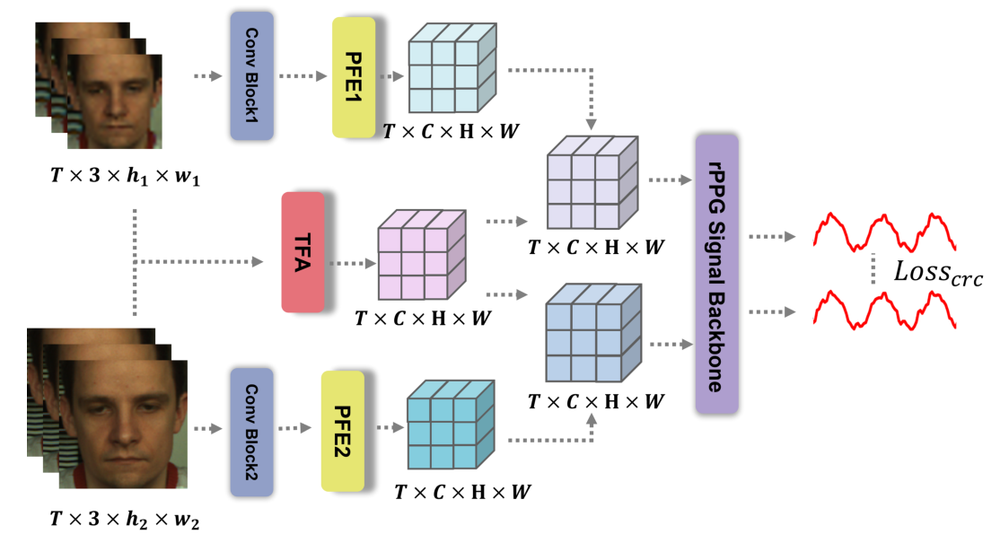
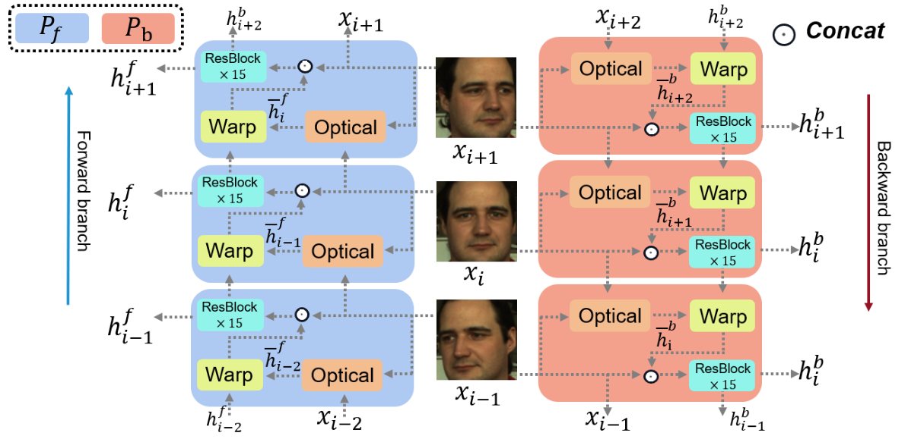
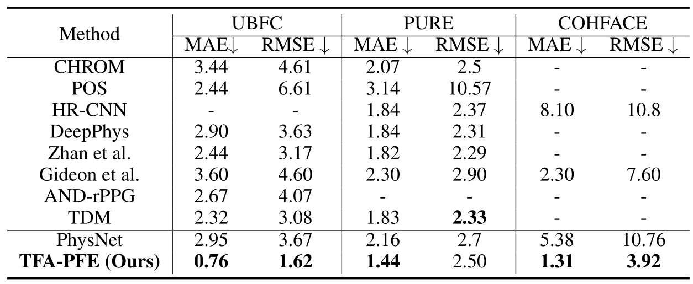
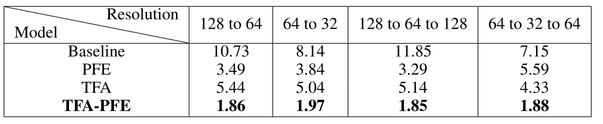
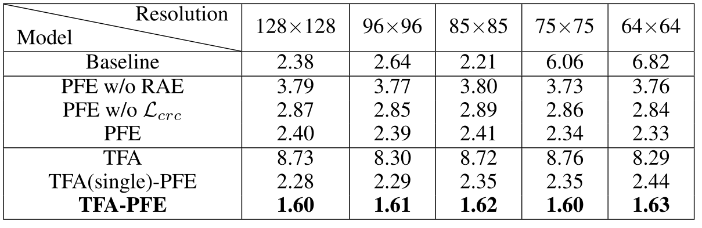
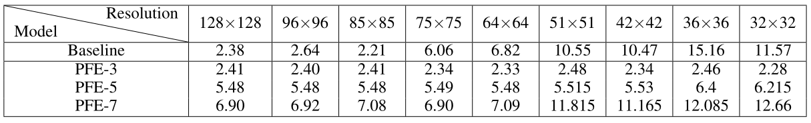

<h2><center> Learning Motion-Robust Remote Photoplethysmography
through Arbitrary Resolution Videos </center></h2>

【心率监测】【AAAI2023】【[paper](http://arxiv.org/abs/2211.16922)】【[code]()】

### 摘要

&emsp;&emsp;本文针对人脸在运动过程中产生的远近问题提出了两个即插即用的模块，将远近移动的问题转化为了多分辨率下的 rppg 信号估计问题，同时使用光流解决了人脸在转动的过程中可能导致的关键点缺失问题，在选择的 baseline（physnet）上取得了一定的进步。主要包括：1. 编码了分辨率信息从而对分辨率鲁棒的 PFE 模块，2. 使用光流恢复人脸运动从而对运动鲁棒的 TFA 模块。效果确实在对比的情况下有所进步，但是确实也缺乏一个 SOTA 的结果。

### 概览


<!-- more -->

----

### 创新

- 提出了可以帮助从可变分辨率视频中估计 rppg 信号的两个即插即用的块
- 其中 PFE 模块能够编码不同帧的分辨率信息，并且使用多分辨率的分支交叉训练
- 其中 TFA 模块能够从正负两个方向的光流恢复人脸运动，使输出包含正面人脸信息特征

### 网络

#### 前向过程


&emsp;&emsp;对于输入的视频，将其记为 $X$，其中每个视频有 $T$ 帧，将单个帧记为 $x_t$，需要注意的是，由于网络允许不同分辨率的视频输入，因此 $x_t \in \mathbb R^{3\times h_t\times w_t}$，也就是每个帧的分辨率之间是不同的。

&emsp;&emsp;对于 $X$，其需要通过两个不同的分支，分别是 PFE 和 TFA，而对于 PFE 分支，同样需要 sample 出两个不同的分辨率 $X_1,\ X_2$，经过整个网络之后再计算交叉损失。

- 对于某个分辨率下的 PFE 分支，其输入为 $X\in \mathbb R^{3\times T\times h\times w}$（$X=X_1/X_2$），首先需要通过一个 conv 模块，将 $X$ 中的每一帧 $x_t$ 进行一个降采样得到 $x_{ar}\in \mathbb R^{C\times \frac h 2\times\frac w 2}$，在论文里选择的 $C=16$，接着将整个视频的 $x_{ar}$ 帧输入 PFE 模块，得到输出记为 $x_{st}\in\mathbb R^{C\times H\times W}$
- 对于 TFA 分支，其输入和 PFE 分支完全一致，TFA 模块使用双向光流恢复图像转动并且提取正向光流与反向光流特征，接着将正反向对应位置的光流特征进行融合，最终得到 $x_{mo}\in\mathbb R^{C\times H\times W}$
- 接着将两个分支得到的结果进行按位相加得到 $x_{st-mo}$，将其输入 backbone 并得到最终的 rppg 信号

&emsp;&emsp;需要注意的是在正向的过程中，每一个 video 被确定为两个分辨率，分别进入两个同样的 PFE 和 TFA 模块，并且得到两个分辨率下的 rppg 信号估计计算损失从而进一步加强分辨率鲁棒性，其示意图如下



&emsp;&emsp;其中，两个不同分辨率的视频从同一个视频中采样得到，两个视频经过不同的 PFE 模块（其中的参数仅包含一个 MLP 层）以及共享参数的 TFA 模块（其中的参数主要包含 15 个 ResBlock 层），在上图中需要注意的是实际上经过 TFA 模块得到的 $X_{mo}$ 是两个视频共享的，只使用了一个数据得到 $X_{mo}$，可以理解为下面的大分辨率视频压根没进 TFA 模块。

&emsp;&emsp;对于得到的两个 rppg 信号，记其为 $Y_1,\ Y_2$，则和 GT 做一致化的损失包括 $\cal L_{time},\ L_{fre}$，这两个 loss 都是只有 $Y_1$ 和 GT 做的。而为了保证 $Y_1,\ Y_2$ 的一致性，则采用 L1Loss 限制一致性 $\mathcal L_{crc}=||Y_1-Y_2||_1$，总损失描述为：
$$
\mathcal L =\mathcal L_{time}+ \mathcal L_{fre}+\alpha\cdot\mathcal L_{crc}
$$
&emsp;&emsp;其中，时间一致性损失由负皮尔森相关性度量，频率一致性用 $CE(PSD(Y),HR_{GT})$ 度量，$\alpha$ 用于平衡多方因素，论文中设置为 0.1。

#### PFE 模块


&emsp;&emsp;对于 PFE 模块，其同样具备两条道路（注意这里是逐帧的操作）：

- 其一用于上采样的固定分辨率，同时聚合周边像素信息
  - 首先将 $x_{ar}$ 进行上采样（直接插值）得到 $x_{cr}\in\mathbb R^{C\times H\times W}$，其中 $H,\ W$ 是固定值，与 $h,\ w$ 无关，而 $X_1,\ X_2$ 的帧之间的区别是 $h,\ w $ 不同
  - 然后聚合 $x_{cr}$  的信息，具体的做法为：将每个像素位置开始向右 / 下各 $n$ 个像素点总共 $n^2$ 的像素点进行 channel 的聚合，得到 $\hat x_{cr}\in\mathbb R^{n^2C\times H\times W}$（注意上图有纰漏，应当是 $n^2$），其数学表述如下：

$$
\hat x_{cr}=Concat(\{x_{cr}(i+n,j+n) \}_{n\in Neighbor})
$$

- 其二用于编码原始帧 $x_{ar}$ 的分辨率信息，也就是记录 $\sigma=\frac h H$，然后 repeat 到和 $x_{cr}$ 一样的形状，同时记录 $H,\ W$ 的信息，最终得到 $x_{size}\in\mathbb R^{2\times H\times W}$，其数学表达式如下：

$$
\begin{align}
&x_{szie}(i,j)=[\sigma_H,\ \sigma_W]\\& where\ \ \  \sigma_H=\frac h H,\ \sigma_W=\frac w W
\end{align}
$$

- 接着将两个道路得到的数据进行拼接、拉平、MLP、reshape之后得到输出 $x_{st}\in\mathbb R^{C\times H\times W}$，其数学表达式如下，同时整个视频经过 PFE 模块之后的输出记为 $X_{st}\in\mathbb R^{T\times C\times H\times W}$

$$
x_{st}=Reshape(MLP(Flatten(Concat(\hat x_{cr},\ x_{size}))))
$$

#### TFA 模块



&emsp;&emsp;设计上 TFA 的设计主要为了解决这些在提取 ROI 区域时会遇到的问题：

- landmark 位置：由于头部的运动，人脸标记的位置可能会发生快速剧烈变化，这导致 ROI 的不准确
- 插值：ROI 的形状可能不同，通常使用插值来保持一致性。然而，插值可能会破坏像素的颜色变化，消除rppg 信息
- landmark  消失：当头部运动遇到大角度旋转时，部分面部可能从画面中消失。这时 landmark  将随机标记一些区域

&emsp;&emsp;结构上 TFA 模块较为复杂，由于其每一帧的输入都包含了前向 / 反向送入的两个输出，因此看上去比较混乱，可以将目光集中于某一个蓝色 / 红色块内：

- 每个块 $i$ 输入包含两个部分：1. 前一帧的视频图像（用于计算光流），2. 前一帧提取出的运动特征（用于恢复运动）
- 对于输入的视频帧 $x_{i-1}$ 和特征 $h_{i-1}$， 首先利用 $x_{i-1}$ 和 $x_i$ 计算出光流 $s_i$，使用的方法为已有的 SPyNet

$$
s_i=Optical(x_i,x_{i-1})
$$

- 将计算出的光流和之前提取出的运动特征 $h_{i-1}$ 进行扭曲，具体方法不含参数，代码入下：

```python
def flow_warp(x, flow, interp_mode='bilinear', padding_mode='zeros', align_corners=True):
    """Warp an image or feature map with optical flow.

    Args:
        x (Tensor): Tensor with size (n, c, h, w).
        flow (Tensor): Tensor with size (n, h, w, 2), normal value.
        interp_mode (str): 'nearest' or 'bilinear'. Default: 'bilinear'.
        padding_mode (str): 'zeros' or 'border' or 'reflection'.
            Default: 'zeros'.
        align_corners (bool): Before pytorch 1.3, the default value is
            align_corners=True. After pytorch 1.3, the default value is
            align_corners=False. Here, we use the True as default.

    Returns:
        Tensor: Warped image or feature map.
    """
    assert x.size()[-2:] == flow.size()[1:3]
    _, _, h, w = x.size()
    # create mesh grid
    grid_y, grid_x = torch.meshgrid(torch.arange(0, h).type_as(x), torch.arange(0, w).type_as(x))
    grid = torch.stack((grid_x, grid_y), 2).float()  # W(x), H(y), 2
    grid.requires_grad = False

    vgrid = grid + flow
    # scale grid to [-1,1]
    vgrid_x = 2.0 * vgrid[:, :, :, 0] / max(w - 1, 1) - 1.0
    vgrid_y = 2.0 * vgrid[:, :, :, 1] / max(h - 1, 1) - 1.0
    vgrid_scaled = torch.stack((vgrid_x, vgrid_y), dim=3)
    output = F.grid_sample(x, vgrid_scaled, mode=interp_mode, padding_mode=padding_mode, align_corners=align_corners)

    # TODO, what if align_corners=False
    return output
```

$$
\bar h_{i-1}=Warp(h_{i-1},s_i)
$$

- 接下来将得到的 $\bar h_{i-1}$ 和 $x_i$ 进行 cat 并通过一系列 ResBlock（15个）之后得到该帧提取出的特征 $h_i$ 并馈送到下一帧，需要注意的是 ResBlock 其实只包含了两层不含 BN 的卷积，只是加入了残差连接

$$
h_i = ResBlock(Concat(x_i,\  \bar h_{i-1}))
$$

```python
class ResidualBlockNoBN(nn.Module):
    """Residual block without BN.

    It has a style of:
        ---Conv-ReLU-Conv-+-
         |________________|

    Args:
        num_feat (int): Channel number of intermediate features.
            Default: 64.
        res_scale (float): Residual scale. Default: 1.
        pytorch_init (bool): If set to True, use pytorch default init,
            otherwise, use default_init_weights. Default: False.
    """

    def __init__(self, num_feat=64, res_scale=1, pytorch_init=False):
        super(ResidualBlockNoBN, self).__init__()
        self.res_scale = res_scale
        self.conv1 = nn.Conv2d(num_feat, num_feat, 3, 1, 1, bias=True)
        self.conv2 = nn.Conv2d(num_feat, num_feat, 3, 1, 1, bias=True)
        self.relu = nn.ReLU(inplace=True)

        if not pytorch_init:
            default_init_weights([self.conv1, self.conv2], 0.1)

    def forward(self, x):
        identity = x
        out = self.conv2(self.relu(self.conv1(x)))
        return identity + out * self.res_scale
```

- 上述分析都是基于正向或者反向计算光流的结果，这些结果 $h_i$ 序列的 shape 都和 $x_i$ 一样大，其中在实现的过程中第一帧获取到的 $h_{0}$ 由全 0 矩阵初始化。这样得到的双流数据比 $X$ 大了一倍，因此接下来要按照时间维度降采样
- 方式为将每一帧对应的正向反向特征进行拼接，然后输入到一个 1x1 Conv 降采样到 $\frac 1 2$ channel（T)

$$
x_{mo}=F(Concat(h_i^b,\ h_i^f))
$$

### 结果

&emsp;&emsp;按照一贯的方式，应当测试数据集内有效性、跨数据集有效性、分辨率和运动鲁棒性以及消融实验，但是分辨率变化大的数据集几乎没有，因此有效性实验更多的是在自己构造的分辨率变化数据集上测试

&emsp;&emsp;对于数据集内测试，本文选取了 UBFC、PURE、COHFACE 三个数据集，PURE 运动信息更多，COHFACE 数据质量更差，UBFC 数据集内误差较大



&emsp;&emsp;可以看出在不同的数据集上都可以降点，这里注意到两点：1. 选择的 SOTA 都比较差，现在的 UBFC 指标大概在 0.4 左右，2. 明明 PURE 更适合 TFA 模块，但是在 PURE 上降点反而不如 UBFC 明显。

&emsp;&emsp;针对这两点，原因为：1. 本文实现的方法在最好的 baseline 上也同样可以降点，但是效果对比度不如普通的 baseline 明显，2. 对于不同的数据集，由于其内在误差和难易程度，指标的下降的绝对值并不等同于提升的效果。

&emsp;&emsp;跨数据集测试上，由于测试方法过多且不统一，并且该方法在跨数据集测试上表现一般，因此没有给出结果。

&emsp;&emsp;消融实验如下，实验测试了将原视频逐帧调整分辨率的情况下在加入不同模块的结果。其中 128 to 64 表示：视频分辨率为 128 分辨率逐帧降低到 64 分辨率



&emsp;&emsp;同时测试了在固定分辨率下的有效性，可以看出固定上的有效性显然不如可变分辨率的有说服力，但也有涨点，让人有点疑惑的是只加 TFA 的话模型会出问题，这里比较奇怪，因为分辨率应该不会影响到 TFA 的，而且固定分辨率下 PFE 所起的作用应当相对较小，可以尤其参考 128x128 的通用分辨率下的结果



&emsp;&emsp;接着还测试了方法的有效性、多余 TFA 和 PFE 模块对模型参数量和推理训练速度的影响、特征图的注意力范围等等，最后还测试了在 PFE 模块中的 $n$ 的灵敏度，基本上除了在参数量和推理速度上大方承认有待改进，其他的实验比较中规中矩，基本就是证明方法有效性的实验，指标因为是自己统计的，很难和其他比较



