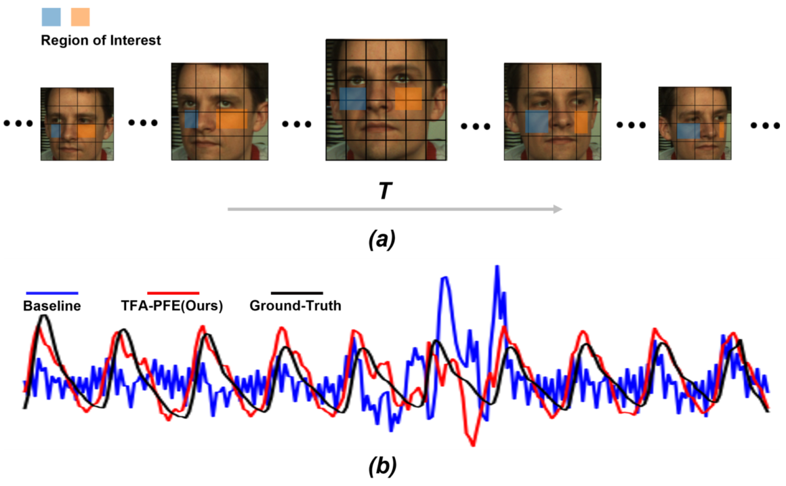
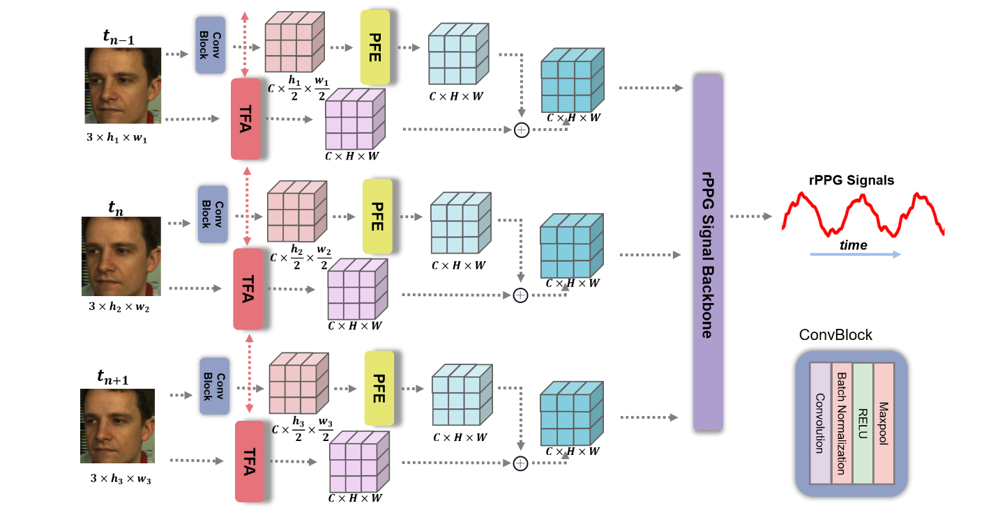
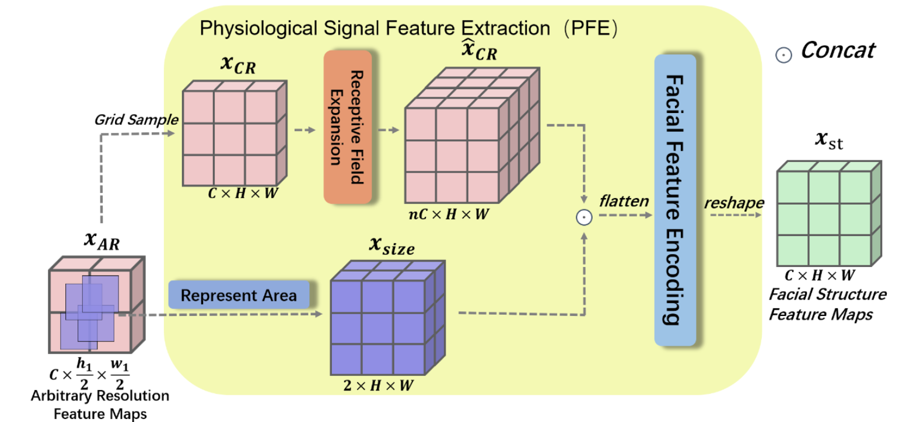

<h2>
 Learning Motion-Robust Remote Photoplethysmography
through Arbitrary Resolution Videos 
</h2>

【心率监测】【AAAI2023】【[paper](http://arxiv.org/abs/2211.16922)】【[code]()】

### 摘要

ds；本文针对人脸在运动过程中产生的远近问题提出了两个即插即用的模块，将远近移动的问题转化为了多分辨率下的 rppg 信号估计问题，同时使用光流解决了人脸在转动的过程中可能导致的关键点缺失问题，在选择的 baseline（physnet）上取得了一定的进步。主要包括：1. 编码了分辨率信息从而对分辨率鲁棒的 PFE 模块，2. 使用光流恢复人脸运动从而对运动鲁棒的 TFA 模块。效果确实在对比的情况下有所进步，但是确实也缺乏一个 SOTA 的结果。

### 概览

<!-- more -->

----

### 创新

- 提出了可以帮助从可变分辨率视频中估计 rppg 信号的两个即插即用的块
- 其中 PFE 模块能够编码不同帧的分辨率信息，并且使用多分辨率的分支交叉训练
- 其中 TFA 模块能够从正负两个方向的光流恢复人脸运动，使输出包含正面人脸信息特征

### 网络

#### 前向过程

ds；对于输入的视频，将其记为 $X$，其中每个视频有 $T$ 帧，将单个帧记为 $x_t$，需要注意的是，由于网络允许不同分辨率的视频输入，因此 $x_t \in \mathbb R^{3\times h_t\times w_t}$，也就是每个帧的分辨率之间是不同的。

ds；对于 $X$，其需要通过两个不同的分支，分别是 PFE 和 TFA，而对于 PFE 分支，同样需要 sample 出两个不同的分辨率 $X_1,\ X_2$，经过整个网络之后再计算交叉损失。

- 对于某个分辨率下的 PFE 分支，其输入为 $X\in \mathbb R^{3\times T\times h\times w}$（$X=X_1/X_2$），首先需要通过一个 conv 模块，将 $X$ 中的每一帧 $x_t$ 进行一个降采样得到 $x_{ar}\in \mathbb R^{C\times \frac h 2\times\frac w 2}$，在论文里选择的 $C=16$，接着将整个视频的 $x_{ar}$ 帧输入 PFE 模块，得到输出记为 $x_{st}$

ds；对于 PFE 模块，其同样具备两条道路（注意这里是逐帧的操作）：

- 其一用于上采样的固定分辨率，同时聚合周边像素信息
  - 首先将 $x_{ar}$ 进行上采样（直接插值）得到 $x_{cr}\in\mathbb R^{C\times H\times W}$，其中 $H,\ W$ 是固定值，与 $h,\ w$ 无关，而 $X_1,\ X_2$ 的帧之间的区别也是这个固定的 $H,\ W$ 不同
  - 然后聚合 $x_{cr}$  的信息，具体的做法为：将每个像素位置开始向右 / 下各 $n$ 个像素点总共 $n^2$ 的像素点进行 channel 的聚合，得到 $\hat x_{cr}\in\mathbb R^{nC\times H\times W}$，其数学表述如下：

$$
\hat x_{cr}=Concat(\{x_{cr}(i+n,j+n) \}_{n\in Neighbor})
$$

- 其二用于编码原始帧 $x_{ar}$ 的分辨率信息，也就是记录 $\sigma=\frac h H$，然后 repeat 到和 $x_{cr}$ 一样的形状，同时记录 $H,\ W$ 的信息，最终得到 $x_{size}\in\mathbb R^{2\times H\times W}$，其数学表达式如下：

$$
\begin{align}
&x_{szie}(i,j)=[\sigma_H,\ \sigma_W]\\& where\ \ \  \sigma_H=\frac h H,\ \sigma_W=\frac w W
\end{align}
$$

- 接着将两个道路得到的数据进行拼接、拉平、MLP、reshape之后得到输出 $x_{st}\in\mathbb R^{C\times H\times W}$，其数学表达式如下，同时整个视频经过 PFE 模块之后的输出记为 $X_{st}\in\mathbb R^{T\times C\times H\times W}$

$$
x_{st}=Reshape(MLP(Flatten(Concat(\hat x_{cr},\ x_{size}))))
$$

### 损失

$$
math\_express
$$

### 结果

----

### 启发

