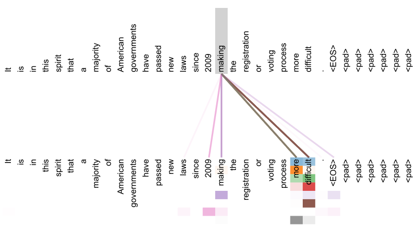

## [attention is all you need](https://papers.nips.cc/paper/2017/file/3f5ee243547dee91fbd053c1c4a845aa-Paper.pdf)【机器翻译】【NIPS】

### 摘要

&emsp;&emsp;原始transformer，RNN（解决 序列建模/位置敏感）$\to$ LSTM（解决 参数依赖/难以训练）$\to$transformer（解决 并行运算）。此篇笔记简要介绍网络、详细分析过程

### 概览

<!-- more -->

----

### 网络

&emsp;&emsp;上图是网络概览图，简单概括：transformer由编码器和解码器两部分组成，对于编码器和解码器，在输入之前都有embedding部分和位置编码部分。

### 理论

#### embedding and positionEncoding

&emsp;&emsp;embedding部分主要目的是将输入的词进行向量化表示。对输入的句子$X$，应当有$X=\{x_i\}_n \to (l,n)$，其中 $l$ 为句子个数，即batchsize，$n$为句子中单词的个数的最大值，$x_i \to (1,x_d)$，具体维度并不确定。对每一个单词进行embedding操作【可以使用的方法包括glove, word2Vec等】，将会得到$X'=\{w_i\}_n\to (n,d)$，其中$w_i\to (1,d)$，$d$代表转化之后每个单词的维度。在标准transformer中为512。

&emsp;&emsp;此时得到的向量$X'$中不包含位置信息，为了包含位置信息，加入位置编码矩阵$P \to (n,d)$。具体来说，对于位置为 $pos$ 的词向量，对该向量第 $i$ 个位置（$2k$ 或 $2k+1$）的值，有：
$$
P(pos,2k)=\sin(\frac{pos}{10000^{2k/d}}),k\in Z
$$
$$
P(pos,2k+1) = \cos(\frac{pos}{10000^{2k/d}}),k\in Z
$$

&emsp;&emsp;在得到位置编码之后，需要进行相加操作得到最终的编码结果，即 $A = P+X'\to(n,d)$。

&emsp;&emsp;虽然位置编码到这里就结束了，但是在实际操作中有些具体细节，包括 ①decoder网络的输入不允许网络看到当前位置之后的数据，因此需要有一个mask上三角矩阵，②对于长度不足 $n$ 的句子的padding。

#### encoder

&emsp;&emsp;encoder层如网络结构图所示，其本身是一个循环结构，因此要求输入输出维度一致，标准transformer循环层数为6。具体到每一个encoder层，其包含一个MHA（多头自注意力层）和一个FFN（前馈网络）。更具体地，每一个encoder层对embedding得到的矩阵 $A$，有 $A^{(i)} \to MHA(A) \to Z\to FFN(Z)\to A^{(i+1)}$。

&emsp;&emsp;对于MHA，其全称为MultiHeadAttention，其由多个Self-Attention并行组成，对于每一个Self-Attention，有如下的计算过程：

---

&emsp;&emsp;记 $A =\{a_i\}_n\to (n,d)$，$a_i\to (1,d)$，对每一个 $a_i$ 计算 $Q_i,K_i,V_i\to(1,k)$，其中 $k$ 可以表示对每个单词提取的特征维度，在标准transformer上是64，维度的进一步变小是为了方便计算。$Q,K,V$ 的计算公式为：
$$
Q_i=a_i\times W_Q
$$
$$
K_i= a_i\times W_k
$$

$$
V_i=a_i\times W_V
$$

&emsp;&emsp;其中，$W_Q,W_K,W_V \to (d,k)$ 是随机初始化得到的，属于网络中的参数，随梯度进行更新。将上述计算过程写成矩阵的格式，即为 $Q=A\times W_Q\to (n,k)$，$K,V$ 同 $Q$。此时对于如 $Q=\{Q_i\},Q_i\to (1,k)$ 表示第 $i$ 个单词的 $k$ 个特征。$Q,K,V$ 分别表示 Query, Key, Value。

&emsp;&emsp;形象化地理解 $Q,K,V$ 可以以浏览器查询为例子， 其中 $Q$ 表示需要查询的字段，$K$ 表示知识库包含的字段，$V$ 表示知识库中该字段的返回结果。使用 $Q_i\times K_i$ 即可得到对于某个查询在某字段的“得分”。将得分变化至0-1之间，再与 $V_i$ 相乘即可得到在某个字段的解，所有的 $V_i$ 求和即可得到最终 $Q_i$ 的查询结果。

&emsp;&emsp;按照以上思路，对于 $a_i$ 可以得到 $Z_i= \sum\limits_{j\in[1,k]} \rm softmax (\frac{ Q_i\times K_i^T}{\sqrt d_k})\times V_i \to(1,k)$，其中 $d_k$ 表示 $Q,K,V$ 的第二维度，即 $k$。重写成矩阵的形式，即可得到：
$$
Z=\rm softmax (\frac{Q\times K^T}{\sqrt {d_k}})\times V \to(n,k)
$$
&emsp;&emsp;这个式子虽然很好地表示了 $Z$ 的求法，但是在实际计算的过程之中，对于得到 $Q\times K^T$ 需要进行mask，即和mask矩阵按位相乘，目的是使被padding部分的注意力清零。

---

&emsp;&emsp;上述过程讲述了如何通过输入 $A\to(n,d)$ 求得对应的Self-Attention输出 $Z\to(n,k)$，但是在实际操作过程中往往使用MHA，即不共享参数同时并行计算 $p$ 个 $Z$，标准transformer计算8个。

&emsp;&emsp;对得到的 $Z_0\to Z_7$，将其横向拼接得到 $Z_{mix}\to(n,p\times k)$，然后对 $Z_{mix}$ 进行线性变换，经过一个Linear层将 $Z_{mix}$ 映射到 $Z'\to(n,d)$，此时的 $Z'$ 将会经过 $A\&N$ 后送至FFN 。

#### Add and Norm

&emsp;&emsp;对于 $A\&N$，大致上 $Add$ 对应残差连接，$Norm$ 对应 LayerNorm。具体来说，对于MHA，$A\&N$ 输出的结果是 $\rm LayerNorm(A + MHA(A))$。对于FFN，输出为 $\rm LayerNorm(Z'+FFN(Z'))$ 。

#### FFN

&emsp;&emsp;FFN网络结构简单，由两个线性层组成，在第一个线性层之后经过RELU，再经过第二个线性层，具体来说两个线性层维度为 $d\to 2048\to d$。

&emsp;&emsp;FFN包括上述的 A&N 部分看起来很容易，但是原论文中进行了消融实验，这两个部分非常重要，尤其对于FFN部分。FFN部分是positionWise的，即这个网络实际上是对每一个维度进行的，类似于kernel=1的Conv2d。

#### decoder

&emsp;&emsp;decoder部分整体和encoder部分没有太大的差别，区别在于decoder具备两个MHA，两个MHA在实现上和encoder的均略有不同。

&emsp;&emsp;对于第一个Masked MHA，首先是起始与终止符，对于输入的序列，起始符号为\<begin\>，终止符号是\<end\>，分别代表句首和句尾。其次是mask，在计算输入的时候就需要进行mask，对每个输入句子，输入的第 $i$ 个句子仅能看到前 $i$ 个词语。除此之外，在计算出 $Q\times K^T$ 之后也需要进行mask。这两个mask操作都是直接按位乘mask矩阵。mask矩阵为上三角矩阵，举例来说，对 4 个单词。
$$
mask = \begin{pmatrix}
1~1~1~1\\
0~1~1~1\\
0~0~1~1\\
0~0~0~1
\end{pmatrix}
$$
&emsp;&emsp;对于第二个MHA，其 $Q,K,V$ 不单独计算，其中 $K,V$ 直接使用encoder输出的结果，$Q$ 使用第一个masked MHA输出的 $A$ 单独进行 $Q$ 的计算。之后的 $A\&N$ 部分也使用第一个masked MHA的输出作为输入。

### 损失

&emsp;&emsp;标准transformer的损失采用交叉熵损失，但是在实际的操作过程中需要忽略padding的输出和ground truth。除此之外，学习率 $l$ 优化器使用Adam优化器，随着训练轮数 $s$ 先变大后变小。

