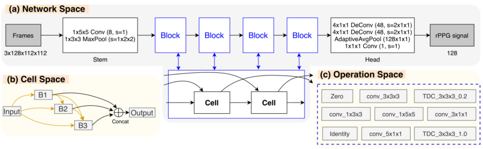
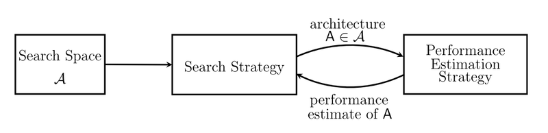
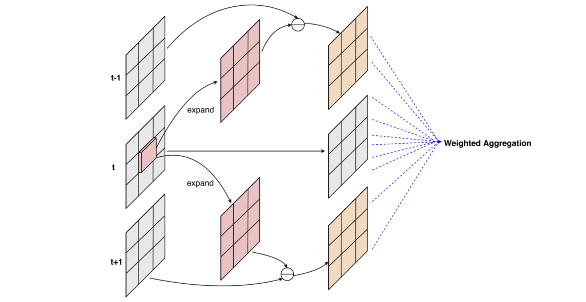
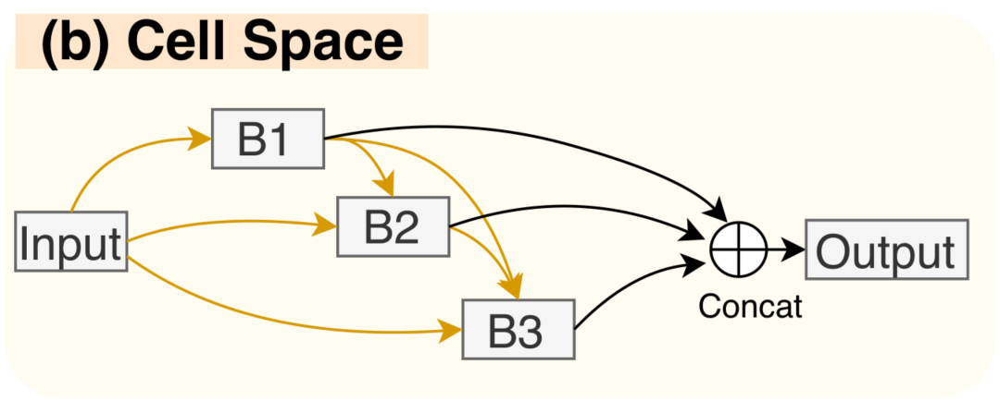
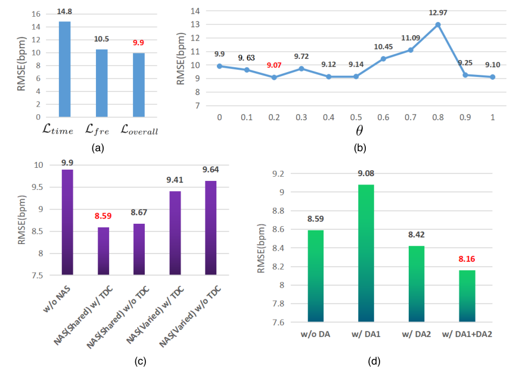
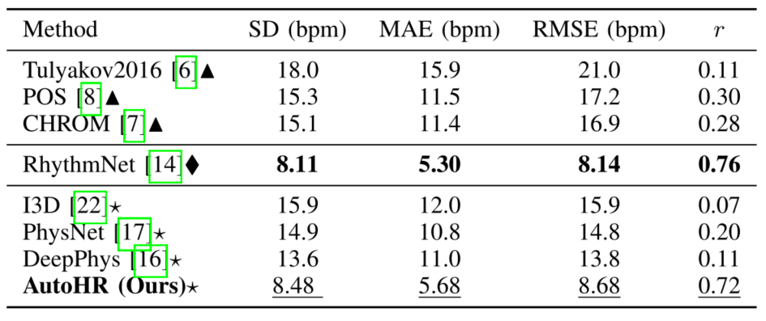

<h2>
 AutoHR: A Strong End-to-end Baseline for Remote Heart Rate Measurement with Neural Searching 
</h2>

【心率检测】【SPL2020】【[paper](https://ieeexplore.ieee.org/stamp/stamp.jsp?tp=&arnumber=9133501)】【[code未开源]()】

### 摘要

&emsp;&emsp;本文提出了一种基于 NAS 的心率检测 backbone 设计策略，在操作域中加入了 TDC（时空差分卷积），同时提出了一种时域和频域的混合损失函数，在单数据集和跨数据集上的测试都取得了较好的结果，并且为了解决现有方法泛化能力弱的问题提出了新的数据增强策略，取得了端到端的 SOTA。

### 概览

<!-- more -->

----

### 创新

- 首次使用 NAS 搜索 HR 任务的网络，并且在 NAS 搜索中加入了 TDC
- 提出了一种时域频域的 loss，提出两种数据增强策略

### 前置知识

#### NAS（神经结构搜索）

&emsp;&emsp;NAS(Neural Architecture Search) 意图使用深度学习任务自主设计神经网络，其基本工作流程如下图所示。首先由人工给定搜索的空间以及搜索策略，由机器自主探索空间中的操作组成的网络结构，并根据其网络的表现更新网络架构和超参数。

&emsp;&emsp;但是 NAS 有着难以避免的问题：1.超参数和搜索空间的网络架构都是离散的，2.大量的超参数使得训练时间太长。为了解决这些问题，提出了层次化表示：Learning Transferable Architectures for Scalable Image Recognition，权重共享：Reinforcement Learning for Architecture Search by Network Transformation，表现预测：Progressive Neural Architecture Search 等方法。

### 网络

#### TDC

&emsp;&emsp;时空差分卷积（TDC）是一种新的卷积策略，其卷积过程大致如下图所示。具体来说，对第 $t$ 帧图像 $p_0$ 为位置的 3x3 卷积过程如下：对第 $t$ 帧图像的 $p_0$ 位置进行 expand 操作，扩展到整个 3x3 的大小，并且分别和 $t-1$，$t+1$ 帧的对应位置进行作差。注意这里的作差中 expand 的部分带有一个参数 $\theta$ 用来控制当前帧对临近帧的影响程度，对原位置直接进行卷积，并且将最终的结果相加。

&emsp;&emsp;上面的过程使用公式可以表示为：
$$
O(p_0^t)=\mathop\sum\limits_{p_n^{t-1}\in\mathcal R_{t-1}}w(p_n^{t-1})·(I(p_0^{t-1}+p_n^{t-1})-\theta·I(p_0^t))
$$

$$
+\mathop\sum\limits_{p_n^{t+1}\in\mathcal R_{t+1}}w(p_n^{t+1})·(I(p_0^{t+1}+p_n^{t+1})-\theta·I(p_0^t))
$$

$$
+\mathop\sum\limits_{p_n^{t-1}\in\mathcal R_{t}}w(p_n^{t})·I(p_0^{t}+p_n^{t})
$$

#### 前向过程

&emsp;&emsp;正如概览图中所示，整个网络由一个有向无环图进行估计，记所有的操作空间为 $\mathcal O$，对于图中的每一个边 $(i,j)$，其输出为：$\tilde o^{(i,j)}(x_i)=\sum_{o\in\mathcal O}\eta_o^{(i,j)}·o(x_i)$，其中的 $o$  代表操作空间中的每一个操作，$\eta$ 由一个 softmax 的式子给出，$\eta_o^{(i,j)}=\frac{exp(\alpha_o^{(i,j)})}{\sum_{o'\in\mathcal O}exp(\alpha_{o'}^{(i,j)})}$，其中的 $\alpha_o^{(i,j)}$ 表示在边 $(i,j)$ 中操作 $o$ 的权重或系数。

&emsp;&emsp;在这种表示下，可以通过如下式子进行训练从而找到最适合的 $\alpha$，在训练的过程中，由于有四个 block，这四个 block 可以以共享权重或不共享权重的方式训练，其中权重共享实际上是 NAS 的共识，这样不仅可以加速搜索，同样可以取得更好的结果。本文的消融实验也探讨了这部分。
$$
\min\limits_\alpha \mathcal L_{val(\Phi^*(\alpha),\alpha)},\ s.t.\ \Phi^*(\alpha)=\arg \min\limits_\Phi\mathcal L_{train}(\Phi,\alpha)
$$
&emsp;&emsp;通过这种方式找到的网络结构每个 cell 中的每一条边都含有所有的 $\mathcal O$ 中的网络算子，并且每一个算子都具备对应的权重，但是这样的网络结构太大，其中的多个算子中某些算子的权重其实非常低，因此作者采用这样的方法进行网络的剪枝以确定最终的网络：1.对于最终的输出 output 的入边，每个边选取一个权重最大的操作保留，2.对于其他的中间节点 B1,B2,B3 的入边，每个选取权重最大的两个操作保留。

#### 损失函数

&emsp;&emsp;损失函数包括两个部分，分为时间和频率，其中时间部分就是所谓的线性相关性，具体由下式给出，并且这个函数在 rPPGNet 之中也用到了，不过 rPPGNet 更晚一些就是了。
$$
\mathcal L_{np}=1-\frac{T\mathop\sum\limits_{i=1}^T y_iy_i^g-\mathop\sum\limits_{i=1}^Ty_i\mathop\sum\limits_{i=1}^Ty_i^g}{\sqrt{(T\mathop\sum\limits_{i=1}^Ty_i^2-(\mathop\sum\limits_{i=1}^Ty_i)^2)(T\mathop\sum\limits_{i=1}^T(y_i^g)^2-(\mathop\sum\limits_{i=1}^Ty_i^g)^2)}}
$$
&emsp;&emsp;对于频率域，就是对 $y_i$ 求功率谱密度，然后和 GT 做比较，即：
$$
\mathcal L_{fre}=\sum CE(PSD(y_i),y_i^g)
$$
&emsp;&emsp;整体来说的损失函数由 $\mathcal L_{overall}=\lambda·\mathcal L_{time}+\mathcal L_{fre}$ 给出，其中 $\lambda$ 用于平衡损失。

#### 数据增强

&emsp;&emsp;本文针对现有数据集的两个问题提出了两个数据增强策略：1.头部运动可能导致 ROI 遮挡，2.HR 分布严重不平衡，呈倒 V 形。

&emsp;&emsp;对于这两个问题的改进为：1.在随机时间片段（小于 20% 的空间大小和 20% 的时间长度）内随机擦除或切除部分时空管，模拟 ROI 遮挡的情况，2.对视频进行时间上采样和下采样，以生成具有极小或极大 HR 值的额外训练样本。具体来说，HR 值大于 90 bpm 的视频将被时间插值两次，而 HR 值小于 70 bpm 的视频将以采样率 2 下采样，分别模拟一半和两倍的心率。

### 结果

&emsp;&emsp;本文做了简单的消融实验，针对性地探究了 a）损失函数，b）TDC 中的 $\theta$ 值，c）是否具备 NAS / TDC 部分，d）是否使用数据增强策略。结果如下图所示，虽然基本上都没有提太多，但是每个方法都或多或少提了0.几 的点。

&emsp;&emsp;除了消融实验，本文还和目前的 SOTA 进行了比较，其中的△表示传统方法，◇表示非端到端的方法，☆表示端到端的深度学习方法。这里的 RhythmNet 是同年的论文，提出了 VIPL-HR，也是很棒的 SOTA 文章。

