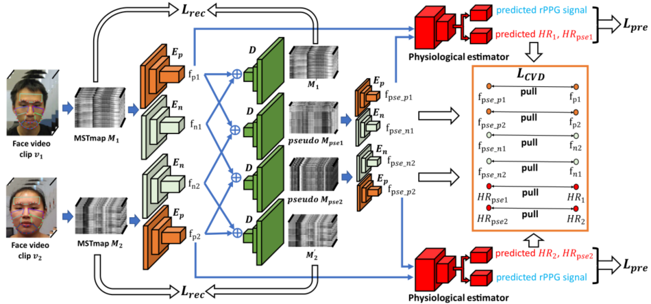
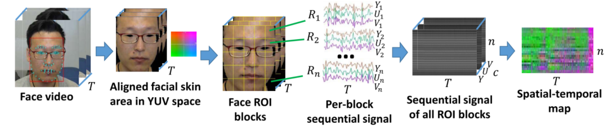
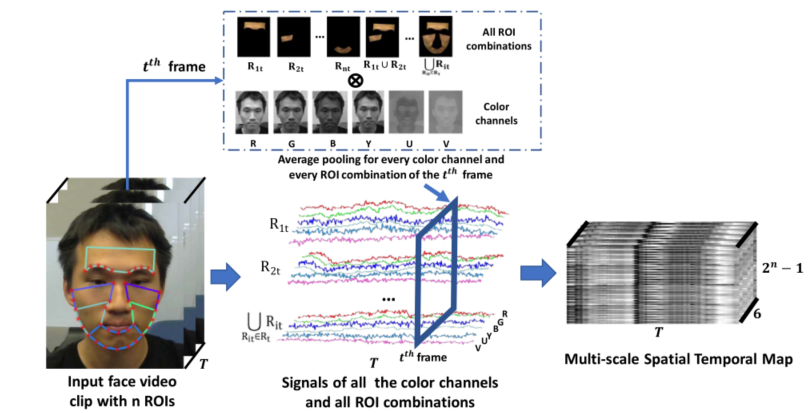
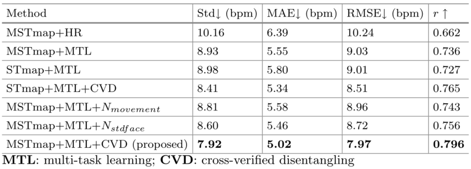
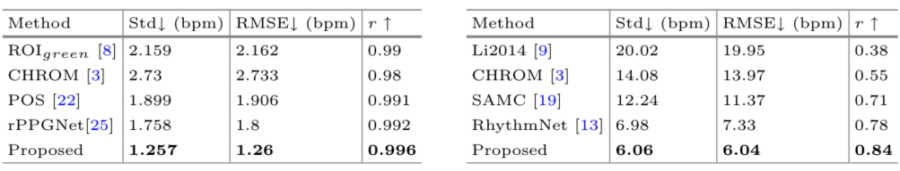

<h2>
 Video-Based Remote Physiological Measurement via Cross-Verified Feature Disentangling 
</h2>

【心率检测】【ECCV2020】【[paper](https://arxiv.org/pdf/2007.08213.pdf)】【[code](https://github.com/nxsEdson/CVD-Physiological-Measurement)】

### 摘要

&emsp;&emsp;本文提出了一种基于自编码器的架构的特征学习器，并且将输入的 video 表示为多尺度 STmap，通过多编码器-单解码器的方式生成编码不同特征的编码器，同时通过交叉验证解离（CVD）的策略训练。同时对解码出的特征估计时使用了可以输出多种生理信号的估计器，是结合了自编码器、解离表征、rppg 估计网络的 SOTA。

### 概览

<!-- more -->

----

### 创新

- MSTmap（多尺度 STmap）的提出
- 新的训练策略 CVD（交叉验证解离）
- 一种用于估计 rppg 信号和 HR 信号的双头网络

### 网络

#### MSTmap

&emsp;&emsp;首先介绍 STmap，所谓 STmap，即时空图。由于在心率估计中，人脸 ROI 区域蕴含的信息相比于环境信息来说更加重要，因此试着将输入的 video 通过某种**非学习的策略**变成仅含有人脸信息的色彩特征图，以便于接下来的估计网络学习这些特征（正是因为在 RhythmNet 和 CVD 中都含有这一部分，一些工作认为这样的处理将整个网络变成了非端到端的架构）。

&emsp;&emsp;其具体的处理为：1.通过开源工具 [SeetaFace](https://github.com/seetaface/SeetaFaceEngine) 标定人脸的关键点，将输入的 video 的每一帧都对齐至同一个位置并且进行 crop 使得人脸位于中央，此时 $video\to(T,H,W,C)$，2.将现在的 video 按照空间维度将每帧分解为 $n$ 个块，将每个块按照 YUV 通道展开，记每个块中的像素点个数为 $c$，这里的 $c=\frac{HW}n$，这里的结果进行一个重排，在不改变维度的情况下就成为了 STmap，此时的 $STmap\to(T,n,c)$。

&emsp;&emsp;所谓多尺度 STmap，即相对于在 RhythmNet 中的 STmap 多了环境信息。具体来说，首先利用开源工具 [SeetaFace](https://github.com/seetaface/SeetaFaceEngine) 标定第 $t$ 帧人脸上信息量最大的 $n$ 个 ROI 区域，将这 $n$ 个区域进行排列组合总共形成 $2^n-1$ 个图像（除了所有 ROI 均不存在的情况）。同时将第 $t$ 帧的图像进行通道分解为 RGBYUV 共六个，之后和 ROI 组合进行笛卡尔积，考虑每一帧，最终得到多尺度 STmap 的 shape 为 $(T,6,2^n-1)$。

#### 前向过程

&emsp;&emsp;网络比较复杂，因此这里对着图介绍。网络进行联合训练，直接算出所有的 loss，求和之后进行梯度回传。首先介绍前向过程。

- 将输入的 video clip 进行预处理，得到 MSTmap，具体地，对于一对视频 $v_1,v_2$，生成的时空图分别记为 MSTmap $M_1,\ M_2$，实现中这一对视频由随机下标在同一个 batch 内取得。
- 将 $M_1,\ M_2$ 分别通过两个不同的编码器 $E_n,\ E_p$ 得到 4 个值 $f_{p1},\ f_{n1},\ f_{p2},\ f_{n2}$ ，其中 $p$ 下标代表生理信号，$n$ 下标代表非生理信号
- 将得到的 4 个信号组合进入解码器 $D$，得到 4 个解码之后的特征 $M_1,\ pseudo\ M_1,\ M_2,\ pseudo\ M_2$，其中 $M_1,\ M_2$ 即为正常的编解码器的输出，用于监督训练 AE；其中 $\ pseudo\ M_1,\ pseudo\ M_2$ 代表使用不对应的生理特征和非生理特征组合得到的伪特征
- 将两个伪特征再一次进行编码，分别通过 $E_n,\ E_p$，得到四个输出 $f_{pse\_p1},\ f_{pse\_n1},\ f_{pse\_p2},\ f_{pse\_n2}$，如果我们的  $E_n,\ E_p$ 能够有效分离生理和非生理特征，这里的 $f_{pse\_p1}$ 应该和 $f_{p1}$ 接近，而 $f_{pse\_n1}$ 反而应该和 $f_{n2}$ 接近，其他同理
- 将得到的 $f_{pse\_p1},\ f_{p1}$ 分别输入双头估计器，只取 $f_{p1}$ 生成的 rppg 信号 $s_{pre}$，并且取两个输入生成的 HR 信号 $HR_1,\ HR_{pse1}$，对 $f_{pse\_p2},\ f_{p2}$ 同理。这里生成的 $s_{pre},\ HR_1$ 用于监督训练双头网络，其余的都用于进行 CVD 训练，目的是监督 $E_n,\ E_p$ 的各司其职

&emsp;&emsp;接下来逐个介绍 loss 的计算。

- $\mathcal L_{rec}$

$$
\mathcal L_{rec}=\lambda_{rec}\sum\limits_{i=1}^2||M_i-M_i'||_1
$$

&emsp;&emsp;使用 L1Loss 限制 AE 的表征学习能力。

- $\mathcal L_{CVD}$

$$
\mathcal L_{CVD}=\lambda_{cvd}\sum\limits_{i=1}^2||f_{pi}-f_{pse\_pi}||_1 +\lambda_{cvd}\sum\limits_{i=1}^2||f_{ni}-f_{pse\_n(3-i)}||_1+\sum\limits_{i=1}^2||HR_i-HR_{psei||_1}
$$

&emsp;&emsp;这个损失函数限制各个对应的预测值相等，通过此限制强迫编码器 $E_n,\ E_p$ 各司其职。

- $\mathcal L_{pre}$

$$
\mathcal L_{rppg}=1-\frac{Cov(s_{pre},s_{gt})}{\sqrt{Cov(s_{pre},s_{pre})}\sqrt{Cov(s_{gt},s_{gt})}}
$$

$$
\mathcal L_{rppg\_hr}=CE(PSD(s_{pre}),HR_{gt})
$$

$$
\mathcal L_{pre}=||HR_{pre}-HR_{gt} ||+\lambda_{rppg}\mathcal L_{rppg}+\mathcal L_{rppg\_hr}
$$

&emsp;&emsp;这个函数通过限制 rppg 信号的估计准确性和心率的预测准确性强迫双头网络估计器的学习。

&emsp;&emsp;总体来说，loss 由下式给出，通过之前的前向过程中的各个中间变量获得损失函数，并且对各个网络进行联合训练。在实现的过程中，backbone 为 res18，编解码器为同一个网络实现，因此代码中的前向过程和描述的过程先后性并不完全一致，但是得到的值和逻辑都一致。
$$
\cal L=L_{rec}+L_{\rm CVD}+L_{pre}
$$

### 结果

&emsp;&emsp;和大部分余老师的论文一致，这篇论文也是主要关注于：1.消融实验，2.单数据集和跨数据集结果

- 消融实验

&emsp;&emsp;这部分探究了 a）STmap 的多尺度性，b）是否含有 MTL，c）是否含有 CVD，其中是否含有 CVD 探索了包含、不含（使用头部运动作为非生理信号解离）、不含（使用面部像素标准差作为非生理性解离）三种情况。

- 单数据集（OBF，左）和跨数据集结果（MMSE-HR，右，训练集为 VIPL-HR）

