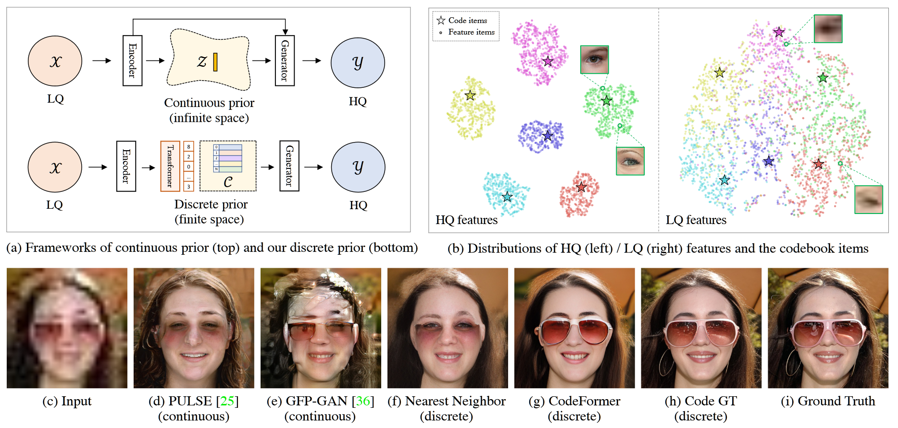
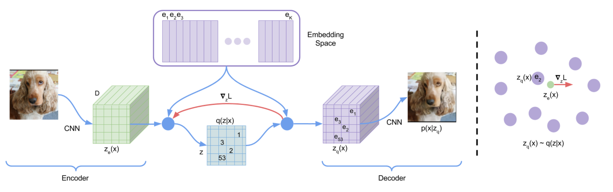
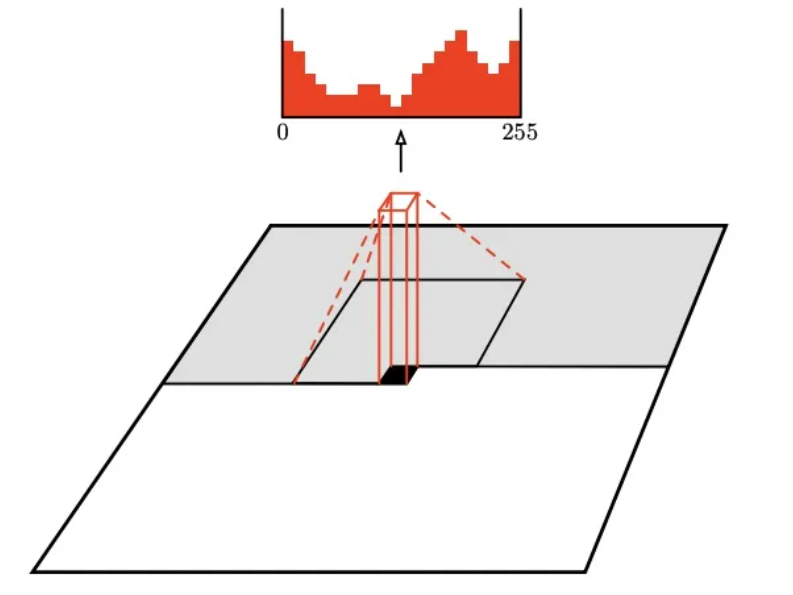
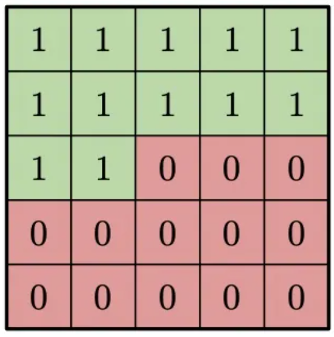
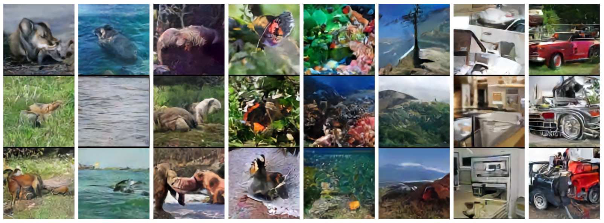
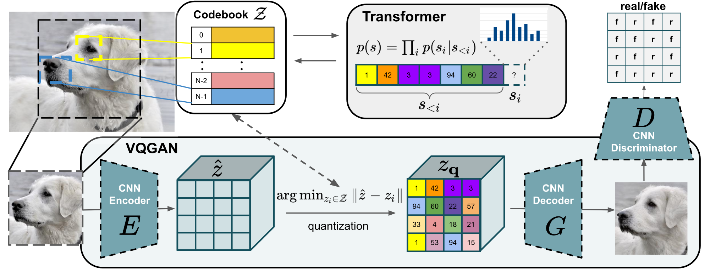
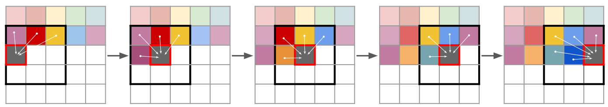
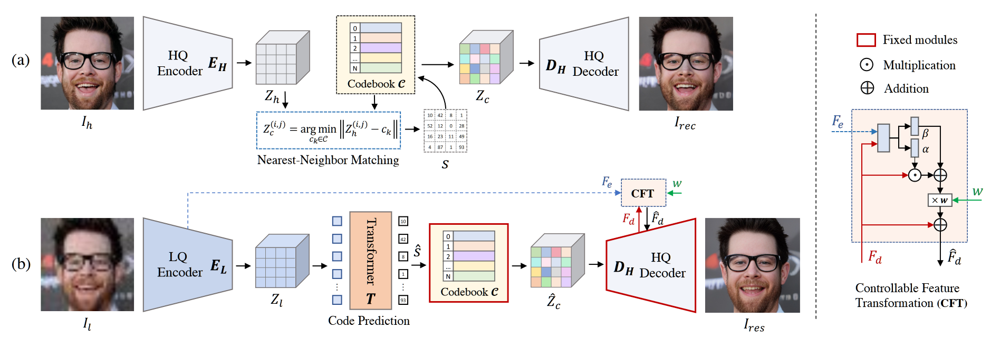

<h2>
 Towards Robust Blind Face Restoration with Codebook Lookup Transformer 
</h2>

【盲图重建】【NIPS2022】【[paper](http://arxiv.org/abs/2206.11253)】【[code](https://github.com/sczhou/CodeFormer)】

### 摘要

ds；本文借鉴 VQGAN 的思想细化了其应用领域并进行了启发式的改造，将条件生成限制到盲人脸重建，通过增加 CFT 模块优化过度平滑的问题，并且将采样器去掉，作为必选项在重建图像时优化隐编码。由于 CFT 模块可选，因此在一定程度上避免了如 GPEN 的跳跃连接，防止过差的 LQ 影响重建质量。其本质与其说参考了更多的盲图重建工作，倒不如说参考了 VQ 系列的工作。

### 概览

<!-- more -->

----

### 前置知识

#### VQVAE

[Neural Discrete Representation Learning](http://arxiv.org/abs/1711.00937)  NIPS2017

ds；所谓 VQVAE，即矢量量化（Vector Quantized）VAE，其基础仍是 VAE，其具备和 VAE 基本一致的训练过程，只是在 Encoder $q$ 编码出 latent code $z_e$ 之后并不直接给 Decoder，而是经过通过一个码本 CodeBook 进行量化，得到离散的编码表示 $z_q$，再输入 Decoder $p$ 生成重建图像 $p(x|z_q)$。

ds；首先，论文本身上，其区别于 VAE，基于量化的编码可以很好地避免隐空间在采样重建时出现崩溃，但是同时由于 codebook 的限制，采样的多样性也相应减弱了，这种量化的思想更适用于重建（生成）质量大于多样性的场景，比如盲图重建。对于原文来说，VQVAE 主要进行图像重建、条件生成、语音生成，其中重建效果甚至不如好的 AE，条件生成结果更是和 CGAN 比不了，更不用提最近的 GAN。语音重建是 VQVAE 卖点之一，其宣称自己证明了深度学习模型可以无监督地从音频里学到语义。和盲图重建无关，就不展开了。

##### backbone

ds；codebook 和量化过程可以描述为：

- codebook 实际上是向量的集合，其 shape 为：$(m\cdot n)\times d$ ，其中 $m,\ n,\ d$ 是原图经过编码器得到的隐编码 $z_e$ 的 shape
  - 该集合有 $m\cdot n$ 个元素，每个元素是连续的 $(1,d)$ 的向量，元素下标范围是 $[0,m\cdot n)$，必须为整数
  - codebook 中每个元素的初始值随机生成，在训练的过程中不断优化，优化目标是量化过程中损失最少的信息
- 量化过程为：
  - 对于编码器的输出 $z_e\to(m,n,d)$，对其中的 $z_e[i,j]$ 有：
    - $z_q[i,j] = e_k,\ \ where\ \ k=arg\min_j||z_e[i,j]-e_j||_2$，从而输出 $z_q\to(m,n,d)$

ds；其网络训练过程主要可以被描述为：

- 正向传播
  - 输入原图 $x$，经过编码器 E 得到 $z_e$
  - $z_e$ 和 codebook 进行最近邻查询，将 $z_e$ 量化为 $z_q$
  - $z_q$ 经过解码器 D 得到重建图像 $p(z_q)$
- 反向传播
  - $L=\log p(x|z_q(x))+||sg[z_e(x)]-e||_2^2+\beta||z_e(x)-sg[e]||_2^2$
  - 其中，第一项为重建损失，也是 VAE 的 ELBO 中的一项，使用 L1 或者 L2 损失度量重建图像质量
  - 第二项和第三项为优化量化过程中的信息损耗，其中 $sg$ 表示 detach，即分别优化编码器 E 和码本 codebook

ds；相对于 VAE 来说，ELBO 缺少了 KL 散度的度量项，这是因为 $z$ 并非高斯分布，实际上，$z$ 的分布是离散的分类分布，具体可以描述为：
$$
q(z=k|x)=\begin{cases}
1\ \ \ \ \rm{for} \ k=arg\min_j||z_e(x)-e_j||_2\\
0\ \ \ \ \rm{otherwise}
\end{cases}
$$
ds；以此分布推理 KL 散度可以得到最终的结果为 $\log K$，$K=m\cdot n$。

##### 从分类分布中采样

ds；对已经训练好的 backbone，按照 VAE 的思路接下来只需要使用解码器 $p$ 然后从高斯分布中采样隐编码 $z$ 就可以了，但是明显可以看到，$z$ 并不属于高斯分布，因此需要额外构建一种采样方式，本文采用的方式为 PixelCNN。

ds；PixelCNN 是自回归模型的一种，事实上使用任意一种自回归模型均可。所谓自回归模型，即模型接收当前位置前的序列并预测当前位置的值，类似于语言生成。对于 PixelCNN，具体的实现方式为采用卷积的方式进行 mask。

ds；上图表示了卷积核的卷积过程，对于黑色位置，卷积核只能看到灰色区域内的像素点，得到红色的像素分布并以此预测黑色位置像素，卷积核具体设计为下图：

ds；因为之后再 VQGAN 之中 PixelCNN 就使用 GPT-2 的 transformer 架构代替了，因此不再专门精读 PixelCNN。

ds；下图展示了使用 IN 训练的 PixelCNN 和 VQVAE 以不同的类别采样的结果，可以看到还是比较差的，只能说是初具雏形。

#### VQGAN

[Taming Transformers for High-Resolution Image Synthesis](http://arxiv.org/abs/2012.09841)  CVPR2021

ds；VQGAN 针对 VQVAE 进行了两方面的改进：

- 在原本的 AE 大框架下加入了判别器 D
- 使用 transformer 架构代替了 PixelCNN

ds；相对于 VQVAE，VQGAN 在训练阶段只是多了一个 GAN 损失，其中量化损失描述为：
$$
L_{VQ}(E,G,Z)=||x-\hat x^2||^2+||sg[E(x)]-z_q||_2^2+||sg[z_q]-E(x)||_2^2
$$
ds；其中，第一项 MSE 即为重建损失 $L_{rec}$，后两项和 VQVAE 一致。

ds；VQGAN 对抗（交叉熵损失）损失描述为：
$$
L_{GAN}(\{E,G,Z\},D)=\log D(x)+\log(1-D(\hat x))
$$
ds；总损失描述为：
$$
L_Q=arg\min_{E,G,Z}\max_D\mathbb E_{x\sim p(x)}[L_{VQ}+\lambda L_{GAN}]\\
\mathrm {where}\ \  \lambda=\frac{\nabla_{G_L}[L_{rec}]}{\nabla_{G_L}[L_{GAN}]+\delta}
$$
ds；其中，$\nabla_{G_L}$ 表示损失关于 G 的最后一层的梯度，$\delta=10^{-6}$。

ds；对于采样部分，transformer 的训练方式为：对已经量化的序列进行预测，使用交叉熵函数学习如何把 codebook 映射到合理的分布，假设量化之后的序列为 $s$，则 transformer $p$ 预测序列 $s$ 可以表述为： $p(s)=\Pi_ip(s_i|s<i)$，训练损失描述为：
$$
L_{transformer}=\mathbb E_{x\sim p(x)}[-\log p(s)]
$$
ds；即对所有的 $x$ 采样之后预测出所有的 codebook 序列。

ds；需要注意的是，对于 VQGAN，其 transformer 需要预测的序列仍然较长，为了能够生成更高分辨率的图像，需要对 transformer 进行滑动窗口的方式进行预测，其示意图如下：

### 创新

- 可以选择的可控特征变换模块，以此解决了过度平滑和图像重建质量的冲突问题
- 一个只针对盲图人脸重建的 VQGAN baseline

### 网络

ds；整个网络结构很好理解，类比于 VQGAN，仍然是

### 损失

$$
math\_express
$$

### 结果

----

### 启发

