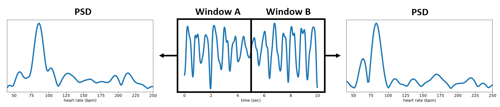
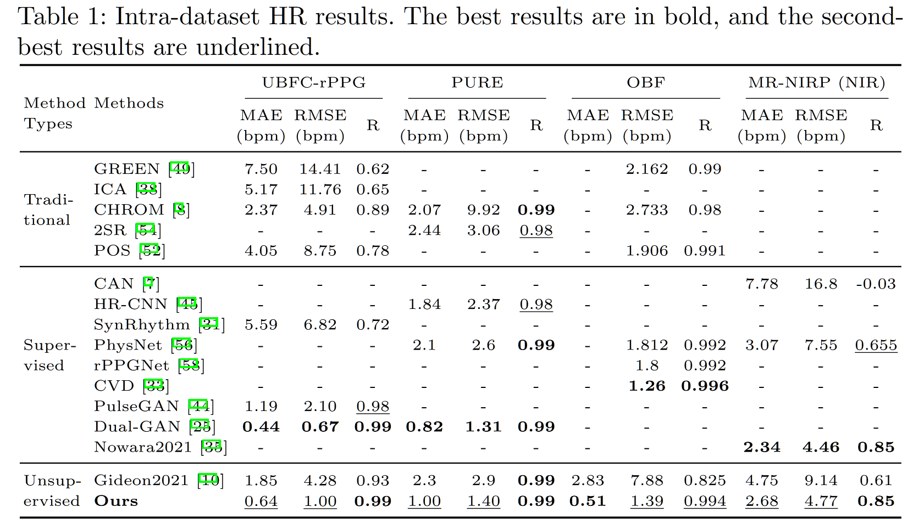

<h2><center> Contrast-Phys: Unsupervised Video-based Remote Physiological Measurement via Spatiotemporal Contrast </center></h2>

【心率监测】【ECCV2022】【[paper](http://arxiv.org/abs/2208.04378)】【[code](https://github.com/zhaodongsun/contrast-phys)】

### 摘要

&emsp;&emsp;本文实现了一种新的对比学习框架，提出了一种新的数据增强策略，这个策略基于对同一人脸不同位置的 ppg 信号 PSD 基本一致的观察，以及对不同人脸的 ppg 信号 PSD 基本不一致的观察，并且使用一个 3DCNN 块对 ppg 信号进行提取，得到 channel-wise 的 ppg 信号，这种方式极大地扩展了正负样本的数量，时间上这篇文章早于 video-base SSL，但是效果实际上不相上下。

### 概览


<!-- more -->

----

### 创新

- 观察到了 rppg 信号的时空相似性和跨视频不相似性等，基于这些观察提出了新的样本提取方法
- 改编 physnet 得到了一个新的 3DCNN 网络，能够以 channel-wise 的方式对 rppg 信号建模，每个 channel 具备较大的感受野

### 网络

#### 前置观察

- **rppg 信号具备空间相似性**，也就是说将每个视频划分为多个子块，每个子块估计出的 rppg 信号在相位和振幅上或许会有差别，但在频率域上（PSD 信号）应当基本一致


- **rppg 信号具备时间相似性**，也就是说将 T 帧的数据估计出的长度为 T 的 rppg 信号一分为二，则这两个子信号在相位和振幅上或许会有差别，但在频率域上（PSD 信号）应当基本一致
  - 需要注意的是，这里显然在 T 过大时不成立，在较大的 T 下，近似于每个人时刻都保持 HR 一致，这显然不对；同时多次分割也会降低这个假设的准确性，文章在最后探索了 T 的大小对该假设成立的影响



- **rppg 信号具备跨视频不一致性**，也就是说在不同的视频中不仅振幅、相位、周期可能不同，尤其在于 PSD 应当不同，即使两个视频具备相同的心率（PSD 最大值点横坐标），也不太可能具备基本一致的 PSD 图像
  - 下图是在 OBF 数据集中 PSD 之间 MSE 最小的两个视频（左）和最大的两个视频（右）的 PSD 曲线对比
  - 这个图确实可以看出不同人之间的 PSD 信号不同，但是我觉得应该再放一个最大值横坐标（HR）一致但曲线明显不同的例子更具备说服力，不过我想到的 oulu 肯定也想得到，没放只能说 DDDD


- **rppg 信号的频率应具备一定的区间**，这个结论算是前置知识了，不过每个文章对这个区间的限定很主观随心，比如这篇文章就是 40-250 bpm，因此 PSD 只选取 0.66-4.16 Hz，而 physnet 则是 40-180 bpm，不太统一

#### 前向过程


&emsp;&emsp;前向过程中同时输入两个 video，首先使用 openface 进行人脸关键点标定和裁剪，裁剪时有几个 trick：1. 对所有的 video，仅处理第一帧的关键点标定，随后固定裁剪大小，2. 裁剪的 crop 大小由最高和最低的 landmark 坐标确定，具体来说是最高和最低相对于中心位置扩大 1.2 倍，然后按照这个长度进行正方形的 crop，3. 裁剪之后的图像全部被缩放到 128x128 用于后续处理。

&emsp;&emsp;处理之后的 video 分别进入同一个 3DCNN 网络，接着输出的并非 Bx1xT，而是 BxNxT（B=2），也就是说总共输出的块中包括了 N 个 rppg 信号（N = SxS），我们描述该块的 shape 为 TxSxS。这 N 个通道每个通道都意味着从某个感受野获得的 rppg 信号估计，而当 N 足够小或网络足够大时，可以近似认为每个通道都包含了足够识别出准确 rppg 信号的感受野，这些感受野之间按照 **rppg 信号具备空间相似性** 的观察，应当具备同样的 PSD。

&emsp;&emsp;接着对 N 个通道分别做随机选取等长的 rppg 信号段，选择示意图如下，具体方法为：

- 首选对 N 个通道分别取出 N 个长度为 T 的 rppg 信号，然后对每个信号：
  - 将其从任意的 $t$ 帧开始选出长度为 $\Delta t$ 的信号，整个过程重复 K 次，按照 **rppg 信号具备时间相似性** 的观察，这些信号也应具备基本一致的 PSD


```python
class ST_sampling(nn.Module):
    # spatiotemporal sampling on ST-rPPG block.
    
    def __init__(self, delta_t, K, Fs, high_pass, low_pass):
        super().__init__()
        self.delta_t = delta_t # time length of each rPPG sample
        self.K = K # the number of rPPG samples at each spatial position
        self.norm_psd = CalculateNormPSD(Fs, high_pass, low_pass)

    def forward(self, input): # input: (2, N, T)
        samples = []
        for b in range(input.shape[0]): # loop over videos (totally 2 videos)
            samples_per_video = []
            for c in range(input.shape[1]): # loop for sampling over spatial dimension
                for i in range(self.K): # loop for sampling K samples with time length delta_t along temporal dimension
                    offset = torch.randint(0, input.shape[-1] - self.delta_t + 1, (1,), device=input.device) # randomly sample along temporal dimension
                    x = self.norm_psd(input[b, c, offset:offset + self.delta_t])
                    # print(f'x.shape = {x.shape}')
                    samples_per_video.append(x)
                # print(f'samples_per_video.len = {len(samples_per_video)}')
            samples.append(samples_per_video)
        # print(f'samples.len = {len(samples)}')
        return samples # (2, NxK, t) 其中 t 是 PSD 信号过滤后的长度，和具体计算过程有关
```

&emsp;&emsp;因此共选出 2xKxN 个 rppg 信号，这些信号分别求 PSD，得到的就是 2xKxN 个 正/负 样本。对同一个 video 选出来的样本之间进行拉进，对不同的则拉远。

&emsp;&emsp;需要特别注意的是，这里虽然是 2xKxN 个长度为 $\Delta t$ 的信号，但是无论网络 backbone 图还是接下来对 loss 的描述，统统只描述了 N，那么**接下来的 N 就是 NxK**，这一点从上述代码的返回值也可以大致看出，不知道为啥不统一标准。但总之提取出了 2N 个 rppg 信号 $p_i\ /p_i'\ ,\ i\in1\to N$，这些信号计算 PSD 之后又变成了 2N 个 PSD 信号 $f_i\ /f_i'\ ,\ i\in1\to N$ 。

&emsp;&emsp;而模型在推理过程中的最终输出就是将一个 video 得到的 N 个 rppg 信号直接进行取平均值即可。

### 损失

&emsp;&emsp;经过前向，总共得到了从两个 video 中采样出的 2xN（再次提醒，这里的以及之后的 N 统统表示上面的 NxK）个 PSD 信号样本 $f_i\ /f_i'\ ,\ i\in1\to N$，从同一个 video 中采样的 N 个样本互为正样本，而来自不同 video 的样本则互为负样本，本文对任意两个正样本和任意两个负样本都计算 loss，具体的计算方法为：

- 正样本损失：对两组正样本，每组 N 个样本之中进行 $\mathbb C_N^2$ 操作，选出来的正样本计算 MSE，然后取平均，总共计算了 $\rm 2N(N-1)$ 次

$$
L_p=\sum_{i=1}^N\sum_{j=1,j\neq i}^N \frac{||f_i-f_j||^2+||f_i'-f_j'||^2}{2N(N-1)}
$$

- 负样本损失：对正样本和负样本，任意两个之间计算 -MSE，然后取平均，总共计算了 $\rm N^2$ 次

$$
L_n=-\sum_{i=1}^N\sum_{j=1}^N\frac{||f_i-f_j'||^2}{N^2}
$$

&emsp;&emsp;整体损失为：$L=L_p+L_n$，没有平衡项。

### 结果

&emsp;&emsp;本文做了详实的实验，包含数据集内测试、跨数据集测试、心率测试、其他生理指标测试、显著图测试、训练时间-IPR 实验、抗噪音实验。

&emsp;&emsp;首先是数据集内的测试，本文总共测了 UBFC，PURE，OBF，MR-NIRP 四个数据集，前两个数据集相对简单，对于无监督任务基本都会在这两个数据集上做测试，毕竟 SSL 在简单的任务上更能取得好的效果，而 OBF 是包含心房颤动病人的数据集，更偏临床，MR-NIRP 则包含了额外的红外信息，在一定程度上可以说明模型的泛化能力。这个测试时主要指标，可以对比 video based XXX 那篇看。



&emsp;&emsp;在其他生理指标测试中，生理指标主要对比 the way to my heart，具体如下


&emsp;&emsp;同时包括了训练时间的测试，纵坐标为 irrelevant power ratio（无关功率比），其值越小说明信号质量越高（偏小众的指标），在跨数据集测试中，跨数据集测试为 UBFC $\to$ MMSE-HR，区别于常见的 UBFC 和 PURE 的互相转化，大概能猜到在 UBFC 和 PURE 上的迁移性差一些吧


&emsp;&emsp;所谓显著性测试，指的是使用一种基于梯度的方法获得显著性图 [ref](https://arxiv.org/pdf/1312.6034.pdf)，该图度量了模型更加关注的区域，因此在一定程度上可以看出模型是否学到了关键信息，并且对于噪音是否具备鲁棒性。左图在 UBFC 数据集上加入了一个随机闪烁区域，然后可以发现 the way to my heart 直接 G 了，说明对噪音太不鲁棒，右图在 PURE 中选择了旋转的 clip，可以发现本文的模型旋转的时候也能很好地捕捉头部运动（相比于 the way to my heart），总之就是噪声鲁棒，原因很简单，毕竟本文最终的结果是多感受野平均得到的，自然对单区域的噪音鲁棒，如果在 clip 中加入 N 个随机闪烁的区域估计这个模型也危险了。


&emsp;&emsp;最后是消融实验，这里的消融实验主要测试的是针对两个假设的设定：1. 不同的 ST block 的空间分辨率，2. 不同的 $\Delta t$ 大小。用以证明模型对该设置灵敏性较高，该设置较为有效。


