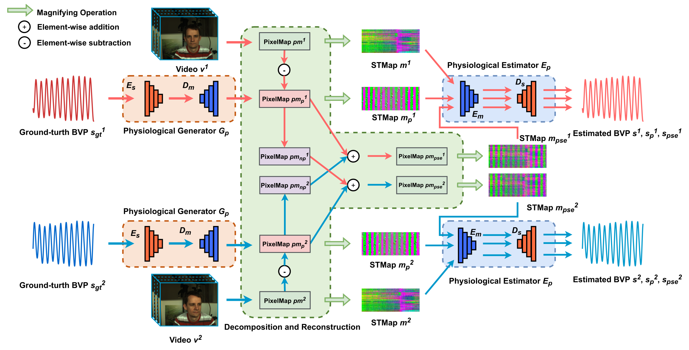
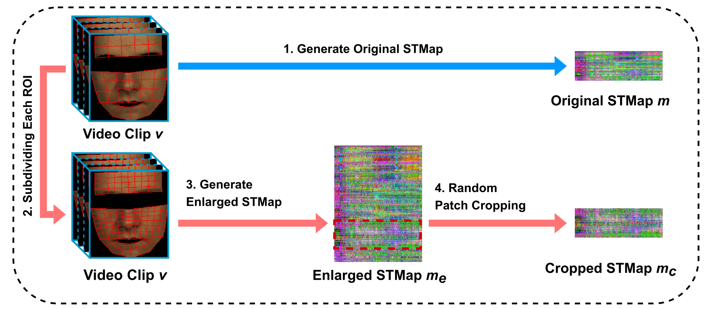
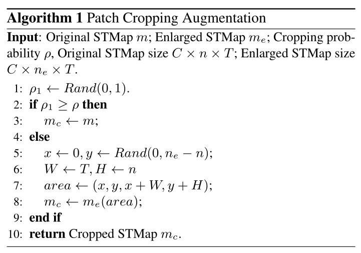
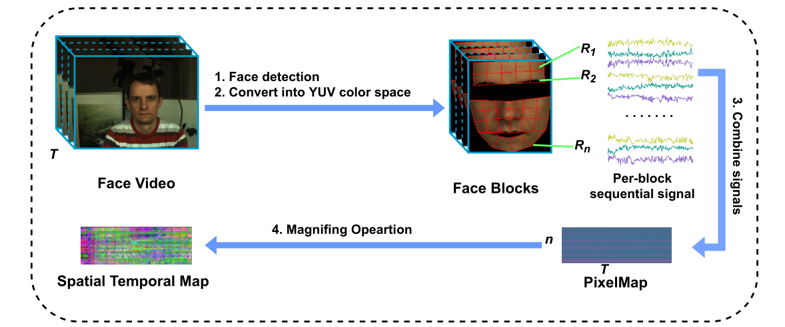
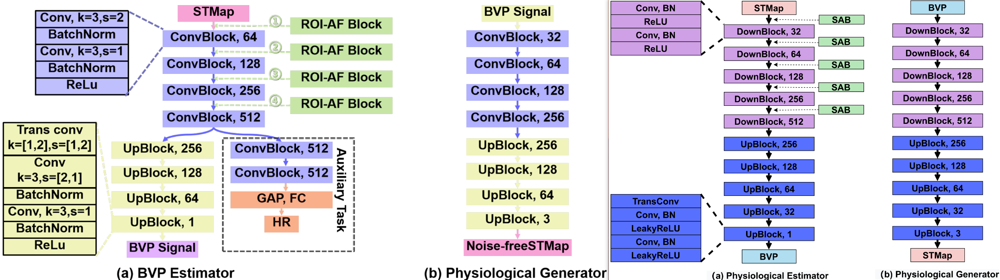
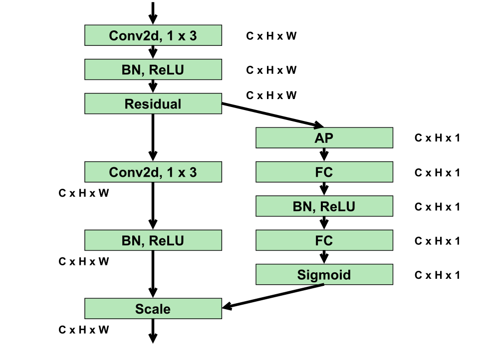
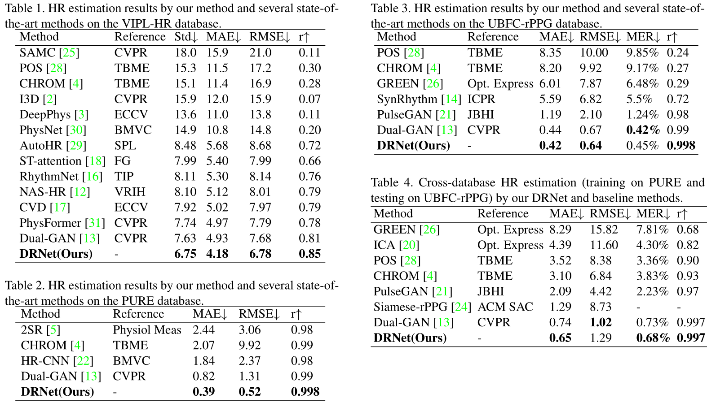
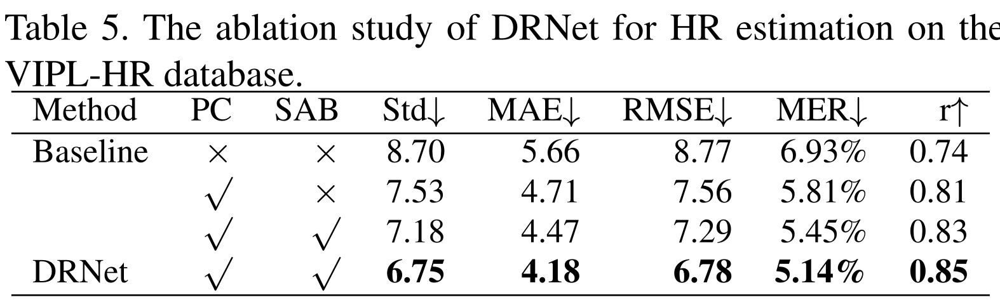

<h2>
 DRNet: Decomposition and Reconstruction Network for Remote Physiological Measurement 
</h2>

【心率监测】【arxiv】【[paper](http://arxiv.org/abs/2206.05687)】【[code未开源]()】

### 摘要

&emsp;&emsp;本文提出了一种非端到端的 bvp 信号估计网络，其基本思想来自 CVD 和 DualGan，可以简要概括为：将生理信号和非生理信号进行分离，并且通过互相组合使 rppg 估计器能够对各种噪声都具备鲁棒性。其整个网络基于两个无法证明的假设：1. STMap 的生理信号和非生理信号是线性组合的，2. 。同时本文提出了一种数据增强策略（仅针对 STMap）、一个即插即用的注意力模块（仅针对 STMap）、一种新的损失函数（并不新），在 VIPL、PURE、UBFC 上基本全指标超了 Dual-GAN，是新的 SOTA，暂未开源。

### 概览

<!-- more -->

----

### 创新

- 提出了一种数据增强方法，专用于 STMap 的增强
- 非生理信号的产生是由对生理信号建模后作差得到的
- 提出了一种即插即用的注意力模块 SAB，可以使 STMap 中生理信号的显著性更高
- 打败了 Dual-GAN，成为了新的 SOTA

### 网络

#### 数据增强

&emsp;&emsp;本文提出的新的数据增强策略名字为 Patch Cropping（PC），目的是合成具备不同噪声水平的新样本。通过上图可以看出来，所谓数据增强，增强的并不是原始视频或者图像，而是生成了新的 STMap，首先简单回顾原始 STMap：将原始 clip 分成 N 个 ROI，每个 ROI 逐帧地 pooling 出一个像素值，得到的 shape 为 CxNxT，其中 C 是 RGB/YUV，N 为 ROI 的个数，T 为帧数。而 PC 具体来说其做法如下：

- 首先将原本的每个 ROI 分成更细的粒度，即将 N 个 ROI 变成 $\rm N\times \gamma\times\gamma$ 个 ROI
- 据此生成的 STMap 的shape 为 CxN'xT，$\rm N'=N\times \gamma\times\gamma$
- 从 $\rm N '$ 中随机裁剪 $\rm N$ 个序列返回，并且用另一个超参 $\rho$ 用来控制是否进行增强的概率
- 具体来说，$\gamma=2,\ \rho=0.5$

&emsp;&emsp;数据增强过程的伪代码如下

#### 前向过程

&emsp;&emsp;首先，这篇论文的网络结构基本接近于 CVD 和 Dual-GAN，借鉴 CVD，本文的训练目的也是解耦合生理信号和非生理信号，区别在于：1. 非生理信号的生成：CVD 通过训练两个自编码器分别预测生理信号和非生理信号，而本文则只预测生理信号，通过全部信号和生理信号作差表示费生理信号，2. 单独信号预测器的工作保证：CVD 采用交叉解耦训练的策略，通过拉进或推离最终的信号距离保证每个 AE 各司其职，而本文因为只训练了生理信号，通过使生理信号具备周期性保证其信号确实为生理信号。至于 Dual-GAN 的借鉴，则主要在于 backbone，一会放个对比图。

&emsp;&emsp;在上图之中提到的 PixelMap，其来源如下图所示，将每个 ROI 提取出的生理信号直接按行排列得到的就是 PixelMap，而那个 Magnifing Operation 操作就是一个最大-最小归一化，也就是说 PixelMap 就是还没有做归一化的 STMap，他们带有的信息没有区别，也没必要刻意区分，这里做这种区分大概只是网络实现过程中发现的 trick。

&emsp;&emsp;接下来详细描述本文的前向过程：

- 网络同时读取两个输入，分别记为 $v^1,\ v^2$，其 GT 分别记为 $s_{gt}^1,\ s_{gt}^2$，对第 $i$ 个输入，分别进行以下过程：
  - 将输入 $v^i$ 生成 PixelMap，记为 $pm^i$
  - 将输入 GT $s_{gt}^2$ 通过生理信号生成器 $G_p$ 生成生理信号时空图 $pm_p^i$
  - 将整体信号时空图减去生理信号时空图得到非生理信号时空图：$pm_{np}^i=pm^i-pm_p^i$
  - 同时将 PixelMap $pm^i,\ pm_p^i$ ，归一化之后生成 STMap，分别记为：$m^i,\ m_p^i$
- 将两个输入的生理信号和非生理信号互相求和得到伪信号，这一步是为了模拟在 $v^1$ 中加入 $v^2$ 的噪声分别生成：
  - $pm_{pse}^1=pm_p^1+pm_{np}^2$，其记录了 $v^1$ 的生理信息
  - $pm_{pse}^2=pm_p^2+pm_{np}^1$，其记录了 $v^2$ 的生理信息
  - 将两个 PixelMap 进行归一化生成 STMap，分别记为：$m_{pse}^1,\ m_{pse}^2$
- 将前两步生成的所有 STMap 进入 rppg 估计器 $E_p$ 分别生成 BVP 预测信号
  - 具体地，对于 $m^i,\ m_p^i,\ m_{pse}^i$ 进入 $E_p$ 之后分别得到信号：$s^i,\ s_p^i,\ s_{pse}^i$

&emsp;&emsp;本文的损失函数限制两个部分，分别是：1. 生成信号和 GT 信号的一致性损失 $\cal L_{phy}$，用于训练 rppg 估计器的准确性和对噪声的鲁棒性 2. 生成的生理信号的周期性损失 $\cal L_{cyc}$，用于督促生成器的有效性。

&emsp;&emsp;其中，$\cal L_{phy}$ 用的是标准负皮尔森系数，$\cal L_{cyc}$ 用的是 AutoHR 的频率损失（其实就是 HR 交叉熵），其具体表达式如下：
$$
\begin{aligned}
&\mathcal L_{phy}=1-\frac{\sum_{t=1}^T(x^i-\bar x)(y^i-\bar y)}{\sqrt{\sum_{t=1}^T(x^i-\bar x)^2}\sqrt{\sum_{t-1}^T(y^i-\bar y)^2}}\\&\mathcal L_{cyc}=\frac 1 c\sum\limits_{i=1}^cCE(PSD(pm_{avg}^i),HR_{gt})
\end{aligned}
$$
&emsp;&emsp;其中，$\bar x,\ \bar y$ 表示 $x,\ y$ 的平均，$c$ 代表 PixelMap $pm$ 的通道数，$pm_{avg}$ 是指随机从 $\rm N$ 中选择多次子序列的平均值。loss 的最终表达式为 $\cal L=L_{phy}+L_{cyc}$，两个损失之中不使用参数进行平衡（估计是测出来 $\lambda=1$ 更合适就直接不写了）

#### backbone

&emsp;&emsp;下图左边是 Dual-GAN 的 backbone，右图是本文的 backbone，相似性无需多言。

&emsp;&emsp;简单来说，基本没有什么变化，本文的 backbone 去除了 Dual-GAN 的辅助任务部分，这是因为 Dual-GAN 希望通过这一部分进行有监督的预训练从而使第二阶段的无监督训练更加快速，而本文没有无监督的部分自然也就没有预训练的需求。

&emsp;&emsp;除此之外，本文相对应 Dual-GAN 的 ROI-AF block，本文也提了一个 SAB，他们做法并不完全一致，具体来说，ROI-AF 是将 STMap 进行 frame-wise 的 1D 卷积，目的是将 BVP 和噪声的分布实现对齐从而有利于估计器分辨出噪声，而 SAB 是通过一系列的 2D 卷积，给每个位置加一个权重，让估计器能够更加容易关注到 STMap 中的生理信号部分。虽然卷积的维度不同，本质上目的是一样的，都是让估计器分辨噪声和生理信号更加容易。

&emsp;&emsp;其中 SAB（Spatial Attention Block）的结构如下图所示，可以看出虽然为了和 Dual-GAN 区分开加入了 2D 卷积，但是两个分支之中右面那个分支仍然是 frame-wise 的子模块结构。

### 结果

&emsp;&emsp;文章结果分为两个部分：1. 数据集内和跨数据集训练与测试，2. 消融研究

- 文章效果

&emsp;&emsp;这里他的效果基本完全超了 Dual-GAN，比 physformer 更好了不少，估计之后引用量不会太少，毕竟是实打实的 SOTA

- 消融实验

&emsp;&emsp;本文的消融实验主要关于两个部分：1. 数据增强策略的有效性，2. SAB 的有效性。可以看出两个模块都是有用的，并且这感觉没这两个小策略，整个网络别说 Dual-GAN 了，连 AutoHR 都打不过。

----

### 启发

&emsp;&emsp;本文算是典范的缝合 SOTA 论文了，网络的整体结构和训练目标来源于 CVD，backbone 的提出和即插即用块的提出来源于 Dual-GAN，损失函数来源于 AutoHR，稍微改了改就成了自己的。文章之中原话说他们提出了一种新的损失 $\cal L_{cyc}$，但是这表达式和 PhysNet、AutoHR 的 $\cal L_{fre}$ 完全一样，这不扯吗，非要说改动就是他随机取值然后算 loss。

&emsp;&emsp;但是这是模板，是榜样，是干活的方向和学习的目标，虽然整个文章的图像风格都和 Dual-GAN 一模一样，损失函数也照抄的 AutoHR，但是确实是 SOTA，不知道能不能中 CVPR。

&emsp;&emsp;特别是他的消融研究指出的，他的 baseline 其实效果相当一般，根本发不出来，正是通过一些模块的调优才达到的 SOTA，这大概也是一个思路，提出一个普通的 baseline 或者直接找一个 backbone，在不影响性能的情况下进行简单的改动以便于讲出不一样的故事，然后加入一些调优模块达到 SOTA 发出文章。

