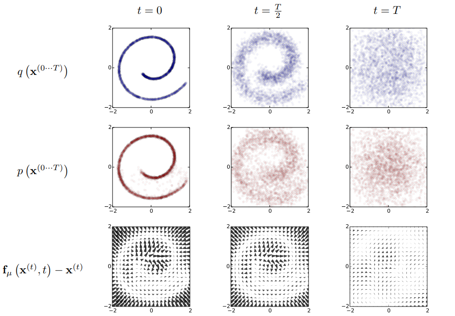

<h2>
 Denoising Diffusion Probabilistic Models 
</h2>

【图像生成】【NIPS2020】【[paper](https://arxiv.org/abs/2006.11239)】【[code](https://github.com/hojonathanho/diffusion)】

### 摘要

&emsp;&emsp;本文将介绍扩散模型（diffusion model）的开山作 DDPM，着重介绍其数学原理，并给出一个简单的实现。简单来看，DDPM 包含两个过程：1.扩散过程，即将原始图像逐步加入高斯噪声最终变成 $\mathcal N(0,I)$ 的过程，此过程无参数；2.逆扩散过程，即通过训练一个神经网络，将从 $\mathcal N(0,I)$ 中采样的 $\epsilon$ 逐层迭代还原至原始输入的过程，此过程含参数。 本质上，DDPM 就是将 VAE 进行了多层的扩展，区别在于：1.扩散过程中无参，2.模型的中间部分与原始输入 shape 保持一致；DDPM 和 VAE 同时都是使用最大似然估计的方式构造损失函数。

### 概览

<!-- more -->

----

### 数学原理

[参考1](https://zhuanlan.zhihu.com/p/525106459) [参考2](https://lilianweng.github.io/posts/2021-07-11-diffusion-models/#forward-diffusion-process) [参考3](https://www.bilibili.com/video/BV1b541197HX/?spm_id_from=333.1007.top_right_bar_window_history.content.click&vd_source=dcb058cda9a9a123a9dfe0dab7ab5116)

#### 前置知识

##### 高斯分布

- 对于分布 $\mathcal N(\mu,\sigma^2)$，其概率密度函数为 $f(x)=\frac{1}{\sqrt{2\pi}\sigma}e^{-\frac{(x-\mu)^2}{2\sigma^2}}$

##### 条件概率 

[参考](https://blog.csdn.net/TonyShengTan/article/details/82814010)

- 对于联合分布 $p(X=x,Y=y)$，我们通常简写为 $p(x,y)$

- 对于 $p(x,y)$，有 $p(x,y)=p(y|x)·p(x)$，即同时取得 $x,y$ 的概率是取得 $x$ 的概率乘以在给定 $x$ 下取得 $y$ 的概率，通常使用变式： $p(y|x)=\frac{p(x,y)}{p(x)}$ 表示 $y\ \ \mathrm {given}\ \  x $ 的概率（即已知 $x$ 求 $y$）

##### 贝叶斯公式 

[参考](https://zhuanlan.zhihu.com/p/134036707)

- 贝叶斯公式主要阐述了更复杂情况下的条件概率
- 通常将 $p(x)$ 称为 $x$ 的先验概率，$p(x|y)$ 称为 $x$ 的后验概率
- 多元时，有 $p(x,y,z) = p(x|y,z)·p(y|z)·p(z)$

##### 马尔科夫过程 

[参考](https://zhuanlan.zhihu.com/p/35124726)

- 马尔科夫过程即每个状态只与前一个状态有关
- 假如推理关系为 $z\to y\to x$，则 $p(x|y,z)=p(x|y)$（因为 $x$ 和 $z$ 之间被认为没有关系）

##### 最大似然估计 

[参考](https://zhuanlan.zhihu.com/p/55791843)

- 所谓最大似然估计，即在 $p(\theta|x)$ 中通过输入 $x$ 解出分布函数参数为 $\theta$ 的可能性大小，是优化神经网络参数的关键，其本质可以理解为：

$$
\mathrm {Find} \ \ \  \theta^*=arg\max\limits_\theta\  p(x|\theta)
$$

- 对于 $p(\theta|x)$ ，在本文中使用 $p_\theta(x)$ 表示，也就是后面说的逆扩散过程的估计函数
- 通常对 $p_\theta(x)$ 的最大似然估计通过计算 $\log p_\theta(x)$ 的最大值得到

##### KL 散度 

[参考](https://zhuanlan.zhihu.com/p/438129018)

- 所谓 KL 散度，使用 $D_{KL}$ 表示，是一个二元运算，其输入为两个分布 $p,\ q$，$D_{KL}(p,q)$ 用于度量 $p,\ q$ 的相似程度，值越小越相似，当值为 0 时分布完全一致

- 对于两个分布 $p,\ q$，通常来说公式可以描述为：

$$
D_{KL}(p,q)=\int p(\log p-\log q)=\mathbb E_p(\log p-\log q)
$$

- 而特殊情况下，若 $p, \ q$ 都是高斯分布，记 $p\sim\mathcal N(\mu_1,\sigma_1^2),\ q\sim\mathcal N(\mu_2,\sigma_2^2)$，此时他们的 KL 散度可以描述为：

$$
D_{KL}(p,q)=\log\frac{\sigma_2}{\sigma_1}+\frac{\sigma_1^2+(\mu_1-\mu_2)^2}{2\sigma_2^2}-\frac 1 2
$$

##### 重参数技巧

- 所谓重参数技巧，指的是当我们需要执行这样的步骤的时候会出现问题：
  - 1.从输入 $x$ 通过网络 $\theta$ 计算一个分布（如正态分布 $\cal N$）的参数（如 $\mu_\theta,\ \sigma_\theta^2$）
  - 2.然后通过在这个正态分布中进行随机采样，将采样后的值输入到网络的下一层
- 这里会出现在 1 之后梯度消失的问题，即回传的 2 中采样的梯度无法进一步回传到 1 中的 $x$ 身上
- 为了解决这个问题，我们不改变步骤 1，但是对于步骤二，我们不直接从 $s\sim\mathcal N(\mu_\theta,\sigma_\theta^2)$ 采样，而是从 $\mathcal N(0,I)$ 中采样 $\epsilon$，再计算 $s=\mu_\theta+\sigma_\theta·\epsilon$，这样可以允许梯度回传到 $x$ 中
- 为了证明 $\mu_\theta+\sigma_\theta·\epsilon\sim\mathcal N(\mu_\theta,\sigma_\theta^2)$，推理过程如下：

$$
\begin{aligned}
&\because \forall X\sim\mathcal N(\mu_1,\sigma_1^2),\ \forall Y\sim\mathcal N(\mu_2,\sigma_2^2) \ \ \ \ \ s.t. \ \ \ \ aX+bY\sim\mathcal N(a\mu_1+b\mu_2,a^2\sigma_1^2+b^2\sigma_2^2)\\
又&\because\mu_\theta\sim\mathcal N(\mu_\theta,0),\ \sigma_\theta\cdot\epsilon\sim\mathcal N(0,\sigma_\theta^2I)\\
&\therefore\mu_\theta+\sigma_\theta·\epsilon\sim\mathcal N(\mu_\theta,\sigma_\theta^2)
\end{aligned}
$$

##### VAE 的优化 

[参考1](http://www.gwylab.com/note-vae.html) [参考2](https://blog.csdn.net/qq_42753940/article/details/124653866) [参考3](https://blog.csdn.net/cjh_jinduoxia/article/details/84995156)

###### VAE 前向

- VAE 的过程描述为：已知图像 $x\sim p(x)$，通过 Encoder 层获得一个隐变量 $z\sim q(z)$，再通过 Decoder 层从 $z$ 中得到 $x$
- 通过 AE 的联合训练获得这样的网络，然后 sample $z$ 之后通过 Decoder 进行生成
- 我们将用于估计 $z$ 分布的函数称为 $\phi$，从 $x$ 中估计 $z$ 分布记为 $q_\phi(z|x)$，同样地，从 $z$ 中估计 $x$ 分布记为 $p_\theta(x|z)$

&emsp;&emsp;上图是李宏毅的 VAE 概述，在这之中没有经过太多的数学推理，而是直接从 NN 的角度给了结论。结论是：

- NN\_Encoder 将输入 input（也就是 $x_i$） 经过网络之后输出均值 $m_i$ 和方差 $\sigma_i^2$

  - 注意：这里的方差并非 VAE 真正的选择，VAE 将其过了个 exp 以保证非负，也就是说 Encoder 输出的分布为 $\mathcal N(m_i,e^{\sigma_i^2})$
- NN\_Decoder 以 $c_i$ 为输入，output（也就是生成的 $x_i$）为输出

  - 其中，$c_i$ 从 $\mathcal N(0,I)$ 中取出的 $e_i$ 进行计算：$c_i=e^{\sigma_i^2}\times e_i+m_i$
- Loss 分为两个部分，分别限制重构损失（类比于普通的 AE），和防止模型走捷径（下节 VAE 优化即证明了为何选择这两个 loss）

$$
\mathcal L_1=\rm MSE(input, output)\tag 1
$$

$$
\mathcal L_2=e^{\sigma^2}-(1+\sigma)+m^2\tag 2
$$

###### VAE 优化目标

&emsp;&emsp;从宏观上看，VAE 的目标是从 $z$ 中生成尽可能和 $x$ 接近的分布，因此在数学上可以转化为 $p_\theta(x|z)$ 的最大似然估计问题。而在解决这个问题的过程中，我们需要引入一个新的分布，也就是 $q$ 分布（此时这个分布还没有参数，只是一个单纯的分布），接下来我们通过化简式子可以发现如何通过优化 $q$ 进而优化 $p$，从而我们尝试预测 $q$，也就给 $q$ 加上了参数 $\phi$。

&emsp;&emsp;其具体化简过程如下：
$$
\begin{aligned}
最大似然估计:\log p_\theta(x)&=\int_zq_\phi(z|x)\log p_\theta(x)，将 \log p_\theta(x) 整体看成一个分布即可得到这一步\\
&=\int_zq_\phi(z|x)\log (\frac{p_\theta(x,z)}{p_\theta(z|x)})，由贝叶斯公式可得\\
&=\int_zq_\phi(z|x)\log (\frac{p_\theta(x,z)·q_\phi(z|x)}{q_\phi(z|x)·p_\theta(z|x)})，构造这一步是为了分理出KL散度\\
&=\int_zq_\phi(z|x)\log \frac{p_\theta(x,z)}{q_\phi(z|x)}+\int_zq_\phi(z|x)\log \frac{q_\phi(z|x)}{p_\theta(z|x)}，这里后面一项就是KL散度\\
&=\int_zq_\phi(z|x)\log \frac{p_\theta(x,z)}{q_\phi(z|x)}+D_{KL}(q_\phi(z|x)||p_\theta(z|x))\\
&\geq\int_zq_\phi(z|x)\log \frac{p_\theta(x,z)}{q_\phi(z|x)}，因为任意的KL散度\geq0
\end{aligned}\tag 3
$$
&emsp;&emsp;因此我们得到了 $\log p_\theta(x)$ 的一个最小值（下界），为了使 $\log p_\theta(x)$ 最大，我们可以最大化这个最小值。接下来继续化简这个下界：
$$
\begin{aligned}
最大化下界:L_{VLB}&=\int_zq_\phi(z|x)\log \frac{p_\theta(x,z)}{q_\phi(z|x)}\\
&=\int_zq_\phi(z|x)\log \frac{p_\theta(x|z)·p_\theta(z)}{q_\phi(z|x)}，为了进一步分离KL散度\\
&=\int_zq_\phi(z|x)\log \frac{p_\theta(z)}{q_\phi(z|x)}+\int_zq_\phi(z|x)\log p_\theta(x|z)，注意前面一项其实是一个KL散度的相反数\\
&=-\underbrace{D_{KL}(q_\phi(z|x)||p_\theta(z))}_{L0}+\underbrace{\int_zq_\phi(z|x)\log p_\theta(x|z)}_{L1}
\end{aligned}\tag 4
$$
&emsp;&emsp;至此，我们发现其实 $L_{VLB}$ 可以由两个子式 $L_0,\ L_1$ 表示，为了最大化 $L_{VLB}$，可以最小化 $L_0$ 同时最大化 $L_1$。而在接下来的过程中，我们就会发现具体来说我们如何根据优化目标写出损失函数。

&emsp;&emsp;在优化 $L_0, \ L_1$ 之前，首先假设：

- 对于 $z$，$z\sim p_\theta(z)= \mathcal N(0,I)$
- 对于 $q_\phi(z|x)$，我们认为 $x$ 中的每一个特定的 $x^i$, 有 $q_\phi(z|x^i)\sim\cal N$
- 记 $J$ 是 $z$ 的维度，因此总共有 $J$ 个点属于标准正态
- 记 $\mu,\ \sigma^2$ 是 $q_\phi(z|x)$ 的方差均值，$\mu_j,\ \sigma_j^2$ 是 $z$ 中第 $j$ 个点的方差均值

&emsp;&emsp;因此 $L_0$ 可以优化为：
$$
\begin{aligned} 
最小化:L_0&=D_{KL}(q_\phi(z|x)||p_\theta(z))\\
&=\int_zq_\phi(z|x)(\log q_\phi(z|x)-\log p_\theta(z))\\
&=\int_zq_\phi(z|x)\cdot\log q_\phi(z|x)-\int_zq_\phi(z|x)\cdot\log p_\theta(z)\\
&=\int_z\mathcal N(z;\mu,\sigma^2)\log \mathcal N(z;\mu, \sigma^2)-\int_z\mathcal N(z;\mu,\sigma^2)\log \mathcal N(0,I)\\
&=(-\frac J 2\log 2\pi - \frac 1 2\sum\limits_{j=1}^J(1+\log \sigma_j^2) )- (-\frac J 2\log 2\pi-\frac 1 2\sum\limits_{j=1}^J(\mu_i^2+\sigma_i^2))\\
&=\frac 1 2\sum\limits_{j=1}^J(\mu_j^2+\sigma_j^2-\log \sigma_j^2-1)
\end{aligned}\tag 5
$$
&emsp;&emsp;对于这里的 $L_0$ 中的 $\mu_j,\ \sigma_j^2$，其实有着一点点的小问题，也就是说这里的 $\sigma_j^2$ 是由网络预测得到的，但是这个值有可能为负数，其实避免也很简单，也就是将所有的 $\sigma_j^2$ 过一个 exp，那么如果将 $\sigma^2\to e^{\sigma^2}$，$L_0$ 将会变成：$L_0=\frac 1 2\sum\limits_{j=1}^J(\mu_j^2+e^{\sigma_j^2}-\sigma_j^2-1)$，接下来进一步去除常数，如果我们再换一下记号 $\mu\to m$，并且将目光从求和聚焦于某一次迭代：最终得到 $L_0^{(j)}=m^2+e^{\sigma^2}-(1+\sigma^2)$，而这正和式 $(2)$ 保持了一致。

&emsp;&emsp;而对于 $L_1$，有
$$
\begin{aligned}
最大化 :L_1&=\int_zq_\phi(z|x)\log p_\theta(x|z)\\
&=\mathbb E_{z\sim q}[\log p_\theta(x|z)]\\
&\simeq \frac 1 L\sum\limits_{l=1}^L\log p_\theta(x^{(i)}|z^{(i,l)})
\end{aligned}\tag 6
$$
&emsp;&emsp;在上式中，最后一步的约等于由蒙特卡罗方法得到，其中 $x^{(i)}$ 是 VAE 的输入，其通过编码器也就是 $q_\phi(z|x)$ 得到一组 $\mu,\sigma$，从而允许我们从正态分布中采样 $L$ 个 $z$，将这些 $z$ 再输入解码器 $p_\theta(x|z)$ 得到新的输出 $p_\theta(x^{(i)}|z^{(i,l)})$，这里的最大似然 $\log p_\theta$ 目的就是让输出 $p_\theta(x^{(i)}|z^{(i,l)})$ 和输入 $x^{(i)}$ 更加接近，实际的操作中使用 MSELoss，因此 $L_1$ 可以重写成 $L_1=\mathrm {MSE}(x^{(i)}，\ p_\theta(x^{(i)}|z^{(i,l)}))$，即式 $(1)$。

&emsp;&emsp;**综上，我们通过最大化似然函数求得了两个优化表示，并且从数学的角度上证明了两个优化表示就对应着在上一小节说明的两个损失函数，为 VAE 的损失提供了理论基础。**

#### 符号假设

- $x_0,\dots,x_T$：从初始状态到标准正态分布的特征图
- $q$：扩散过程得到的分布，此过程不含参数
- $p_\theta$：逆扩散过程得到的分布，$\theta$ 是网络参数
- $\beta_0,\dots,\beta_T$： 常数，实际网络中采用 $\rm 0.0001\to0.02$ 的线性差值
- $\alpha_t$：常数，值为 $\alpha_t=1-\beta_t$
- $\bar \alpha_t$：常数，值为 $\bar \alpha_t=\Pi_{i=1}^t\alpha_i$

#### 扩散过程

- 扩散过程即为从 $x_0$ 逐步推断出 $x_T$ 的过程，其中从 $t-1\to t$ 的过程可以表示为得到分布 $q(x_t|x_{t-1})$
- 由于每一步的结果只和前一步有关，因此可以视为一个马尔科夫过程
- 整个扩散过程没有参数，目的是使最终的 $x_T\sim\mathcal N(0,I)$，而 $x_T$ 的分布可以由 $x_0,\ \beta_{0:T}$ 唯一确定，因此可以通过计算得出具体的 $T$

##### 中间状态的分布表示

- 对于第 $t$ 个状态，其分布表示为 $q(x_t|x_{t-1})$，这个无参过程的表达式为 $(7)$，其意义为：$\mu_t=x_t=\sqrt{1-\beta_t}x_{t-1},\ \sigma_t^2=\beta_tI$

$$
q(x_t|x_{t-1})=\mathcal N(x_t;\sqrt{1-\beta_t}x_{t-1},\beta_tI)\tag 7
$$

- 对于 $0\to T$ 个状态，由马尔科夫过程，可以得出 $q(x_{1:T}|x_0)=\Pi_{t=1}^T q(x_t|x_{t-1})$，这也说明了所有过程的分布都是确定的

##### 任意状态 $t$ 的 $x_t$ 与 $x_0,\ \beta_t$ 的关系

&emsp;&emsp;事实上，任何一个状态的分布 $x_t$ 都可以由 $x_0$ 和 $\beta_{0:t}$ 唯一确定。直觉上是很好理解的，由于扩散过程本质上是一个迭代的过程，而上一小节我们已经给出了 $x_{t-1}\to x_t$ 的递推，我们自然是可以总结出通项公式的，其推导过程如下：
$$
\begin{aligned}
x_t&=\sqrt{1-\beta_t}x_{t-1}+\sqrt{\beta_t}z_1，其中z_1\sim\mathcal N(0,I)，这里用到了式(7)和重参数技巧，尤其注意 \sigma\&\sigma^2\\
&=\sqrt{\alpha_t}x_{t-1}+\sqrt{1-\alpha_t}z_1，这里只是简单的代换，为了接下来运算更方便\\
&=\sqrt{\alpha_t}(\sqrt{\alpha_{t-1}}x_{t-2}+\sqrt{1-\alpha_{t-1}}z_2)+\sqrt{1-\alpha_t}z_1，这里进一步展开 x_{t-1}，其中z_2\sim\mathcal N(0,I)\\
&=\sqrt{\alpha_t\alpha_{t-1}}x_{t-2}+\sqrt{\alpha_t(1-\alpha_{t-1})}z_2+\sqrt{1-\alpha_t}z_1，化简\\
&=\sqrt{\alpha_t\alpha_{t-1}}x_{t-2}+\sqrt{1-\alpha_t\alpha_{t-1}}z_3，不理解请看重参数技巧的最后一步，其中z_3\sim\mathcal N(0,I)\\
&\cdots\cdots\\
&=\sqrt{\bar\alpha_t}x_0+\sqrt{1-\bar \alpha_t}z，着重观察本公式第二、五行，是简单的递推改通项，其中z\sim\mathcal N(0,I)
\end{aligned}\tag 8
$$
&emsp;&emsp;也就是说在网络的实现过程中，我们实际上式不需要逐层迭代来求 $x_t$ 的，而是可以直接根据已知的常数和 $x_0$ 计算得到 $x_t$ 的分布。

##### 为什么最终的 $x_T\sim \mathcal N(0,I)$ 

&emsp;&emsp;由上一小节可以知道，对于最终的 $T$ 状态的分布，证明其在 $T$ 足够大时为标准正态分布：
$$
\begin{aligned}
&\because x_T=\sqrt{\bar\alpha_T}x_0+\sqrt{1-\bar \alpha_T}z，其中x_0\sim q(x_0),\ z\sim\mathcal N(0,I)\\
&\because \bar\alpha_T=\Pi_{i=1}^T\alpha_i,\ \alpha_i=1-\beta_i<1\\
又&\because\beta_1<\cdots<\beta_T\\
&\therefore\alpha_1>\cdots>\alpha_T\\
&\therefore\lim_{T\to\infty}\bar\alpha_T\to0\\
&\therefore\lim_{T\to\infty}x_T\to z\\
&\therefore\lim_{T\to\infty}x_T\sim\mathcal N(0,I)
\end{aligned}
$$
&emsp;&emsp;而在计算的过程中不可能真的算到无穷，因此 $T$ 可以使 $\bar\alpha_t$ 取得一个小数字的时候即可，因而通过我们对“小数字”的认定，就可以算出 $T$。

#### 逆扩散过程

- 逆扩散过程即从标准正态分布采样出 $x_T$，通过预测函数 $p_\theta$ 反推出 $x_0$ 的过程，其从 $x_t\to x_{t-1}$ 的过程表示为 $p_\theta(x_{t-1}|x_t)$
- 同样由于每一步的结果只和前一步有关，因此可以视为一个马尔科夫过程
- 由于逆扩散过程的目标是尽可能还原扩散过程，因此我们可以假设在各个中间状态的特征都满足正态分布
- 整个逆扩散过程的每一步都是由同一个网络 $\theta$ 估计得到的，网络的输入是 $x_t,\ t$，输出是 $x_{t-1}$ 分布的 $\mu,\ \sigma$

##### 中间状态的分布表示

- 对于第 $t-1$ 个状态，其分布表示为 $p_\theta(x_{t-1}|x_t)$，这个过程的表达式为 $(8)$，其意义为：$\mu_{t-1}=x_{t-1}=\mu_\theta(x_t,t),\  \sigma_t^2=\Sigma_\theta$

$$
p_\theta(x_{t-1}|x_{t})=\mathcal N(x_{t-1};\mu_\theta(x_t,t),\Sigma_\theta)\tag 9
$$

- 对于 $T\to 0$ 个状态，由马尔科夫过程，可以得出 $p_\theta(x_{0:T}|x_T)=p_\theta(x_T)\Pi_{t=1}^T p_\theta(x_{t-1}|x_t)$，这也说明了所有过程的分布都是确定的
- 做一个简单的补充说明：$p_\theta(x_t)\sim\mathcal N(0,I)$，以及对于 $\Sigma_\theta$，文中使用常数进行赋值，并不学习 $\sigma_t^2$
  - 对于具体使用哪个常数赋值，本文尝试了：1.$\sigma_t^2=\beta_t$，**2.$\sigma_t^2=\frac{1-\bar\alpha_{t-1}}{1-\bar\alpha_t}\beta_t$**，结果相差无几，1 很好理解，而 **2 接下来会解释**

##### 后验扩散条件概率 $q(x_{t-1}|x_t,x_0)$ 的表示

&emsp;&emsp;我们希望通过 $x_t$ 直接在无参的情况下求得 $x_{t-1}$，但是很难求解 $q(x_{t-1}|x_t)$，不过如果再给我们一个 $x_0$ 直观上就可以实现了，因此我们尝试探索一下 $q(x_{t-1}|x_t,x_0)$，化简这个表达式的目的是直接从 $x_t$ 得到 $x_{t-1}$ 的均值，并且期望通过一个网络就能够预测所有的逆扩散过程，说白了就是写出 $p_\theta(x_{t-1}|x_t)$ 的期望输出用于构造损失。记 $q(x_{t-1}|x_t,x_0)\sim\mathcal N(x_{t-1};\tilde\mu_t(x_t,x_0),\tilde\beta_tI)$，则有：
$$
\begin{aligned}
求解后验概率q(x_{t-1}|x_t,x_0)&=q(x_t|x_{t-1},x_0)\frac{q(x_{t-1}|x_0)}{q(x_t|x_0)}，将分母乘过去，左右均为q(x_t,x_{t-1}|x_0)\\
&=q(x_t|x_{t-1})\frac{q(x_{t-1}|x_0)}{q(x_t|x_0)}，由马尔科夫过程可以去掉x_0\\
&=\mathcal N(x_t;\sqrt{1-\beta_t}x_{t-1},\beta_tI)\cdot\frac{\mathcal N(x_{t-1};\sqrt{\bar\alpha_{t-1}}x_0,(1-\bar\alpha_{t-1})I)}{\mathcal N(x_t;\sqrt{\bar\alpha_t}x_0,(1-\bar\alpha_t)I)}，根据式(7)(8)进行替换\\
&\propto \exp(-\frac 1 2(\frac{(x_t-\sqrt{\alpha_t}x_{t-1})^2}{\beta_t}+\frac{(x_{t-1}-\sqrt{\bar\alpha_{t-1}}x_0)^2}{1-\bar \alpha_{t-1}}-\frac{(x_t-\sqrt{\bar\alpha_t}x_0)^2}{1-\bar \alpha_{t}})，按照高斯分布进行展开后化简即可\\
&=\exp(-\frac 1 2((\underbrace{\frac{\alpha_t}{\beta_t}+\frac{1}{1-\bar\alpha_{t-1}}}_{A})x_{t-1}^2-(\underbrace{\frac{2\sqrt{\alpha_t}}{\beta_t}x_t+\frac{2\sqrt{\bar\alpha_{t-1}}}{1-\bar\alpha_{t-1}}x_0}_B)x_{t-1}+\underbrace{\frac{x_t^2}{\beta_t}+\frac{\bar\alpha_{t-1}}{1-\bar\alpha_{t-1}}-\frac{(x_t-\sqrt{\bar\alpha_t}x_0)^2}{1-\bar \alpha_{t}}}_C))\\
\end{aligned}\tag {10}
$$
&emsp;&emsp;注意到，$\forall a,b,ax^2+bx=a(x+\frac{b}{2a})^2+C$，又由高斯分布概率密度公式，式 $(10)$ 可以描述为 $e^{-\frac 1 2 A(x+\frac{B}{2A})^2}\cdot e^{C'}$， 因此对标高斯分布，可以得出：$\tilde\mu_t=-\frac {B}{2A}, \tilde\sigma_t^2=\frac 1 A$，化简之后为：$\tilde\mu_t=\frac{\sqrt{\alpha_t}(1-\bar\alpha_{t-1})}{1-\bar\alpha_t}x_t+\frac{\sqrt{\bar\alpha_{t-1}}(1-\alpha_t)}{1-\bar\alpha_t}x_0$，$\tilde \beta_t=\frac{1-\bar\alpha_{t-1}}{1-\bar\alpha_t}\cdot\beta_t$。

&emsp;&emsp;对于上面的结果，我们发现 $\tilde\beta_{t}$ 就是个常数，也就对应了之前中间状态小节中的第二个常数的尝试值（加粗处）

&emsp;&emsp;又由式 $(8)$，得到 $x_0=\frac 1 {\sqrt{\bar\alpha_t}}(x_t-\sqrt{1-\bar\alpha_t}z_t)$，带入式 $(10)$，可得最终的化简结果：
$$
\begin{cases}
\tilde\mu_t=\frac 1 {\sqrt{\alpha_t}}(x_t-\frac{\beta_t}{\sqrt{1-\bar\alpha_t}}z_t)\\
\tilde\sigma_t^2=\frac{1-\bar\alpha_{t-1}}{1-\bar\alpha_t}\cdot\beta_t
\end{cases}\tag{11}
$$

##### 最大似然估计目标函数 $p_\theta$ 及优化

&emsp;&emsp;和 VAE 基本保持一致，这里对 $p_\theta$ 的优化也是通过最大似然的方式寻找下界，然后最大化下界并分解为多个优化目标然后给出损失函数。在求解的过程略有不同，VAE 是最大化 $\log p_\theta(x)$，而 DDPM 是最小化 $-\log p_\theta(x)$（其实没啥区别），其具体的优化过程为：
$$
\begin{aligned}
最小化:-\log p_\theta(x_0)&\leq-\log p_\theta(x_0)+D_{KL}(q(x_{1:T}|x_0)||p_\theta(x_{1:T}|x_0))，因为KL散度一定>0\\
&=-\log p_\theta(x_0)+\mathbb E_{x_{1:T}\sim q}[\log \frac{q(x_{1:T}|x_0)}{p_\theta(x_{1:T}|x_0)}]，展开KL散度\\
&=-\log p_\theta(x_0)+\mathbb E_{x_{1:T}\sim q}[\log \frac{q(x_{1:T}|x_0)}{p_\theta(x_{0:T})/p_\theta(x_0)}]，由贝叶斯公式和马尔科夫过程\\
&=-\log p_\theta(x_0)+\mathbb E_{x_{1:T}\sim q}[\log \frac{q(x_{1:T}|x_0)}{p_\theta(x_{0:T})}+\log p_\theta(x_0)]，\log的展开\\
&=\mathbb E_{x_{1:T}\sim q}[\log \frac{q(x_{1:T}|x_0)}{p_\theta(x_{0:T})}]，消项\\
&\leq \mathbb E_{x_{0:T}\sim q}[\log \frac{q(x_{1:T}|x_0)}{p_\theta(x_{0:T})}]:=L_{VLB}
\end{aligned}\tag{12}
$$
&emsp;&emsp;故而我们只需要最小化 $L_{VLB}$ 即可，而对于 $L_{VLB}$，有：
$$
\begin{aligned}
最小化:L_{VLB}&=\mathbb E_{x_{0:T}\sim q}[\log \frac{q(x_{1:T}|x_0)}{p_\theta(x_{0:T})}]\\
&=\mathbb E_{x_{0:T}\sim q}[\log \frac{\Pi_{t=1}^T q(x_{t}|x_{t-1})}{p_\theta(x_T)\Pi_{t=1}^Tp_\theta(x_{t-1}|x_t)}]，由式(7)(8)代入后得到\\
&=\mathbb E_{x_{0:T}\sim q}[-\log p_\theta(x_T)+ \sum_{t=1}^T\log \frac{ q(x_{t}|x_{t-1})}{p_\theta(x_{t-1}|x_t)}]，将\log 内的求积放到外面求和\\
&=\mathbb E_{x_{0:T}\sim q}[-\log p_\theta(x_T)+ \sum_{t=2}^T\log \frac{ q(x_{t}|x_{t-1})}{p_\theta(x_{t-1}|x_t)}+\log \frac{ q(x_1|x_0)}{p_\theta(x_0|x_1)}]，将 t=1的情况拆分出来\\
&=\mathbb E_{x_{0:T}\sim q}[-\log p_\theta(x_T)+ \sum_{t=2}^T\log \frac{ q(x_{t}|x_0)\cdot q(x_{t-1}|x_t,x_0)}{p_\theta(x_{t-1}|x_t)\cdot q(x_{t-1}|x_0)}+\log \frac{ q(x_1|x_0)}{p_\theta(x_0|x_1)}]，贝叶斯公式和马尔科夫过程:q(x_t,x_{t-1}|x_0)\\
&=\mathbb E_{x_{0:T}\sim q}[-\log p_\theta(x_T)+ \sum_{t=2}^T\log \frac{ q(x_{t-1}|x_t,x_0)}{p_\theta(x_{t-1}|x_t)}+\sum_{t=2}^T\log \frac{ q(x_{t}|x_0)}{ q(x_{t-1}|x_0)}+\log \frac{ q(x_1|x_0)}{p_\theta(x_0|x_1)}]，拆分\\
&=\mathbb E_{x_{0:T}\sim q}[-\log p_\theta(x_T)+ \sum_{t=2}^T\log \frac{ q(x_{t-1}|x_t,x_0)}{p_\theta(x_{t-1}|x_t)}+\log \frac{ q(x_{T}|x_0)}{ q(x_{1}|x_0)}+\log \frac{ q(x_1|x_0)}{p_\theta(x_0|x_1)}]，连加拿到外面变成连乘后化简\\
&=\mathbb E_{x_{0:T}\sim q}[-\log p_\theta(x_T)+ \sum_{t=2}^T\log \frac{ q(x_{t-1}|x_t,x_0)}{p_\theta(x_{t-1}|x_t)}+\log  q(x_{T}|x_0)-\log p_\theta(x_0|x_1)]，将分式全部展开后消项\\
&=\mathbb E_{x_{0:T}\sim q}[\log\frac{q(x_{T}|x_0)}{p_\theta(x_T)}+ \sum_{t=2}^T\log \frac{ q(x_{t-1}|x_t,x_0)}{p_\theta(x_{t-1}|x_t)} -\log p_\theta(x_0|x_1)]，将\log  q(x_{T}|x_0)和第一项合并\\
&=\mathbb E_{x_{0:T}\sim q}[\log\frac{q(x_{T}|x_0)}{p_\theta(x_T)}+ \sum_{t=2}^T\log \frac{ q(x_{t-1}|x_t,x_0)}{p_\theta(x_{t-1}|x_t)} +\log \frac {q(x_0|x1,x_0)} {p_\theta(x_0|x_1)}]，因为q(x_0|x1,x_0)=1\\
&=\mathbb E_{x_{0:T}\sim q}[\log\frac{q(x_{T}|x_0)}{p_\theta(x_T)}+ \sum_{t=2}^T\log \frac{ q(x_{t-1}|x_t,x_0)}{p_\theta(x_{t-1}|x_t)}]，合并至一处\\
&=\mathbb  E_{x_{0:T-1}\sim q}[\underbrace{D_{KL}(q(x_{T}|x_0)||p_\theta(x_T))}_{L_0}]+ E_{x_{0,T}\sim q}[\sum_{t=1}^T\underbrace{D_{KL}( q(x_{t-1}|x_t,x_0)||p_\theta(x_{t-1}|x_t))}_{L_t}]，对第一项积 x_T，第二项积x_{1:T-1}
\end{aligned}\tag{13}
$$
&emsp;&emsp;对于 $L_0$，其本质上在任一设置下属于确定的分布，这是因为在逆扩散过程中 $x_T$ 已知，因此 $p_\theta(x_T)$ 无法优化，又因为 $q$ 过程是无参的，因此整个 $L_0$ 部分是不需要优化的，我们只需要优化 $L_t$。

&emsp;&emsp;对于 $L_t$，其在宏观上表示了预测图和扩散过程图的分布一致性，由于我们假设这两个分布都是高斯分布，因此代入高斯分布下的 $KL$ 散度计算公式将会得到一个很复杂的式子，但是式 $(11)$ 注意到我们可以直接用 $\tilde\beta_t\ \mathrm{or}\ \beta_t$ 直接 $\beta_t$ 作为方差，因此其实只需要最小化带有 $\mu$ 的部分，只保留高斯 $KL$ 散度的 $\mu$ 之后的化简结果为
$$
L_t=\mathbb E_q[\frac 1{2\sigma_t^2}||\tilde\mu_t(x_t,x_0)-\mu_\theta(x_t,t)||]\tag{14}
$$
&emsp;&emsp;事实上由式 $(11)$，有 $\tilde\mu_t=\frac 1 {\sqrt{\alpha_t}}(x_t-\frac{\beta_t}{\sqrt{1-\bar\alpha_t}}z_t)$，因此我们对于 $\mu_\theta$ 的优化目标也应该是这个式子，考虑到重参数技巧，我们实际估计的是正态分布 $z_\theta(x_t,t)$，其表达式应当写成
$$
\mu_\theta(x_t,t)=\frac 1 {\sqrt{\alpha_t}}(x_t-\frac{\beta_t}{\sqrt{1-\bar\alpha_t}}z_\theta(x_t,t))\tag{15}
$$
&emsp;&emsp;据此，将式 $(8),\ (11),\ (15)$ 代入式 $(14)$，得出 $L_t$ 的最终优化目标为
$$
\begin{aligned}
L_t&=\mathbb E_z[\frac{\beta_t^2}{2\sigma_t^2\alpha_t(1-\bar\alpha_t)}||z-z_\theta(x_t,t)||^2]，代入式(11),(15)\\
&=\mathbb E_z[\frac{\beta_t^2}{2\sigma_t^2\alpha_t(1-\bar\alpha_t)}||z-z_\theta(\sqrt{\bar\alpha_t}x_0+\sqrt{1-\bar \alpha_t}z,t)||^2]，代入式(8)
\end{aligned}\tag{16}
$$
&emsp;&emsp;丢掉不影响训练的常数，损失函数就可以写为：
$$
L_t=\mathbb E_{x_0,t,z}[||z-z_\theta(\sqrt{\bar\alpha_t}x_0+\sqrt{1-\bar \alpha_t}z,t)||^2]\tag{17}
$$
&emsp;&emsp;其中，$x_0,t$ 均为已知的输入，$z$ 是标准正态分布，直白来说，我们最小化 $L_t$ 的目的就是使逆扩散过程中预测出的中间过程和扩散过程产生的对应过程特征图均值一致，而方差以不学习的方式直接给出。

&emsp;&emsp;至此，我们就推理并证明了 DDPM 选择的损失函数 $L_t$ 的具体表达形式，说白了就是在逆扩散过程之中通过网络 $\theta$ 输入后一时刻的状态图 $x_t$ 和 当前时刻 $t$，期望 $\theta(x_t,t)$ 的输出能够和 $x_{t-1}$ 的均值对齐，并且使用了 $\rm MSELoss$。

### Demo

[参考](https://github.com/azad-academy/denoising-diffusion-model)

/home/chushuyang/research/practice/denoising-diffusion-model/diffusion_model_demo.ipynb
