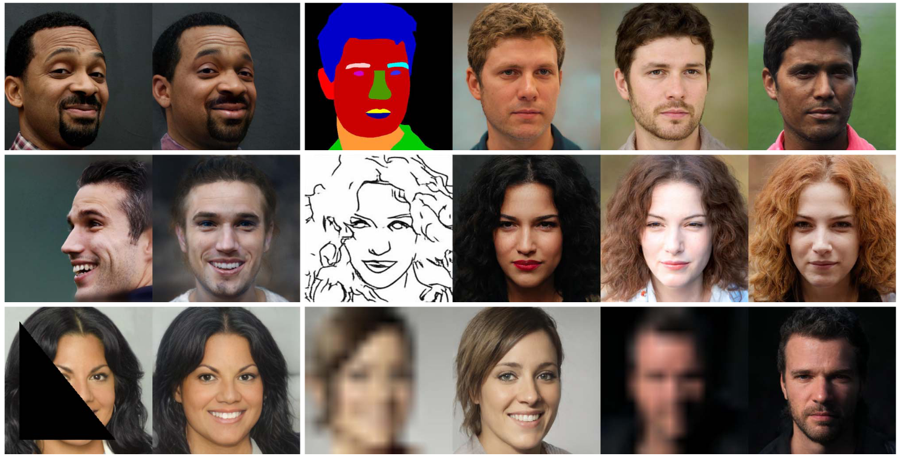
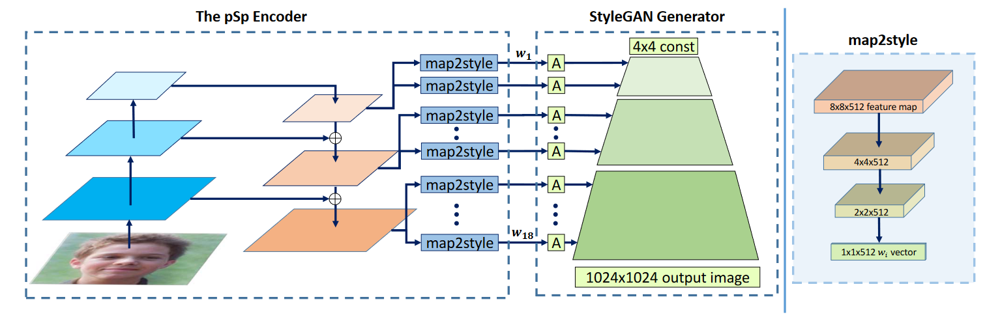

<h2>
 Encoding in Style: a StyleGAN Encoder for Image-to-Image Translation 
</h2>

【图像生成】【CVPR2021】【[paper](https://ieeexplore.ieee.org/document/9578137/)】【[code](https://github.com/eladrich/pixel2style2pixel)】

### 摘要

ds；本文就是大名鼎鼎的 pSp，相比于 image2styleGAN 的逆映射后优化的方式，本文直接提出了一种以 ResNet 为 backbone，以 FPN 为架构的编码器，可以将任意图像通过训练好的编码器映射到隐空间。实现了人脸转向、特征融合、使用素描或分割图生成不同的人脸、人脸补全、人脸条件生成、人脸超分等任务。

### 概览

<!-- more -->

----

### 创新

- 使用基于学习的编码器而不是基于优化的方式进行图像编码
- 一个通用的解决 image2image 的端到端框架

### 网络

ds；pSp 框架基于 StyleGAN 的生成器和其提出的 $\cal W+$ 空间，这个 $\cal W+$ 空间是 styleGAN2 中的一个小改进，相当于把随机生成的 $z$ 向量通过几个随即层映射到了一个可控的 $\cal W+$空间。

ds；但是这里做的不是 GAN，而是图像风格迁移之类的任务，所以需要先将图片映射到 latent space 里，这个 latent space 是一个解耦合的空间，也就是将原本可能特征之间有相关性的矩阵映射为矩阵之间的特征无相关性。最简单的方法就是将图片通过一个 encoder (ResNet,VGG等等) 直接 embedding 到 $\cal W+$空间维度，但是这种方法效果并不够好，无法很好 encoding 原图像的细节。

ds；在 StyleGAN 里，其使用了一个金字塔型的 encoding，从粗到细粒度，框架图如图。按照这种思想，pSp同样提出了一个三层的金字塔特征框架，先通过 ResNet 提取三层 vector，每一层层过一个 map2style 的全连接层之后再过一个全连接层 A 输入到 styleGAN 生成器的各个 style 中去，每一个 style 都有一个 $w$ 。所以最后 pSp 生成的图像是由 styleGAN 预训练好的生成器得到的图片。模型的输出为：
$$
pSp(x):=G(E(x)+\bar w)
$$
ds；其中，$E$ 为 pSp 训练的 encoder，$\bar w$ 则是所有向量的平均，最后过一遍 styleGAN 的生成器 $G$ 。

### 损失

ds；接下来介绍 pSp 的损失函数，这里需要训练的只有 pSp Encoder，其损失函数则为：
$$
\mathcal L(x)=\lambda_1\mathcal L_{construct}(x)+\lambda_2\mathcal L_{LPIPS}(x)+\lambda_3\mathcal L_{ID}(x)+\lambda_4\mathcal L_{reg}(x)
$$
其中

第一个是一个像素级别的L2损失，即目标像素点和训练像素点的均方差。

像素点损失

感知损失，这是CVPR 2018 的一篇 poster提出的一种新的损失函数，这个是F是训出来的，没有直接的定义，整体就是传统的用cosine计算图片之间的相似度在人类眼中结果并不好，例如高斯模糊之后的图像在和原图计算L2损失的时候并没有很相近，但是却丢失了很多的特征信息，所以使用一个训练好的模型来计算两张图片之间的相似度比单纯用cosine等低层次的计算效果好。

感知损失

因为上面用到了，所以计算以下生成的encoding的与w平均的均方差。

计算生成损失

最后就是一个人脸损失，也是在styleGAN上的一个创新点，用预训练好的人脸识别模型计算输入和生成图片的cosine相似度

最后把所有的Loss加在一起就是整个encoder的损失函数了。
$$
math\_express
$$

### 结果

----

### 启发

