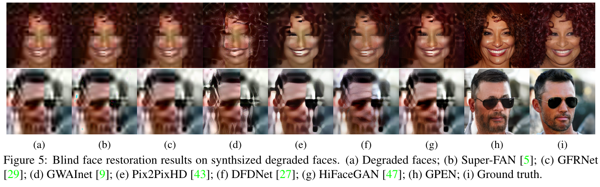
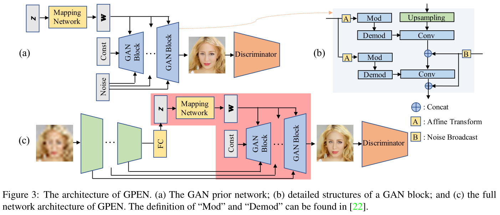
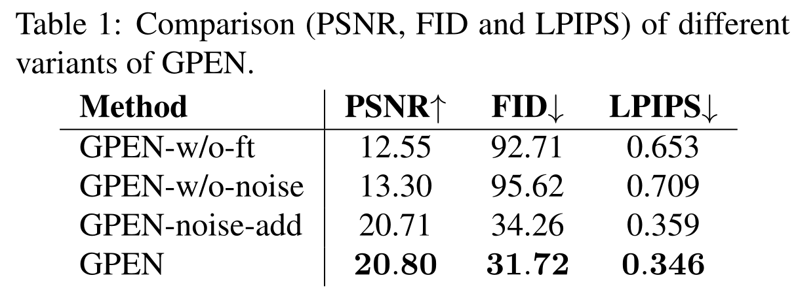
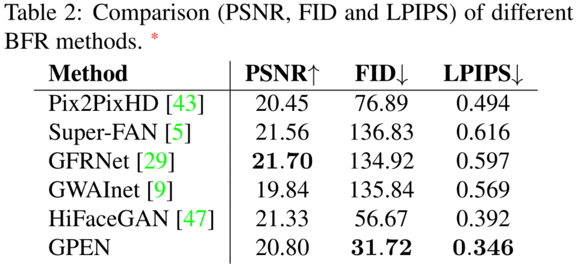
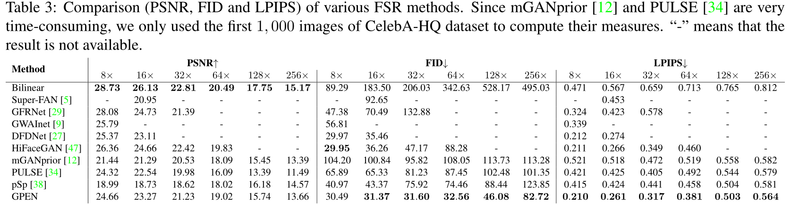
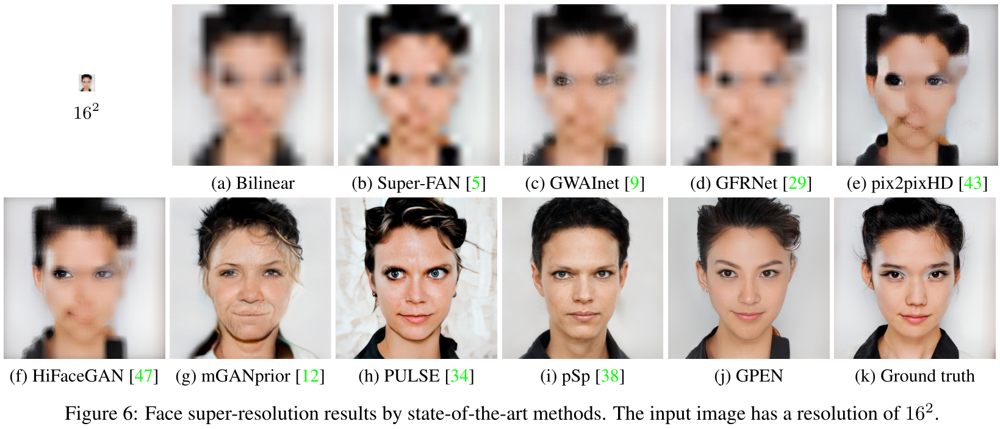
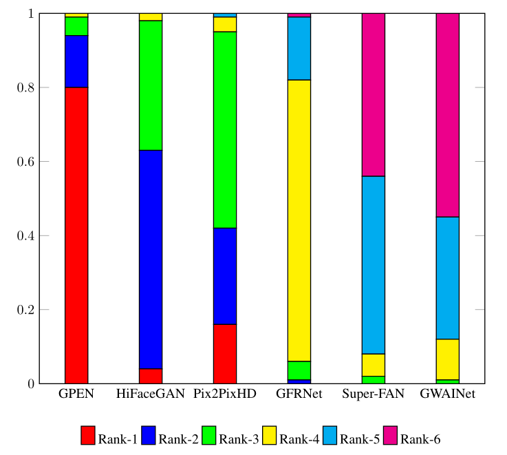

<h2>
 GAN Prior Embedded Network for Blind Face Restoration in the Wild 
</h2>

【盲图重建】【CVPR2021】【[paper](http://arxiv.org/abs/2105.06070)】【[code]( https://github.com/yangxy/GPEN)】

### 摘要

&emsp;&emsp;本文采用了训练好的 styleGAN2 作为先验网络嵌入到重建架构之中，重建架构使用 U-net 网络，对于 Encoder，其在降采样过程中的中间表示被送入对应的 Decoder (styleGAN2) 层作为 noise；其整体的输出作为 $z$ 经由 mapping 映射至 $w$ 输入预训练的 styleGAN2。整个网络架构均进行梯度更新。

### 概览

<!-- more -->

----

### 创新

- 使用可以微调的预训练 styleGAN2 嵌入重建网络
- styleGAN2 的 $z$ 和 noise 分别从 Encoder 的深层和浅层特征中产生，相应地重构图像的全局结构、局部人脸细节和背景

### 网络

&emsp;&emsp;网络分为两个部分，第一部分为上图中 (a) 展示的 styleGAN2 的 backbone，唯一区别之处在于在 (b) 部分中展示的 B(noise) 输入时采用的是 concat 而非原版 styleGAN2 中的 add。

&emsp;&emsp;其中的 Mod 和 Demod 是 styleGAN2 的操作，对于 Mod，其输入除了 A 输出的 $y_i$ 之外还有下面的 Conv 的权重 $w$，其操作即为 $w'=y_i\cdot w$，而对于 Demod，其输入为 $w'$，操作为：$w''=w'/\sqrt{\sum w'^2+\epsilon}$，其等价于 $w''=w'/\sigma_{w'}$，$\epsilon$ 只为了保证分母不为 0。

&emsp;&emsp;训练时首先训练 styleGAN2，使用 HQ 的人脸数据集沿用标准训练方法进行训练，训练得到的 GAN 网络插入 UNet 之中作为 Decoder 部分并使用构造的 LQ-HQ 样本对进行微调，在微调的过程中采用的损失函数由三部分组成，分别为：对抗学习损失 $L_A$，内容重建损失 $L_C$，特征匹配损失 $L_F$，其总表达式为：$L=L_A+\alpha L_C+\beta L_F,\ (\alpha=1,\ \beta=0.02)$，具体表达式为：
$$
\begin{aligned}
&L_A=\min_G\max_DE_{(X)}\log(1+\exp(-D(G\cdot E(\tilde X))))\\
&L_C=||G\cdot E(\tilde X)-X||_1\\
&L_F=\min_GE_{(X)}(\Sigma^T_{i=0}||D^i(X)-D^i(G\cdot E(\tilde X))||_2)
\end{aligned}
$$
&emsp;&emsp;其中，$i$ 表示判别器的第 $i$ 层，$T$ 表示总层数，$X\ ,\tilde X$ 分别表示 HQ 和 LQ 的图像，$\tilde X$ 由如下公式得到：
$$
\tilde X=((X\otimes k)\downarrow_s+n_\sigma)_{JPEG_q}
$$
&emsp;&emsp;其中，$k,\ n_\sigma$ 分别表示模糊核，标准差为 $\sigma$ 的高斯噪声、$\otimes,\ \downarrow_s,\ JPEG_q$ 分别表示二维卷积、标准 $s$ 倍下采样器和压缩质量为 $q$ 的 $JPEG$ 压缩算子。对于每个图像，模糊核 $k$ 是从一组模糊模型中随机选择的，包括具有不同核大小的高斯模糊和运动模糊。其中各个参数范围为：$\sigma\in[0,25],\ q\in[5,50],\ s\in[10, 200]$。

### 结果

&emsp;&emsp;本文的消融实现测试了：不微调 GAN，取消 GAN 的噪声，将噪声按照 GAN 原本的方式进行相加，结果如下图，可以看出噪声级联或者相加其实影响不大，其他的倒是意料之中的产生了较大的影响：

&emsp;&emsp;相比于其他的 BFR(Blind Face Restoration) 的指标：

&emsp;&emsp;相比于其他 FSR(Face Super-Resolution) 的指标和结果可视化：

&emsp;&emsp;本文还提出了一个指标：将不同的算法得到的图像交给真人进行打分：“对从互联网上收集的113幅真实世界的LQ人脸图像的BFR结果以随机顺序呈现给17名志愿者进行主观评价”，并给出了对应的分数直方图：

