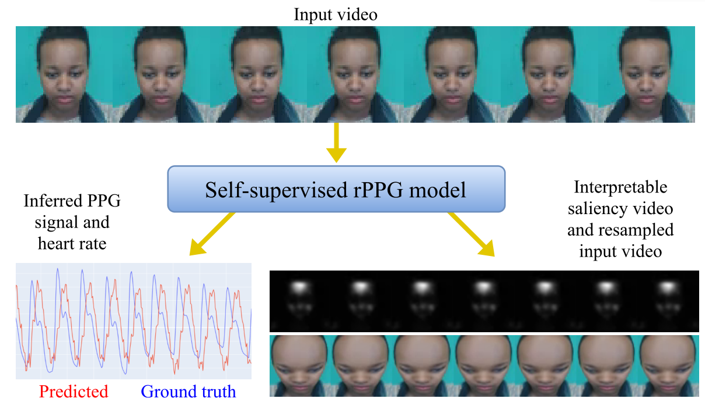
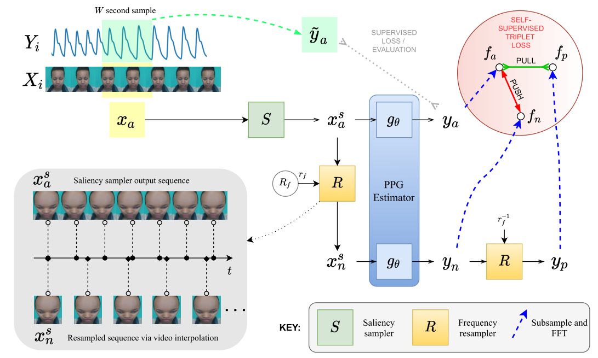
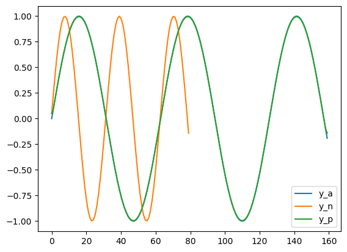
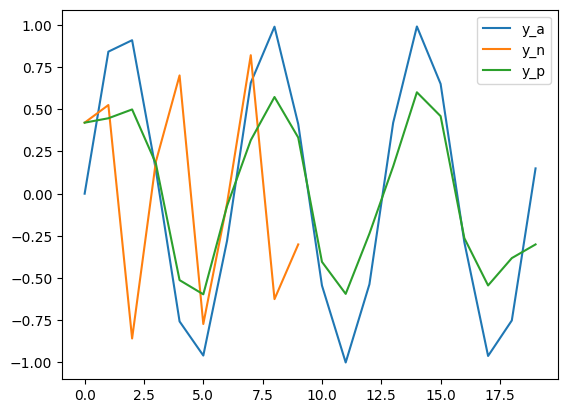
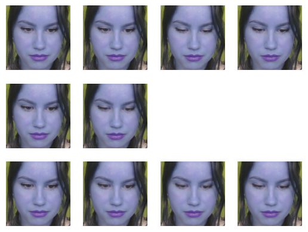
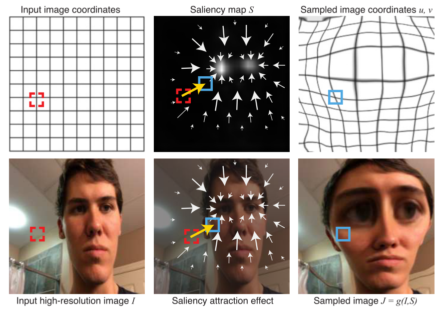
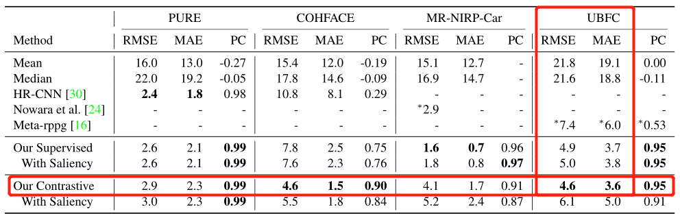
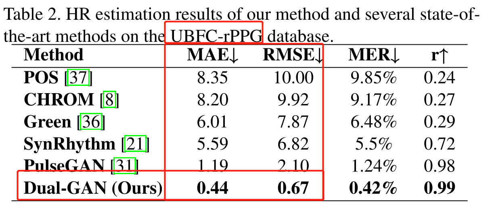

## The Way to my Heart is through Contrastive Learning:Remote Photoplethysmography from Unlabelled Video

【心率检测】【ICCV2021】【[paper](https://openaccess.thecvf.com/content/ICCV2021/papers/Gideon_The_Way_to_My_Heart_Is_Through_Contrastive_Learning_Remote_ICCV_2021_paper.pdf)】【[code](https://github.dev/ToyotaResearchInstitute/RemotePPG)】

### 摘要

&emsp;&emsp;这篇文章为了解决心率检测数据集难以采集的问题提出了一种可能的对比学习方法，并且同时缝合了能够放大 ROI 区域的显著性采样器，取得了一般的结果。实际上，这篇文章对比的 SOTA 都很有年代感，而 CVPR2021 有一篇基于 Dual-GAN 的工作在效果上已经远超这篇文章的结果，甚至是数量级级别的优势。这篇文章的结果甚至放在 20 年都毫无竞争力，基本可以说贡献仅限于某个可行的对比学习框架和一个新 loss。

### 概览



<!-- more -->

----

### 创新

- 缝合了显著性采样器（直觉上有改进，实际上无）
- 提出了一种对比学习的框架（陷入了 MoCo 提出的两种缺陷之一：负样本太少）
- 提出了一种代理任务（通过改变心率频率获得正负样本，理论上仅说得通，但想不到更好的）
- 提出了一种新的 loss 函数 MCC（最大互相关，或许能更好适配 CL）

### 网络



#### 整体框架

&emsp;&emsp;首先通过输入 $X_i$ 进行均匀采样得到 $x_a\to(N,C,D,H,W)$，$x_a$ 通过显著性采样器 $S$ 得到 $x_a^s$，这里的显著性采样器作用就是放大图像的 ROI 区域，输入输出 shape 不变。接着 $x_a^s$ 经过估计器（backbone）$g_\theta$ 得到 $y_a\to(N,1,D,1,1)$，也就是对 $x_a$ 的心率预测结果。

- 监督学习框架

&emsp;&emsp;在监督学习框架下，直接用 $y_a$ 对比 GT，并使用损失函数限制输出估计从而训练 $g_\theta$，对于 backbone 的选择，本文中选择了老熟人 physnet，也就是说这种“监督学习框架”只是把 physnet 加了个显著性采样器，而且效果还不如不加🤦‍♂️

- 对比学习框架

&emsp;&emsp;在对比学习框架下，我们自然需要正负样本，于是对 $x_a^s$ 经过一个频率重采样器 $R$（在代理任务中详细介绍）得到 $x_n^s\to(N,C,[\frac D {r_f}],H,W)$，这里的 $x_n^s$ 即为对显著性采样后的图像进行的频率重采样，此时的视频帧序列长度变少了，具体取决于 $r_f$ 的值，而这个值随机在 $1.25\to1.5$ 之间取得。

&emsp;&emsp;对于已经得到的 $x_n^s$，其经过同一个估计器 $g_\theta$ 得到 $y_n\to(N,1,[\frac D {r_f}],1,1)$ 即为对比学习之中的负样本，这里经过同一个参数的估计器可以保证负样本和预测值的一致性。对于 $y_n$ 再进行重采样变回到原来的频率即可得到 $y_p$（即正样本），虽然这里写的 $R$ 模块是一个由 $r_f$ 参数确定的采样模块，其实就是一个线性插值，甚至获得正负样本的代码里用的还不是一个函数，直接调的 nn.UpSample，还分别调了两次🤦‍♂️

&emsp;&emsp;对于得到的预测值 $y_a$，正样本 $y_p$，负样本 $y_n$，分别经过 rfft 和 fft 得到新的表示 $f_a,f_p,f_n$，然后用一些对比学习的常用函数进行 loss 计算，具体来说包括：IrrelevantPowerRatio、NegativeMaxCrossCov（新）、NegSNRLoss。

#### 代理任务

&emsp;&emsp;这里将详细描述代理任务的正负样本构造过程以及这样做的目的、为什么有效、在何时有效、以及在后处理中为了适配视频帧数目的一些 trick。

- 正负样本构造过程

```python
class FrequencyContrast(nn.Module):
    """ Frequency contrast wrapper around a backbone model e.g. PhysNet
    """
    def __init__(self, args, device, dataset):
        super().__init__()

        self.backbone = init_model(args.contrast_model, args, device, dataset)
        self.upsampler = nn.Upsample(size=(dataset.options.D,), mode='linear', align_corners=False)
        self.get_temp_views = CalculateMultiView(args.mvtl_window_size, args.mvtl_number_views) # 记两个参数分别为 ws, nv

    def forward(self, x_a):
        B = x_a.shape[0]    # 没用上，经典写点废话
        D = x_a.shape[2]
        # x_a shape : (N, C, D, H, W)
        branches = {}   # 这个参数最终返回 anchors, positives, negatives，需要注意的是最后他们的shape都是 (nv, N, ws)

        # Resample input
        freq_factor = 1.25 + (torch.rand(1, device=x_a.device) / 4) # 随机生成频率参数 1.25 ~ 1.5
        target_size = int(D / freq_factor)  # 计算目标频率（即目标帧数量）
        resampler = nn.Upsample(size=(target_size, x_a.shape[3], x_a.shape[4]),
                                mode='trilinear',
                                align_corners=False)    # 使用三线性插值的方式将帧数量调整到目标频率
        x_n = resampler(x_a)    # x_n shape : (N, C, target_size, H, W)
        x_n = F.pad(x_n, (0, 0, 0, 0, 0, D - target_size)) # 将帧数量补齐到目标频率，具体来说，就是在 target_size 之后补0

        # Pass both samples through backbone
        y_a = self.backbone(x_a).squeeze(4).squeeze(3)
        # backbone : PhysNet, (N, C, D, H, W) -> (N, 1, D, 1, 1)
        # y_a shape : (N, 1, D)
        y_n = self.backbone(x_n).squeeze(4).squeeze(3)
        # y_n shape : (N, 1, D) 这里需要注意的是，由于 y_n 是经过了 pad 的，因此在 target_size 之后的结果或许不准确
        # Remove padding from negative branch
        y_n = y_n[:,:,:target_size] # y_n shape : (N, 1, target_size) 正如刚刚说的，这里将 target_size 之后的结果去掉

        # Resample negative PPG to create positive branch
        y_p = self.upsampler(y_n)   # y_p shape : (N, 1, D)，这里使用线性插值的方式将帧数量调整到目标频率

        # Save branches and backbone
        branches['anc'] = y_a.squeeze(1) # anc shape : (N, 1, D) -> (N, D) 这三个都一样
        branches['neg'] = y_n.squeeze(1)
        branches['pos'] = y_p.squeeze(1)

        # Create backbone output
        backbone_out = branches['anc']

        # Sample random views for each branch
        for key, branch in branches.items():
            branches[key] = self.get_temp_views(branch) # 这里的 branch key shape : (nv, N, ws)
            # 具体来说，这个函数从 target_size / D 中随机取 ws 帧，目的是保证序列长度一致
            # 这个操作会进行 nv 次，最终返回的 shape 为 (nv, N, ws)
        
        return backbone_out, branches
```

- 正负样本有效性

&emsp;&emsp;这里的正样本和负样本从视觉上看几乎没有差别，毕竟差不多相当于重新在输入中采样，而 HR 的输入一般都差别较小。区分正负样本的本质是**改变正负样本的心跳频率**，下图展示了为什么重采样会改变预测出的心跳频率。假设对于 GT 进行重采样得到 GTN，GTN 的帧数约为 GT 的 50%，接着再将 GTN 重采样回 GTP。



&emsp;&emsp;这里假设 $y_a$ 是正弦分布，共采样了 160 个点，周期为 64。我们可以看出负样本 $y_n$ 就是频率减小一半的 $ y_a$，至于为什么这个图里面看起来只有两个，是因为 $y_a$ $y_p$ 基本相等，其中 UpSample 方法基本和原论文保持一致，生成代码如下：

```python
# 正负样本分析
D, target_size = 160, 80
y_a = torch.from_numpy(np.sin(np.arange(0, D//10, 0.1))).unsqueeze(0).unsqueeze(0)
#D, target_size = 20, 10
#y_a = torch.from_numpy(np.sin(np.arange(0, D, 1))).unsqueeze(0).unsqueeze(0)
print(f'y_a.shape: {y_a.shape}')
y_n = nn.Upsample(size=(target_size,), mode='linear', align_corners=False)(y_a)
print(f'y_n.shape: {y_n.shape}')
y_p = nn.Upsample(size=(D,), mode='linear', align_corners=False)(y_n)
print(f'y_p.shape: {y_p.shape}')
plt.plot(y_a.squeeze().numpy(), label='y_a')
plt.plot(y_n.squeeze().numpy(), label='y_n')
plt.plot(y_p.squeeze().numpy(), label='y_p')
plt.legend()
plt.show()
```

&emsp;&emsp;但是，如果我们稍微减少 D 和 target_size 的值，也就是使其采样频率大幅度降低，每秒采样数极少的情况下，仍然采用 sin 生成，得到的结果如下：



&emsp;&emsp;可以看出其中正样本和锚点的预测图像也开始变得不同，实际上如果更大的采样间隔会产生更严重的问题，下图展示了实际采用 UBFC 数据集每秒采集三帧然后重采样得到的结果：



&emsp;&emsp;从上至下依次是 $x_a,x_n,x_p$，采用方式和之前对 GT 的采样方式完全一致，代码如下所示。从上图可以看出，$x_a$ 表示了原人脸进行 睁眼-闭眼-睁眼 的过程，而重采样之后的负样本 $x_n$ 仅包含 睁眼-闭眼 两帧，这个其实没问题，毕竟负样本频率就要比锚点频率低的。但是重采样后的正样本虽然帧数和 $x_a$ 一样，也只包含了 睁眼-闭眼 的过程，整个频率预测之后 $x_n,x_p$ 反而保持了一致，这是不可接受的。

```python
# 重采样分析：UBFC
UBFC_data_root = 'put root here'
img1 = torch.tensor(cv2.imread(f'{UBFC_data_root}/subject1/pic/0.png'), dtype=torch.float32).unsqueeze(-1)
img2 = torch.tensor(cv2.imread(f'{UBFC_data_root}/subject1/pic/10.png'), dtype=torch.float32).unsqueeze(-1)
img3 = torch.tensor(cv2.imread(f'{UBFC_data_root}/subject1/pic/20.png'), dtype=torch.float32).unsqueeze(-1)
img4 = torch.tensor(cv2.imread(f'{UBFC_data_root}/subject1/pic/30.png'), dtype=torch.float32).unsqueeze(-1)
img_all = torch.cat((img1, img2, img3, img4), axis=-1)
print(img_all.shape)
x_a = img_all.permute(2,3,1,0).unsqueeze(0)
(B, C, D, H, W) = x_a.shape
freq_factor = 1.25 + (torch.rand(1, ) / 4)
print(freq_factor)
target_size = int(D / freq_factor)
print(target_size)
print(f'x_a.shape: {x_a.shape}')
resampler = nn.Upsample(size=(target_size, x_a.shape[3], x_a.shape[4]),
                                mode='trilinear',
                                align_corners=False)
x_n = resampler(x_a)
print(f'x_n.shape: {x_n.shape}')
unsampler = nn.Upsample(size=(D, x_n.shape[3], x_n.shape[4]),
                                mode='trilinear',
                                align_corners=False)
x_r = unsampler(x_n)
print(f'x_r.shape: {x_r.shape}')
after_inter = x_n[0].permute(1,3,2,0).numpy().astype(np.uint8)
row_img = x_a[0].permute(1,3,2,0).numpy().astype(np.uint8)
re_img = x_r[0].permute(1,3,2,0).numpy().astype(np.uint8)
for i in range(4):
    plt.subplot(3,4,i+1)
    plt.axis('off')
    plt.imshow(row_img[i])
for i in range(2):
    plt.subplot(3,4,i+5)
    plt.axis('off')
    plt.imshow(after_inter[i])
for i in range(4):
    plt.subplot(3,4,i+9)
    plt.axis('off')
    plt.imshow(re_img[i])
```

&emsp;&emsp;因此这种代理任务仅适用于采样频率较高的数据集，若采样频率稍低，可能会产生正负样本都和锚点预测频率不一致的情况。

&emsp;&emsp;❓❓❓这里有个小疑惑：为什么这个代理任务是奏效的❓❓❓通过阅读代码可知，这个网络实际上并没有进行预训练，也没有教师网络，如何保证其训练不会走偏❓（这大概也是对对比学习的疑惑），以及，这里的每个锚点其对应的正样本和负样本的数目是一样的，而 MoCo 认为负样本实际上越多越好，那么这里也给他加上动量更新的 memory bank 是不是会得到更好的结果呢❓

#### 显著性采样器

&emsp;&emsp;显著性采样器来自于 ECCV2018 的这项工作：[Learning to zoom: a saliency-
based sampling layer for neural networks](https://openaccess.thecvf.com/content_ECCV_2018/papers/Adria_Recasens_Learning_to_Zoom_ECCV_2018_paper.pdf)，简单介绍这个工作，这一项工作是针对所有图像处理领域的前置工作，本质上是对不同任务的 ROI 进行放大，在生成放大 ROI 之后的图像时需要经过这两个步骤：1.根据不同的 task_network 获得显著性特征图 Saliency map $S$（其实就是一个注意力图，这是由已经训练好的 task_network 得到的）2.根据特征图进行重采样，并得到新的图像（这里仅使用了图像处理）



&emsp;&emsp;根据生成的显著性图 $S$ 获得每个新像素（红色位置）的采样点（蓝色位置），然后进行采样。

### 损失

&emsp;&emsp;这里提出了一种新的计算 loss 的方法，名字为 maximum cross-correlation (MCC) 最大互相关，这个 loss 对对比学习具备更好的适配，具体来说，其计算公式如下：
$$
\rm MCC=c_{pr}\times Max(\frac{F^{-1}\{BPass(F\{y\}·\overline{F\{\hat y\}})\}}{\sigma_y\times\sigma_{\hat y}})
$$
&emsp;&emsp;这里首先将输出和 GT 分别减去均值以简化运算，分别得到了 $\rm y,\hat y$，接着对 $\rm y, \hat y$ 分别进行快速傅里叶变化 $\rm F$，然后使用输入的 fft 乘以 GT 的 fft 的共轭（即上横线），对得到的结果先通过 $\rm BPass$ 后进行逆快速傅里叶变换 $\rm F^{-1}$，这里的 $\rm BP ass$ 指的是将值位于 $\rm 40-250bpm$ 之外的填充为 0。对于这里得到的结果再除以 $\rm \sigma_y\times\sigma_{\hat y}$，这里的 $\sigma$ 表示标准差，得到结果中的最大值就表示了**理想偏移量处的相关系数**，这个值再乘一个常数 $\rm c_{pr}$（**心跳频率内的功率比**）得到的即是最终的 MCC（此段加粗的地方是原文，没理解意思）。

### 结果

&emsp;&emsp;结果很差，不值一提，举个例子，可见一斑。



&emsp;&emsp;这里展示了是否有监督以及是否使用显著性采样器在 UBFC 数据集上的 RMSE 和 MAE 最好的结果，4.6 / 3.6。同时下图展示了同年发表在 CVPR2021 的论文 Dual-GAN 的结果，为 0.67 / 0.44。



&emsp;&emsp;其他的一些结果我都不乐意展示，他们这篇论文刻意避开了一些更常用的数据集，并且很多数据集没选择的理由几乎没有解释（详见本文 Table. 2），并且在比较结果的时候仅比较了 HR-CNN，是一篇 2018 年的工作，经典鸵鸟比较法了属于是。

&emsp;&emsp;不过不管怎么说，自监督还是牛的，至少拉平了 physnet 的结果，如果选用更好的 backbone 是不是会更好呢？以及采用更加合理的对比学习框架是不是会更好呢？

----

### 启发

&emsp;&emsp;究极缝合：为了解决负样本不足的问题，可以将其余数据采样之后的负样本进入队列存储，但是这样或许会导致网络学到捷径，为了解决这个问题，可以加入教师网络进行知识蒸馏，以及为了得到更好的结果可以尝试更换 backbone。

&emsp;&emsp;更好的代理任务一定是可行的，但是对于心率检测，代理任务还提出的相当少，或许需要大量的假设和尝试，简单的方法就是迁移已有的代理任务，多多实验尝试。

