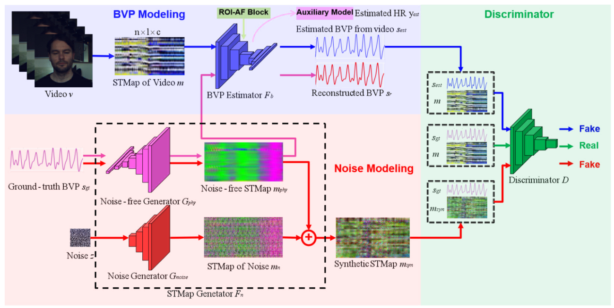
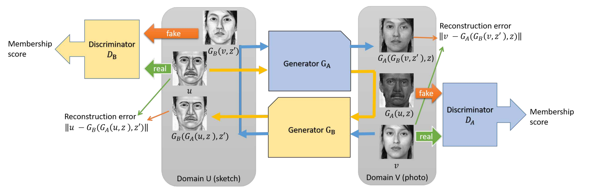
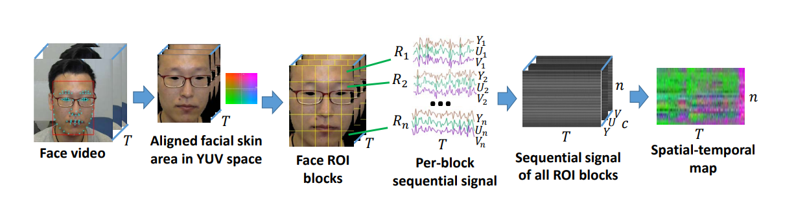
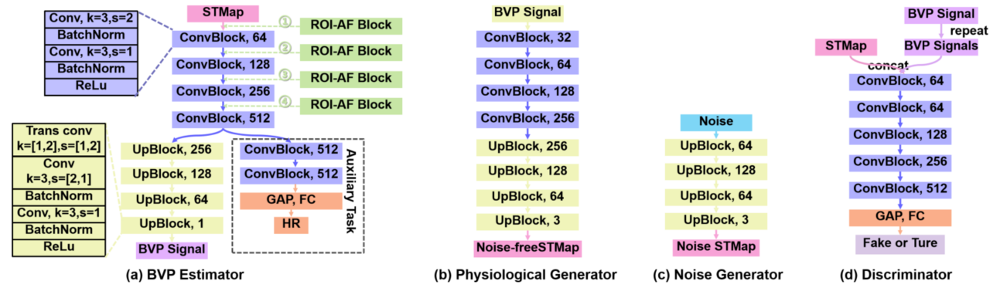
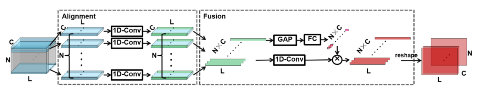
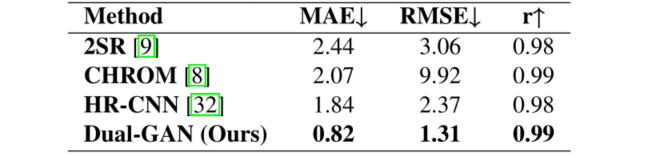
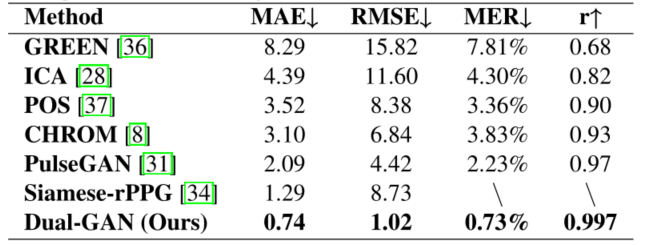
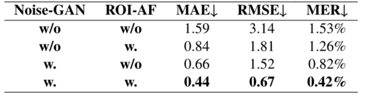

## Dual-GAN: Joint BVP and Noise Modeling for Remote PhysiologicalMeasurement

【心率检测】【CVPR2021】【[paper](https://openaccess.thecvf.com/content/CVPR2021/papers/Lu_Dual-GAN_Joint_BVP_and_Noise_Modeling_for_Remote_Physiological_Measurement_CVPR_2021_paper.pdf)】【[code未开源]()】

### 摘要

&emsp;&emsp;本文提出了一种基于对偶 GAN 的心率预测网络，同时提出了一种解决不同 ROI 之间的噪声和 BVP 分布不一致的问题的即插即用块。并且本文网络的贡献除了效果非常好之外，对于噪声更加鲁棒。除此之外，该网络结构并不是纯 Dual-GAN，而是由三个生成器和一个判别器组成的网络，用到了回归的方式进行训练，并非无监督训练，并且全部的 G/D 基于 CNN，网络只需要在 1080Ti 上训练 10 个 epoch 即可收敛。可以说唯一的缺点是还没开源了😭

### 概览

<!-- more -->

----

### 创新

- 基于 Dual-GAN 的预测网络
- 调整不同 ROI 之间噪声，BVP 分布不同的即插即用块
- 集合了噪声生成器，增强了对环境噪音的鲁棒性

### 网络

#### 前置知识

- [Dual-GAN](https://openaccess.thecvf.com/content_ICCV_2017/papers/Yi_DualGAN_Unsupervised_Dual_ICCV_2017_paper.pdf)

&emsp;&emsp;Dual-GAN 即对偶 GAN，是一篇发表于 ICCV2017 的文章，其通过对偶学习的方式提出了一种在两种具备同样语义信息之间的图像的转化方式。Dual-GAN 的网络结构如下图所示：

&emsp;&emsp;其网络的目的是训练处两个生成器，$G_A$ 可以将素描转化为照片，$G_B$ 可以将照片转化为素描。训练的方式是使分先后顺序通过 $G_A,G_B$ 的图像分布更接近原图。简单解释这个意思：现在我们有素描的数据集和照片的数据集，把一张照片通过 $G_B$ 之后会变成素描图，这时候我们训练 $D_B$ 进行判别，强迫生成的素描图更真实。到这里和普通的 GAN 没区别，只是把 sample 的数据改成了照片。但是 Dual-GAN 还要求对于生成的素描图再通过 $G_A$ 变回去之后和原图分布一致。

&emsp;&emsp;这种 GAN 适用于输出和输入都为强语义信息的数据，对于原本需要建立 label 对应的数据现在就可以进行无监督的训练了。

- STMap

&emsp;&emsp;生成 STMap 的方式有很多，上图是其中一种方式，多项工作均显示了使用 STMap 代替原始输入能够得到更好的结果。简单来说，STMap 就是去除背景，仅保留 ROI 区域的图，然后将 ROI 图划分W为多个小块，每个小块划分为 YUV 三通道并拉平成 3D 序列，再将对应位置 YUV 通道的不同帧求平均。

#### 前向过程

&emsp;&emsp;正如概览中的图像，网络由多个子模块组成，首先详细解释概览图中每一项表示的具体含义：

&emsp;&emsp;$Video\ v$ 表示原始输入视频，$m$ 表示由 $v$ 提取出的 STMap，其维度为 nx1xc。$F_b$ 表示心率/BVP估计器，是整个网络的核心，其输出最终被作为心率检测的结果。$s_{est}$ 表示 $m$ 通过 $F_b$ 的输出 BVP，$y_{est}$ 表示输出的心率。

&emsp;&emsp;$s_{gt}$ 表示心率的 GT，$G_{phy}$ 表示通过真实心率生成不含有噪音的 STMap，输出即为 $m_{phy}$。$Z$ 为高斯随机产生的噪声，$G_{noise}$ 表示通过 $Z$ 生成随机噪声 STMap $m_n$ 的生成器。 其中，$m_{phy}\bigoplus m_n=m_{syn}$ 表示含有噪声但从 GT 生成的 STMap。$m_{phy}$ 经过 $F_b$ 之后输出为 $s_r$ 作为重建 BVP，回想 $s_r$ 的重建过程，由 $s_{gt}\to G_{phy}\to F_b\to s_r$，这个过程即为对偶学习。

&emsp;&emsp;最后的判别器 $D$ 输入为 $s$ 和 $m$ 的组合，包括：1.从输入视频中得到的 STMap 和 预测出的心率，2.从输入视频中得到的 STMap 和 GT心率，3.含有噪声的 STMap 和 GT心率。其中 $D$ 认为 2 为真实，其余为虚假，以此训练。

&emsp;&emsp;该文章提出了很多的损失函数，共包括：

- 为了辅助回归训练的损失函数：

$$
\zeta_p=1-PCor(s_{est},s_{gt})\tag 1
$$

$$
\zeta_{fre}=CE(PSD(s_{est},o_{gt}))\tag 2
$$

$$
\zeta_{phy}=\lambda_1||y_{est}-y_{gt}||_1+\lambda_2\zeta_p+\lambda_3+\zeta_{fre}\tag 3
$$

&emsp;&emsp;其中 $PCor$ 表示皮尔森相关性，$CE$ 表示交叉熵，$PSD$ 表示功率谱密度。公式 $(2)$ 中的 $o_{gt}$ 表示将心率的 GT $y_{gt}$ 表示为 one-hot 向量（详见原文公式 P5.Eq2）。公式 $(1),(2)$ 用于评估预测结果的质量，整体来说使用公式 $(3)$ 进行回归训练限制预测值和 GT 保持一致。

- 为了训练判别器的损失函数：

$$
\mathop{max}\limits_{D} \mathop{min}\limits_{F_b,G_{noise}} \zeta_{joint}=log(D(s_{gt},m))-log(D(s_{est},m))-log(D(s_{gt},m_{syn}))\tag 4
$$

&emsp;&emsp;这个式子很简单且直观，就是要让 $D$ 将之前说的输入 2 判断为真，将输入 1 3 判断为假。

- 为了训练 Dual-GAN 的损失函数：

$$
\zeta_r=1-PCor(s_r,s_{gt})\tag 5
$$

&emsp;&emsp;这个式子是为了限制 $s_{gt}=F_b(G_{phy}(s_{gt}))$，即限制生成器和估计器都完成各自的工作。

&emsp;&emsp;网络的训练方式大致分以下四个步骤循环进行：

- 使用公式 $(3)$ 训练估计器 $F_b$（回归训练，仅训练 $F_b$）
- 锁定 $F_b$，使用公式 $(5)$ 训练生成器 $G_{phy}$（对偶学习训练）
- 锁定 $G_{phy},D$，使用公式 $(4)$ 训练 $F_b$ 和 $G_{noise}$（相当于普通的 GAN 中 G 的训练）
- 锁定其他所有网络，使用公式 $(4)$ 训练 $D$（相当于普通的 GAN 中 D 的训练）

#### 组件架构

- $F_b,\ G_{phy},\ G_{noise}, \ D$

&emsp;&emsp;这个网络架构是纯 CNN 架构，看着这些 block 已经基本可以复现论文的网络了，但是可惜的是还没有开源。

- ROI-AF

&emsp;&emsp;将 STMap 按行分割，每行进行 1D-Conv，通过这种方式处理 BVP 和噪声分布差异以实现特征对齐。然后将对齐的特征根据通道和一维卷积连接起来。使用通道注意模型（即全局平均池化（GAP）后跟两个线性层（FC））来获得融合特征图。最后，融合的特征图被 reshape 成它的原始尺寸。

### 结果

- PURE 数据集训练，PURE 数据集测试，优于部分方法（有些方法没有展示，比如 Siamese-rPPG 在 PURE 上的效果为 MAE-RMSE = 0.51-1.56）

- PURE 数据集训练，UBFC 数据集测试，优于绝大多数方法

- 消融实验：1.Noise-GAN（增强对噪音的鲁棒性）2.ROI-AF（增强 BVP 信号和噪音的分布一致性）

