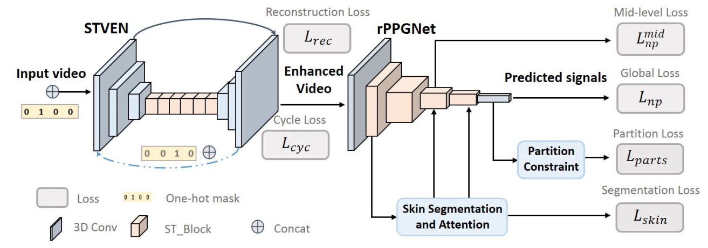
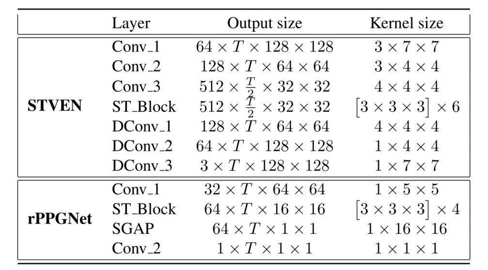
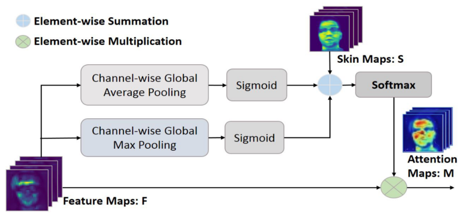
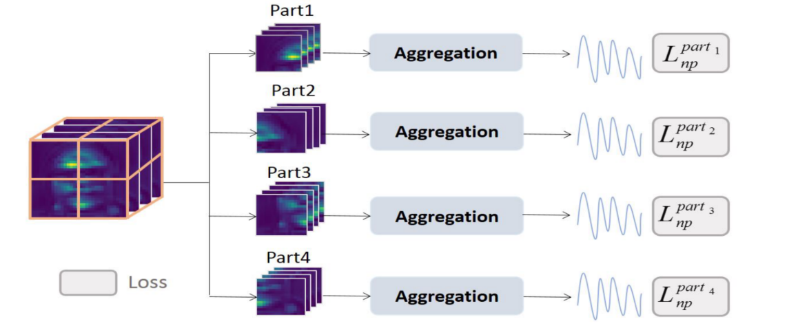
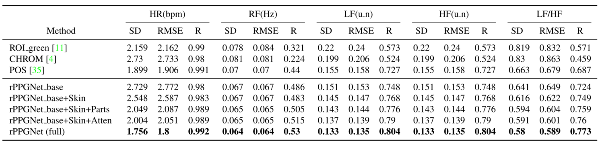
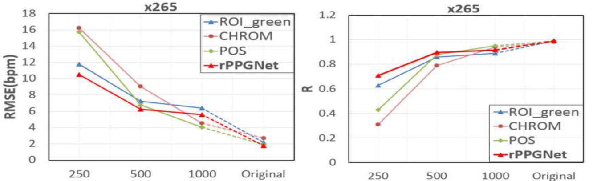
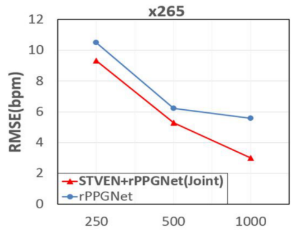

<h2>
Remote Heart Rate Measurement from Highly Compressed Facial Videos: an End-to-end Deep Learning Solution with Video Enhancement
</h2>

【心率检测】【ICCV2019】【[paper](https://openaccess.thecvf.com/content_ICCV_2019/papers/Yu_Remote_Heart_Rate_Measurement_From_Highly_Compressed_Facial_Videos_An_ICCV_2019_paper.pdf)】【[code](https://github.com/ZitongYu/STVEN_rPPGNet)】

### 摘要

&emsp;&emsp;本文提出了一种可以加强压缩视频的网络 STVEN 和一个更有效的 rPPG 信号估计网络 rPPGNet，总共探索了包括 x264/AVC，x265/HEVC，MPEG4 三种传统压缩算法，整体的网络结构可以接受压缩后的视频并且获得在同等输入条件下相对于其他网络结构的最优解。

### 概览

<!-- more -->

----

### 创新

- 一个可以增强视频质量的网络 STVEN，相比于其余的增强/去噪网络对 HR 更有效
- 一个更加有效的 rPPG 信号估计网络 rPPGNet，其具备复杂的约束条件
- 一个在 rPPGNet 中用于计算注意力图的无参数模块
- 第一次实际意义上探索了使用压缩视频作为输入的网络结构

### 网络

&emsp;&emsp;整体的网络结构正如概览图所示，整体来说分为 STVEN 和 rPPGNet 两个子模块，其一负责加强视频质量，其二负责从视频输入中重建 rPPG 信号。具体来说，这两个子模块都是基于 CNN 的架构，参数分别如下图所示，其中的 ST\_Block 是 R(2+1)D 的结构，SGAP 是空间 Global Average Pooling 的缩写。在训练的过程中，两个子模块进行联合训练。

#### STVEN

&emsp;&emsp;STVEN 是一个 video-2-video 的网络结构，在此工作的预想下可以从一些特定的比特率下压缩的视频还原出 GT，并且具备尽可能好的 HR 语义信息。整个 STVEN 的网络基于一个未证明的假设：在不同的比特率下的压缩图像的数据分布不同，而同一个比特率下数据分布较为一致。首先介绍一些符号表示：

- 压缩后的视频序列为 $\C=[0,1,2,...,C]$，其中 $0,C$ 分别表示多种压缩率下的最低和最高比特率

- 对于某一个比特率下的视频，记为 $c_k^\tau=[c_{k1},c_{k2},...,c_{k\tau}]$，其中 $k\in\C$，$\tau$ 表示视频的帧数
- 对于 STVEN，记为 $G$，其接受两个输入，包括：$c_i^{\tau}$ 和 $k$，即长度为 $\tau$ 的压缩率为 $i$ 的视频和数字 $k$。输出为 根据 $c_i^\tau$ 更改其数据分布得到的新的压缩率为 $k$ 的视频，表示为 $\hat c_k^\tau=[\hat c_{k1},...,\hat c_{k\tau}]$

&emsp;&emsp;在训练的过程中我们主要希望 $G$ 函数能够达到两个优化目标：1.良好的重建性，2.循环处理不变性。为了达到良好的重建性，本文选取了两个指标进行约束，分别是 MSE 和 L1 损失。因此 loss 写为：
$$
\rm \mathcal L_{rec} = E_{k\in\C,t}||c_0^\tau(t)-G(c_k^\tau,0)(t)||_2^2+E_{k\in\C,t}||c_k^\tau(t)-G(c_0^\tau,k)(t)||
$$
&emsp;&emsp;其中 $t\in [1,\tau]$ 表示该视频的第几个帧，至于为什么 loss 形式不一样，作者简单说了一下，估计就是效果不好吧，毕竟 L1 L2 应该都是基于像素级别的损失。

&emsp;&emsp;为了达到良好的循环处理不变性，也就是过两次 $G$ 之后仍然保持一致，loss 描述为：
$$
\rm \mathcal L_{cyc}=E_{k\in\C,t}||c_k^\tau(t)-G(G(c_k^\tau,0),k)(t)|| + E_{k\in\C,t}||c_0^\tau(t)-G(G(c_0^\tau,k),0)(t)||
$$
&emsp;&emsp;两个 loss 的组合可以表示为：
$$
\rm \mathcal L_{STVEN}=\mathcal L_{rec}+ \mathcal L_{cyc}
$$
&emsp;&emsp;通过这样的约束条件训练出的 STVEN 支持将任何比特率的视频压缩/解压缩到任何比特率，尤其对于低比特率的视频可以通过解压缩的方式实现数据增强。但是局限性是明显的：参与训练的数据的压缩算法是传统且局限的，目前基于深度学习的表征压缩数据大概并不服从同一分布。

#### rPPGNet

&emsp;&emsp;rPPGNet 由三个部分组成：时空卷积网络，基于皮肤的注意力模块，分阶段的约束模块。

&emsp;&emsp;对于时空卷积网络，其本身是基于 R(2+1)D 的 3D CNN 网络，具体参数在之前已经展示，像概览图中所示，其本身是一个逐步降采样的过程。需要注意的是，这里的目的是从 ECG 信号中恢复 rPPG 信号，由于两个信号只需要具备同样的峰值而不需要具备同样的值，因此采用负皮尔森相关系数作为 loss，描述为：
$$
\rm \mathcal L_{np}=1-\frac{T\mathop\sum\limits_{i=1}^T y_iy_i^g-\mathop\sum\limits_{i=1}^Ty_i\mathop\sum\limits_{i=1}^Ty_i^g}{\sqrt{(T\mathop\sum\limits_{i=1}^Ty_i^2-(\mathop\sum\limits_{i=1}^Ty_i)^2)(T\mathop\sum\limits_{i=1}^T(y_i^g)^2-(\mathop\sum\limits_{i=1}^Ty_i^g)^2)}}
$$
&emsp;&emsp;同时，本文将在时空卷积网络的中间层（第三个 ST\_Block）的输出单独拿出来，希望这个图也能和 ECG 信号保持线性一致性，因此对于第一个模块，loss 描述为下式，其中 $\alpha,\beta$ 用于平衡两部分的重要性，$\beta$ 要小一些。
$$
\rm \mathcal L_{rPPG}=\alpha\mathcal L_{np}+\beta\mathcal L_{np}^{mid}
$$
&emsp;&emsp;对于基于皮肤的注意力模块，其是一个没有参数的计算模块，具体计算方式如下图所示，这个模块理论上是即插即用的模块，但是在本文中仅在第一个 ST\_Block 后加入了这个模块（代码里面写的有点乱没看懂，主要问题在于论文里面已经说了这个模块是无参数的，但是在代码之中和 skin 相关的代码里面居然有 conv：答案：基于皮肤的注意力中，皮肤分割是有参数的，注意力是没参数的），最后这个模块选择使用交叉熵函数作为 loss，论文中没有给出公式，但是根据代码看起来是这样：$\rm \mathcal L_{skin}=CB(M,M^{GT})$，其中 $\rm M=Softmax(\sigma(AvgPool(F))+\sigma(MaxPool(F))+S)$，$F\,,S$ 在下图中给出。

&emsp;&emsp;对于分区的约束模块，将整个模型最后输出的 skin 图像分为四个部分如下图所示，对于每个部分经过 AVGPool 和一个 conv3d 可以得到输出，这些输出表示每个部分预测出的 rPPG 信号，这些 rPPG 信号也需要和 ECG 信号具备同样的线性一致性，因此也使用负皮尔森相关性 loss：$\rm \mathcal L_{parts}=\mathop\sum\limits_{i=1}^N\mathcal L_{np}^{part_i}$

&emsp;&emsp;总的来说，对于 rPPGNet，其 loss 描述为：
$$
\rm \mathcal L_{rPPGNet}=\mathcal L_{rPPG} + \gamma\mathcal L_{skin}+\delta\mathcal L_{parts}
$$
&emsp;&emsp;为了两个模块的联合训练，本文又引入了一个联合训练的感知损失 $\mathcal L_p$，真给我整破防了，这也太长了，代码开源也就开了一半，这么复杂的限制和损失居然是有效的？

### 结果

&emsp;&emsp;消融实验如下图所示，从下图可以看出每一部分都是有必要的，并且这些小模块可以结合在一起得到更好的效果。需要注意的是这里仅展示了 rPPGNet，没有 STVEN 部分。

&emsp;&emsp;和其他方法对压缩视频的效果对比，论文包含 x264,x265,MPEG 三种压缩方法，这里只展示 x265 的：

&emsp;&emsp;通过这张图大致可以看出本文的网络是具备一定效果的，需要注意的是这里仅展示了 rPPGNet，没有 STVEN 部分，但是也就那样，没比其他的好了多少。

&emsp;&emsp;接下来接上 STVEN 之后和仅有 rPPGNet 单独做了对比实验，实验结果如下图所示，可以看出加上 STVEN 之后是多少有提点的，提点的效果并不是比特率越高越明显，因为他还做了一个 MPEG 的实验，平均提点大约 2。（但是其实随便找一个自动压缩视频的网站对视频进行上传再下载，他肯定掉点，现在各大网站的压缩算法都是自己做的，不再用 HEVC 了）

