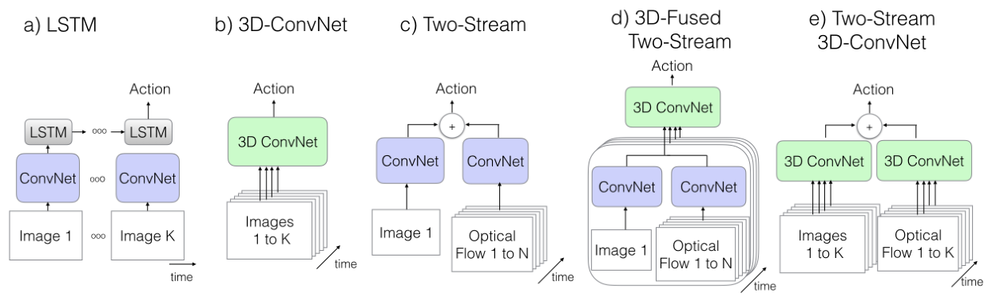
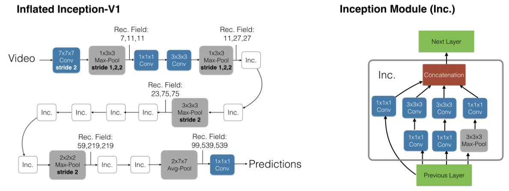
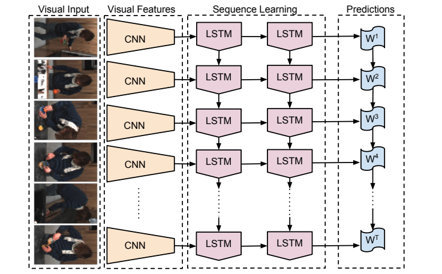
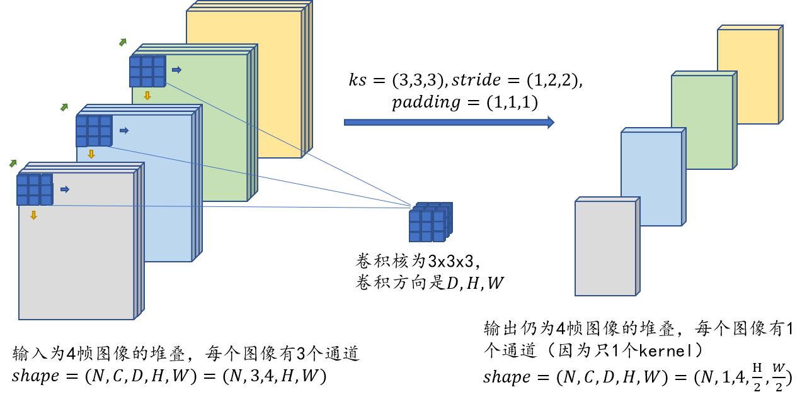
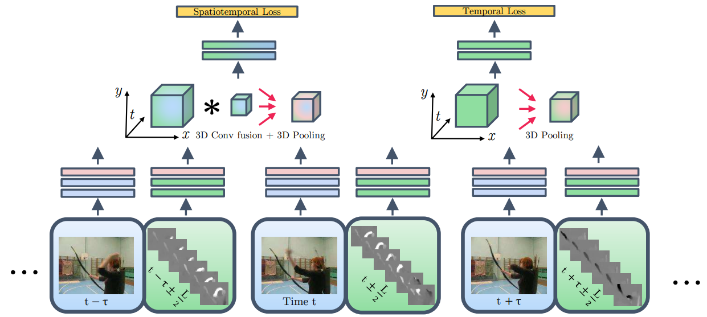

## [Quo Vadis, Action Recognition? A New Model and the Kinetics Dataset](https://openaccess.thecvf.com/content_cvpr_2017/papers/Carreira_Quo_Vadis_Action_CVPR_2017_paper.pdf) 【视频动作识别】 CVPR2017

### 摘要

&emsp;&emsp;本文提出了一种新的视频理解网络结构，和一个新的数据集。这两个都是里程碑式的工作，对于新网络架构，其名字叫做“膨胀的3D网络”，方法简单有效，仅是将 2D 卷积核进行 3D 膨胀，相对于以往的训练 3D 卷积核，关键就在于先训练 2D 网络，再在不改变权重的情况下进行扩张后进行微调。新的数据集也十分有效，大小适合，范围多样，是视频理解领域新工作绕不开的测试数据集。

### 概览



<!-- more -->

----

### 创新

- 提出了一种基于 2D 网络预训练得到的参数膨胀到 3D 的方法
- 提出了一个可用的视频领域经典数据集
- 保留了光流的预提取，结合了 3D 卷积核和光流预提取

### 网络



&emsp;&emsp;这篇论文本质上是一个框架性质的论文，并没有提出自己的 backbone，而是结合旧有的网络结构进行扩展和计算，这里选取的网络是 inception，因为这个时候 inception 在视频领域表现还不错，不过很快 ResNet 就在视频领域也占据主导地位了，因此之后作者又选取 ResNet 做了一下。这些都无关紧要，仅作为例子讲解如何进行 inflate 操作。

#### 旧有视频理解网络结构

##### 2DCNN + LSTM/RNN



&emsp;&emsp;这一类的网络通用方法是使用一个 2DCNN 网络进行逐帧的特征抽取，然后在抽取完成的特征上接入一个 LSTM/RNN，从而学习到时序信息。但是在之后的实践中我们发展这种方式得到的结果显著地不如使用光流这种手工特征进行时间建模，因此目前大致在逐渐废弃这种基于 2DCNN+LSTM，但是不排除使用 transformer 代替某一个小结构或者干脆把 CNN 和 LSTM 都换成 transformer 之后效果会变好，甚至成为 SOTA。 

##### 3DCNN

&emsp;&emsp;对于 3DCNN，关键就是理解如何进行 3D 卷积，为了更好地理解 3D 卷积过程，接下来从代码和可视化的方向分别表示：

- 代码（pytorch）

```python
#--------------------------------------conv2D------------------------------------------#
layer_2d = nn.Conv2d(3, 8, 3, 1, 1)
data_2d = torch.randn(1, 3, 3, 3)
print(layer_2d(data_2d).shape)
#data2d(N, C, H, W)
#layer2d(C_out, C_in, kernel_size, stride, padding)
#output(N, C_out, H_out = (H + 2*padding - kernel_size + 1)/stride, W_out = (W + 2*padding - kernel_size + 1)/stride)
#output.shape = (1, 8, 3, 3)
#--------------------------------------conv3D------------------------------------------#
layer_3d = nn.Conv3d(3, 8, 3, 1, 1)
data_3d = torch.randn(1, 3, 10, 128, 128)
print(layer_3d(data_3d).shape)
#data3d(N, C, D, H, W)
'''
注意：这里的D, H, W是指输入数据的维度，即视频的帧数，高度，宽度
例如，输入的视频是每10帧进行堆叠，每帧是128*128的图片，图片的通道数为3，那么输入数据的维度就是(N, 3, 10, 128, 128)
'''
#layer3d(C_out, C_in, kernel_size, stride, padding)
'''
注意：这里的kernel_size, stride, padding是指3D卷积核的大小，步长，填充，此时他们可以是一个元组分别指代每一个维度，也可以是一个数字代表每个维度都一致
例如，kernel_size = (3, 3, 3), stride = (1, 1, 1), padding = (1, 1, 2)
一般情况下，我们不在D维度上进行下采样，因为视频帧本就难以完整描述一个动作
'''
#output.shape = (1, 8, 10, 128, 128)
```

- 图像



&emsp;&emsp;虽然 3DCNN 在一定程度上对时间序列的信息抽取能力超过了堆叠帧的 2DCNN，但是有两个缺点导致一直不温不火，实际上直到本文 I3D 提出之前，基本没有能和 SOTA 一战的任何 3DCNN 网络。这两个缺点分别是：1.3DCNN 的参数太多，相对与 2DCNN 模型要大很多倍，并且由于参数多导致不容易收敛以及效果一般。2.3DCNN 对时间序列信息的抽取能力仍然比不过光流输入的 2DCNN。

##### two-stream 2DCNN

&emsp;&emsp;[这里已经有了详细的描述。](https://bnucsy.github.io/Two_stream_CNN/)

##### 3D fused two-stream



&emsp;&emsp;这种网络的思路也非常简单，但是其实和 I3D 在某些程度上已经近似了，这种网络将之前先计算出特征然后融合的 late fusion 改成了先融合经过 3DCNN 头再输出，即变成了 early fusion。 这其实确实解决了问题，对于 3DCNN 的参数量大难以循环的问题，因为这个网络里只有 3DCNN 的头，较少的参数使得其训练并不困难，模型大小也没有太大。除此之外这种网络结构也使用了光流，没有因为使用 3DCNN 而造成时间序列信息的欠学习。说白了，只有一点不太行，就是结果不好，当然 I3D 的提出巧夺天工，但是 3DCNN fusion 的提出也不能说活该被埋没，纯粹是谁效果好谁就是更好的算法，单从结构上实在很难判断孰优孰劣。

#### 本文具体网络架构

&emsp;&emsp;本文的网络很简单，基本采用的就是双流网络，只不过把双流网络的两个子网络都换成 3DCNN。照理说这样会陷入一个问题：太多的参数导致难以训练。但是 I3D 提出了一个巧妙的构想：我们不从头训练 3DCNN，而是训练一个和双流网络一样的 2DCNN，再将其中的所有 2 维的卷积核和池化层全部变成 3 维。这样我们得到了参数已经初始化好的 3DCNN，然后我们在数据集上做微调即可。 

&emsp;&emsp;这个思路简单明了，接下来我们主要探究如何进行 2D 扩张。作者给了一个简单的想法，对于一个 NxN 的 2D 卷积层，首先把所有的单张帧进行 N 次复制粘贴得到一个 N 帧相同图片的视频，然后将 2D 的卷积核也进行 N 次复制粘贴，得到 NxNxN 的 3D 卷积核，每个卷积核和对应的图片帧进行卷积运算，这样得到 N 个相同的值，接下来就可以直接输入下一层，对于 pooling 层也是这样，复制 N 份，然后逐层 pooling。以此为基础得到的最终结果是 N 份的旧网络结果，将这个结果取平均，理论上效果应该和旧网络的结果一模一样。以此就可以初始化 3D 网络，再进行微调即可。

