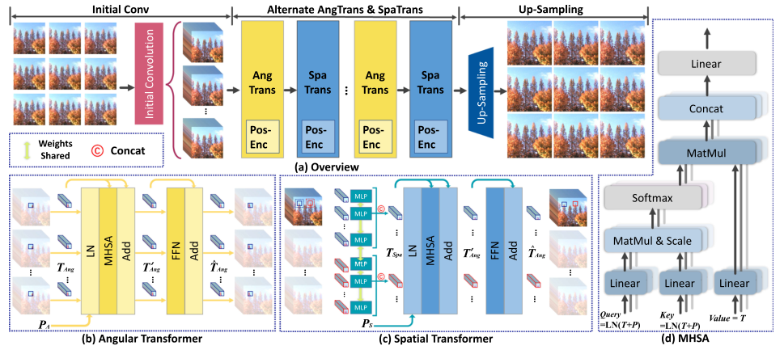

## [Light Field Image Super-Resolution With Transformers](https://ieeexplore.ieee.org/stamp/stamp.jsp?tp=&arnumber=9695363)【光场超分】【SLP】

### 摘要

&emsp;&emsp;本文将transformer方法应用到了光场超分的领域，提出了一个简单且有效的baseline，相对于SOTA具有更小的计算代价和更优的效果。具体来说，提出了角度转换和空间转换两个模块，意图更好地学习不同视图之间的互补性。

### 概览

<!-- more -->

----

### 创新

### 理论

### 网络

### 损失

$$
math\_express
$$

### 结果

----

### 启发

