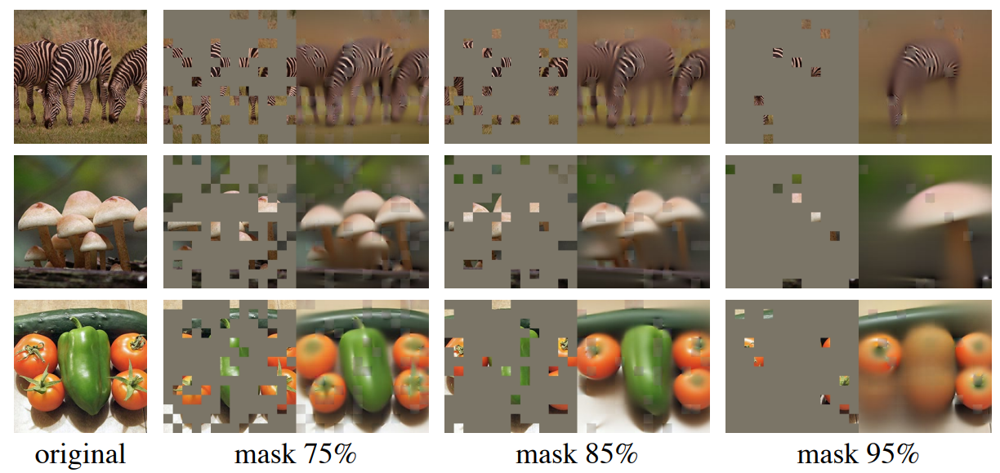
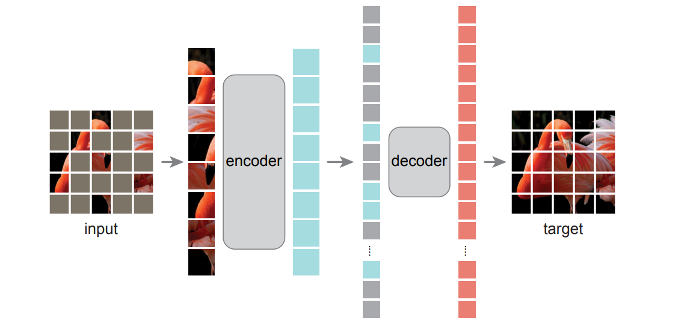
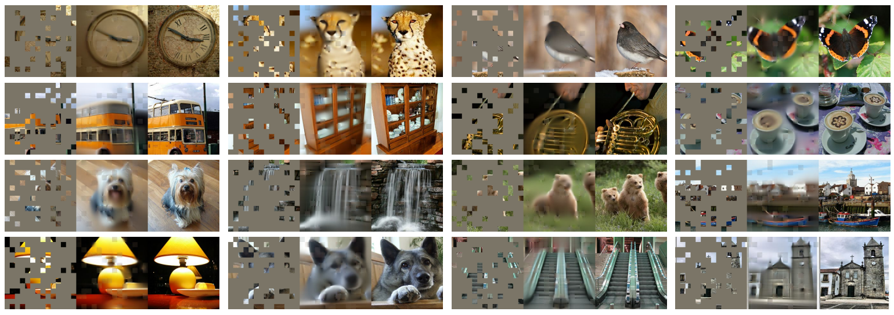
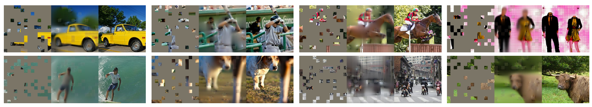

## [Masked Autoencoders Are Scalable Vision Learners](url) 【图像分类、语义分割、目标检测】 CVPR2022

### 摘要

&emsp;&emsp;在 transformer 成功迁移到 CV 之后（VIT，swinTransformer），bert 等自监督训练的模型的迁移也开始被关注，虽然在 VIT 论文的末尾作者已经讨论了相关的可能性，但是 VIT 当时并不看好这种自监督的训练。这篇 MAE 大胆地进行了自监督训练图像的尝试，MAE 以一种非常简单的策略：遮挡某些 patch 后输入 VIT 得到隐空间表征，再通过另一个 VIT 解码全部图像，从而使 AE 学会表征语义信息。这是非常常见的 AE 训练策略，但是 MAE 做了 75% 以上的遮挡，构建了非常困难的任务场景，却得到了远超预期的结果。

### 概览



<!-- more -->

----

### 创新

- 借鉴 bert，采用自监督的训练方式训练 transformer
- 对于 encoder，被遮挡的 patch 并不输入，这保证了在复杂度一定的情况下 encoder 可以更深
- 对于隐空间的向量，没有 mask 的向量将由同一个 0 向量表示，该向量可以训练
- 对于 encoder 和 decoder，两次加入位置编码（这里虽然和其他 transformer 不一样，但是没做消融实验）

### 网络



&emsp;&emsp;这篇论文的具体网络架构实在没啥好说的，就连代码也就 200 多行，不过由于这种简单的架构，我们在记录时基本可以把训练时的所有 trick 都试着看一看。这并非是不重要的，由于 VIT 在结尾也尝试了这种自监督的训练却没有好的结果，这种 bert 的迁移模型也有 BEiT 等工作，但偏偏 MAE 以非常简单的策略比其他的效果都要好，我认为一些超参数的设定，包括位置编码、某些变量的随机初始化分布，encoder 和 decoder 的层深，loss 的计算等细节部分可能对文章贡献更大。[源代码见此](https://github.dev/facebookresearch/mae/blob/main/models_mae.py)。

---

#### 初始化网络结构及参数初始化

&emsp;&emsp;这一部分关注与 encoder/decoder 及 encoder 之前的预处理部分，decoder 之前的预处理部分，包括如何打 patch，如何进行 random mask，以及 encoder/decoder 的一些参数。这里不多讨论具体 AE 做了什么，主要还是探讨一些初始化层。

&emsp;&emsp;首先是打 patch，这一部分和 VIT 完全没有任何区别，就是 VIT-base 的翻版，甚至直接 import 了 VIT 的实现，将 224x224 的图像打成多个 16x16 的 patch。

```python
self.patch_embed = PatchEmbed(img_size, patch_size, in_chans, embed_dim)
num_patches = self.patch_embed.num_patches
```

&emsp;&emsp;然后 MAE 做了一个 mask 操作，具体的操作之后再说，总之在 mask 之后，原本 196x1024 的输入现在变成了 49x1024。接下来 MAE 完全按照 bert 来，也加了一个 CLS，然后加入 position embedding。具体来说，embedding 之后的维度为 1024，同时 pos 并非可学习的，而是直接采用 consin 编码方式，这一点和原始 transformer 一致。CLS 并非全零 tensor，而是服从 (0,0.2) 的正态分布。对于 decoder，也是同样的位置编码方式和反 embedding。

```python
#———————————————————————————encoder————————————————————————————
self.cls_token = nn.Parameter(torch.zeros(1, 1, embed_dim))
self.pos_embed = nn.Parameter(torch.zeros(1, num_patches + 1, embed_dim), requires_grad=False)  # fixed sin-cos embedding
pos_embed = get_2d_sincos_pos_embed(self.pos_embed.shape[-1], int(self.patch_embed.num_patches**.5), cls_token=True)
self.pos_embed.data.copy_(torch.from_numpy(pos_embed).float().unsqueeze(0))
#———————————————————————————decoder————————————————————————————
decoder_pos_embed = get_2d_sincos_pos_embed(self.decoder_pos_embed.shape[-1], int(self.patch_embed.num_patches**.5), cls_token=True)
self.decoder_pos_embed.data.copy_(torch.from_numpy(decoder_pos_embed).float().unsqueeze(0))
```

&emsp;&emsp;在这之后， MAE 选择了和 VIT 一致的 encoder，深度为 24，自注意力头数为 16，MLP 隐层维度为 4x1024，接受 token 维度为 1024。这样就可以输入 encoder 然后得到 50x1024 的输出了。对于和 VIT encoder 结构一致的 decoder，深度为 8，自注意力头数为 16，MLP 隐层维度为 4x512，接受输入的 token 维度为 512。【论文里多次强调，这是一个非对称结构的自编码器，然而实际上这里的非对称并非体现在框架算法上，更多的是 transformer 的层数和维度的大小】

```python
# MAE encoder specifics
self.blocks = nn.ModuleList([
        Block(embed_dim, num_heads, mlp_ratio, qkv_bias=True, qk_scale=None, norm_layer=norm_layer)
        for i in range(depth)])
# MAE decoder specifics
self.mask_token = nn.Parameter(torch.zeros(1, 1, decoder_embed_dim))
self.decoder_blocks = nn.ModuleList([
        Block(decoder_embed_dim, decoder_num_heads, mlp_ratio, qkv_bias=True, qk_scale=None, norm_layer=norm_layer)
        for i in range(decoder_depth)])
```

#### encoder

&emsp;&emsp;在上面已经讨论过的一些模块的基础上，我们可以快速梳理 encoder 的前向过程，具体的过程直接在代码中注释说明

```python
def forward_encoder(self, x, mask_ratio):
    # embed patches
    x = self.patch_embed(x)	#将图像切分成多个小 patch【196x256】

    # add pos embed w/o cls token
    x = x + self.pos_embed[:, 1:, :]	#在得到的 patch 中加入 cos-sin 位置编码【196x256】

    # masking: length -> length * mask_ratio
    x, mask, ids_restore = self.random_masking(x, mask_ratio)	#进行 mask，实际上是进行 shuffle 之后取前 75%，返回 mask 和下标【49x256】

    # append cls token
    cls_token = self.cls_token + self.pos_embed[:, :1, :]	#加入 CLS，并和 x 连接起来【50x256】
    cls_tokens = cls_token.expand(x.shape[0], -1, -1)
    x = torch.cat((cls_tokens, x), dim=1)

    # apply Transformer blocks
    for blk in self.blocks:	#进入 encoder，经过 embedding 和 transformer block 等过程【50x1024】
        x = blk(x)
    x = self.norm(x)	#标准LayerNorm
```

&emsp;&emsp;在上述代码中我们仅有一处一笔带过，即 mask，接下来我们详细分析 mask 函数

```python
def random_masking(self, x, mask_ratio):
    # mask_ratio 即为遮挡的比例，默认值 0.75，即剩余 1/4
    """
    Perform per-sample random masking by per-sample shuffling.
    Per-sample shuffling is done by argsort random noise.
    x: [N, L, D], sequence
    """
    N, L, D = x.shape  # batch, length, dim
    len_keep = int(L * (1 - mask_ratio))	#mask 之后的长度，对于原本的输入 224，得到的是 224 * (1 - 0.75) = 49
    
    noise = torch.rand(N, L, device=x.device)  # noise in [0, 1] 生成一定的噪音
    
    # sort noise for each sample
    ids_shuffle = torch.argsort(noise, dim=1)  # ascend: small is keep, large is remove 排序噪声，这里的 noise 只作为排序的 shuffle 依据，没有实际含义
    ids_restore = torch.argsort(ids_shuffle, dim=1)	#存储最终留下的 idx

    # keep the first subset
    ids_keep = ids_shuffle[:, :len_keep]
    x_masked = torch.gather(x, dim=1, index=ids_keep.unsqueeze(-1).repeat(1, 1, D))	#得到 mask 之后的 x，即【49x256】

    # generate the binary mask: 0 is keep, 1 is remove
    mask = torch.ones([N, L], device=x.device)	#所谓的 mask 矩阵，即在保留的位置赋 0，其余赋 1，在 decoder 中是不需要的，返回这个值是为了后续 loss 的计算
    mask[:, :len_keep] = 0
    # unshuffle to get the binary mask
    mask = torch.gather(mask, dim=1, index=ids_restore)

    return x_masked, mask, ids_restore
```

#### decoder

&emsp;&emsp;这里的大部分操作是非常简单的，简单讲一下 decoder 的过程：首先复原和原本一样多的 patch ，复原方法是将其余被遮住的 patch 用同一个向量表示，这个向量进入计算图。然后加入位置编码，进入 transformer，出来之后过一个 Norm 和线性投射层，移除 CLS 后返回。

&emsp;&emsp;需要注意的是，在 李沐 的视频中，他说 decoder 是可以看到未经过 encoder 也未经过 mask 的原 patch，但实际上通过读源码我们发现并不能看到原图。这是因为在 李沐 出视频的时候 KaiMing 还没有放出来源码。同样的，李沐 在视频中抛出疑问：decoder 中是否所有部分都要加位置编码？有这个疑问是因为在没有被 mask 的 patch 中，其实本来就是有位置编码的，这样相当于加了两次。但实际上就是加了两次，又由于没有消融实验，我们无法判断两次加入位置编码是否对这项工作起了关键作用。

```python
def forward_decoder(self, x, ids_restore):
    # embed tokens
    x = self.decoder_embed(x)

    # append mask tokens to sequence
    mask_tokens = self.mask_token.repeat(x.shape[0], ids_restore.shape[1] + 1 - x.shape[1], 1)
    x_ = torch.cat([x[:, 1:, :], mask_tokens], dim=1)  # no cls token
    x_ = torch.gather(x_, dim=1, index=ids_restore.unsqueeze(-1).repeat(1, 1, x.shape[2]))  # unshuffle
    x = torch.cat([x[:, :1, :], x_], dim=1)  # append cls token

    # add pos embed
    x = x + self.decoder_pos_embed

    # apply Transformer blocks
    for blk in self.decoder_blocks:
        x = blk(x)
    x = self.decoder_norm(x)

    # predictor projection
    x = self.decoder_pred(x)

    # remove cls token
    x = x[:, 1:, :]

    return x
```

#### loss

&emsp;&emsp;网络的 loss 比较普通，选用常见任务对应的损失，这里因为是自监督的训练，选了个 MSE，也是自监督非常常见的损失选择，不过是最后加了一个针对 mask 的处理，并不复杂。

```python
def forward_loss(self, imgs, pred, mask):
    """
    imgs: [N, 3, H, W]
    pred: [N, L, p*p*3]
    mask: [N, L], 0 is keep, 1 is remove, 
    """
    target = self.patchify(imgs)
    if self.norm_pix_loss:
        mean = target.mean(dim=-1, keepdim=True)
        var = target.var(dim=-1, keepdim=True)
        target = (target - mean) / (var + 1.e-6)**.5

    loss = (pred - target) ** 2
    loss = loss.mean(dim=-1)  # [N, L], mean loss per patch

    loss = (loss * mask).sum() / mask.sum()  # mean loss on removed patches
    return loss
```

### 结果

&emsp;&emsp;结果是这项工作最重要的部分了，因为纵观这篇 paper，10 页之中只有 1 页讲了具体做了什么，其他全部在说我们为什么这么做，我们做出来有多么好，尤其是我们做出来多么好的结果这方面，真的占据了很大的篇幅，并且这结果确实让人直呼震惊，叹为观止。





----

### 启发

&emsp;&emsp;自从 transformer 出现之后，基于此产生的工作层出不穷，首先在 NLP 领域，transformer 被加入了自监督的训练方式，造就了 NLP 领域通用的预训练 baseline，如 bert，GPT 等。自从 2021 年之后，transformer 在 CV 领域也开始逐渐大放异彩，在诸多迁移的文章中，VIT 是首个将原生 transformer 用于 CV 领域的成功研究，这项研究让人们认识到，就算不针对图像做特殊处理，transformer 也可以和 CV 领域的传统老大哥 CNN 掰手腕，VIT 的同年，MSRA 提出了 swinTransformer，在多领域完成了对 VIT 的扩展，并几乎取得了所有的 SOTA。在这之外，针对 bert 等自监督训练模型向 CV 领域的迁移也开始进行，其中最成功的，甚至成功地有点过分的，就是这篇 MAE，即带掩码的自编码器。神奇的是，这个结果好得出奇甚至有点玄学的工作，在国外没有引起太大的反响，或许是因为网络设计真的太简单，但是单从结果上看，这项工作给人带来的震惊不逊于 KaiMing 的另一个工作 ResNet，嗷现在也有 ResNext 了。这俩大道至简了嗷属于是。

