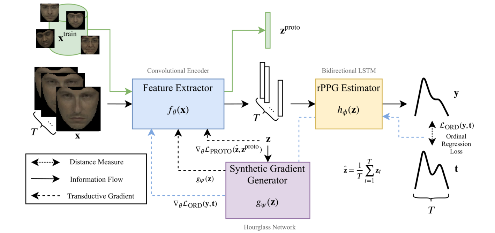
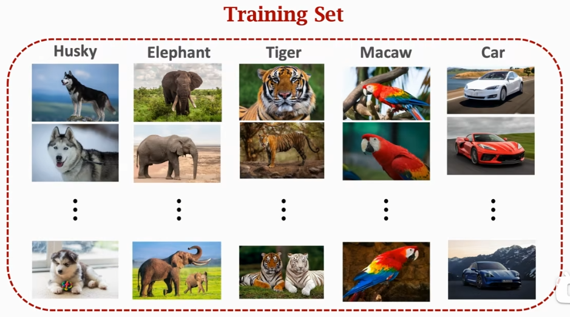
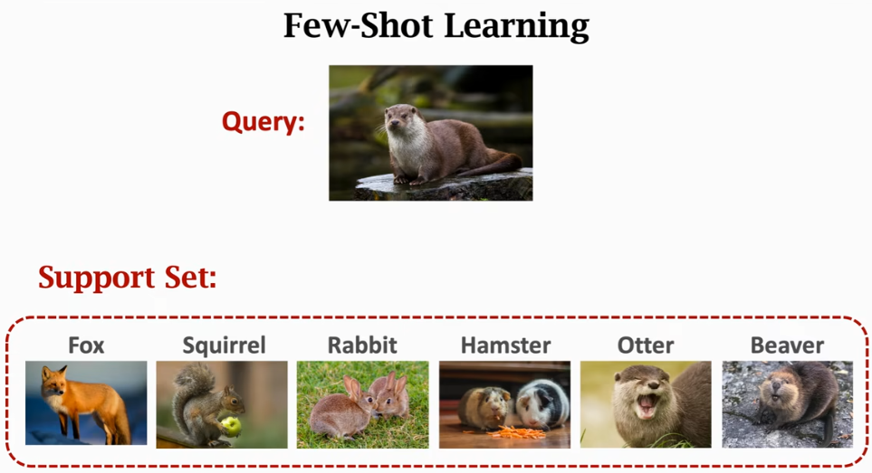
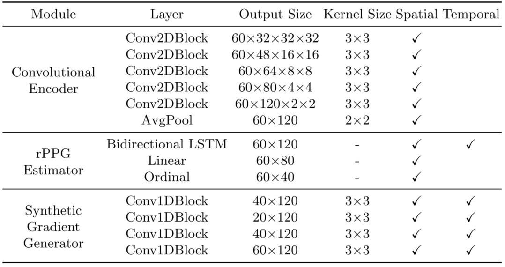
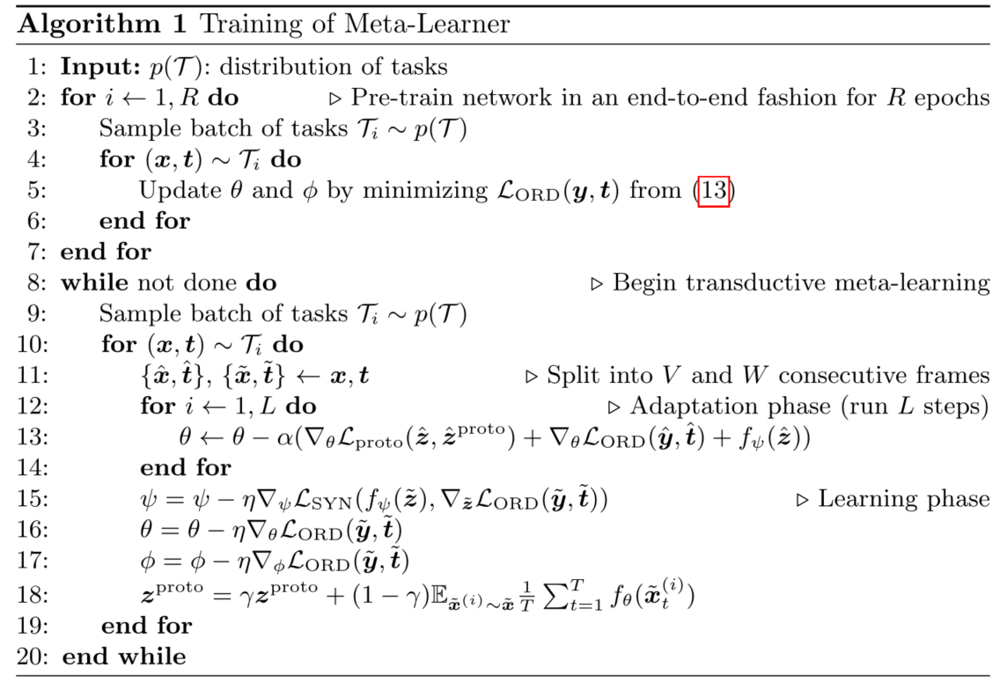
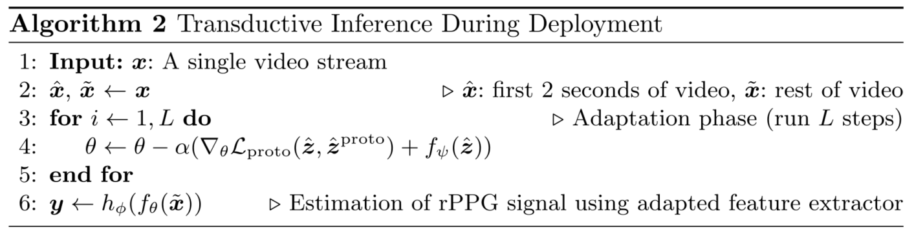
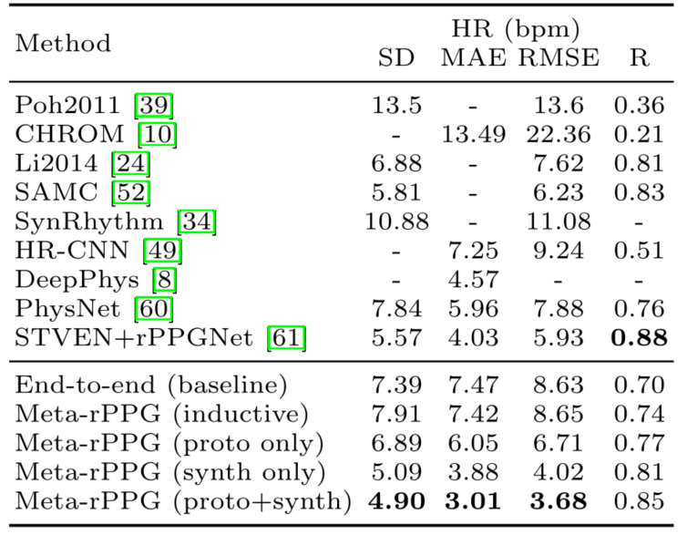
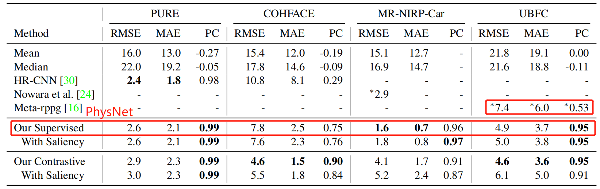

<h2>
 Meta-rPPG: Remote Heart Rate Estimation Using a Transductive Meta-Learner 
</h2>

【心率监测】【ECCV2020】【[paper](https://arxiv.org/pdf/2007.06786.pdf)】【[code](https://github.com/eugenelet/Meta-rPPG)】

### 摘要

&emsp;&emsp;本文采用了元学习的方式探索了在跨数据集上的适应性问题，通过将每个 clip 的预测看做单个任务的方式构造多任务，并将每个 clip 区分为互不相交的 Q, S 进行 few-shot 学习。得到的网络结构理论上可以在预训练的基础上支持 zero-shot 学习，通过梯度合成生成器快速学习无标签数据。缝合元学习的基础上在 MAHNOB-HCI 取得了 SOTA，在 UBFC 上效果普通。

### 概览

<!-- more -->

----

### 前置知识

#### 元学习概念

- 元学习、自监督学习、对比学习、FSL

  - 自监督学习的常用方法包括对比学习
  - few-shot learning（小样本学习）是自监督学习的下游任务之一
    - FSL 目的是通过不足以训练网络的样本量进行学习和预测
  - FSL 通常使用迁移学习完成
    - 迁移学习着眼于：1.利用先验知识快速学习新的数据集，2.在学习新数据集的基础上不忘记旧数据集
  - 元学习是迁移学习的一种

- 元学习的含义

  - 元学习原本的含义为 "learn to learn"，即通过学习超参数从而生产网络（有点像 NAS）

    - 但是在本文中并没有学习超参数

    - 事实上在当前一些带有 "Meta" 的论文其中的本质是对比学习

  - 元学习着眼于：在同分布的任务上通过先验网络快速学习新数据集
    - 获取灵活的先验网络的方式：在多个任务上进行训练

  - 元学习最常用的任务为分类任务，其最初架构的提出与改进都在分类任务上进行测试
    - 但是在本文中的任务为回归任务（创新点之一，但创新得很牵强）
  - 由于常在 few-shot 任务上学习，元学习的网络结构通常不深，为了避免过拟合

- 元学习中的定义

  - $\mathcal {Q, S}$：Query，Support，即为了区别于元学习架构中真正的测试集、训练集，重新命名在迁移的单任务中的测试集（Query Set）、训练集（Support Set）。  
  - N-ways，K-shot：N-在 $\mathcal S$ 中的类别数目，K-在 $\mathcal S$ 中每个类别的样本数目

#### 一个元学习的实例

&emsp;&emsp;对于图像分类任务，有网络 $f_\theta$，输入图像 $x$，训练数据集 $\mathcal T$。其中训练集如下图所示：

&emsp;&emsp;由于元学习需要在多任务上进行训练，一个简单的想法就是把 $\cal T$ 分成多个任务，多次训练之后可以得到初始化的 $f_\theta$，输入图像 $x$ 之后可以输出在多个类别上的概率分布。

&emsp;&emsp;此时给出在某个小任务（训练集分出来的或者新遇到的），对于此任务，其训练集（Support Set）和测试集（Query Set）都很小，一个可能的例子如下图所示，在此任务中，由于总共有 6 个类别，每个类别只有一个样本，因此称之为 6-ways，1-shot 任务。

&emsp;&emsp;以训练好的 $f_\theta$ 作为初始化网络开始学习新的小数据，可以在很快的时间内学会此分类任务。

### 创新

- 一种可以用于心率监测的元学习框架
- 使用合成梯度生成器和分布最小化损失快速学习无标签数据

### 网络

#### 网络组成

&emsp;&emsp;整个网络分为三个部分：特征提取器、rPPG 估计器、合成梯度生成器。前两部分首先训练，就是普通的 rPPG 估计器训练方式，分别由 Conv 和 LSTM 组成。合成梯度生成器由 Conv 组成，仅在直推学习期间使用。三个组成部分的具体网络组成如下图所示，其中 Conv2DBlocks 由Conv2D、Batchnorm、average pooling 和 ReLU 组成。Conv1D 模块由 Conv1 d、Batchnorm 和 ReLU 组成。

#### 前向过程

&emsp;&emsp;对于输入 $\cal T$，首先的预处理是标定其 landmark，切割出人脸部分（这里使用的是 dlib，肯定耗时很长，又不能叫端到端啦 😅）结果记为 $x^{train}$，从训练集中取出 N 个独立的 clip，这些 clip 每一个的 ppg 信号估计都代表了一个任务。接着对每一个子任务，将 clip 分为 $V,\ W$ 帧的子 clip，分别记为 $\cal {S,\ Q}$。这样就完成了元学习的基本设定。

&emsp;&emsp;在预训练阶段，对 $x^{train}$ 采样 T 个连续帧 $x$，将其输入特征提取器，得到 $f_\theta(x)$，其中 $\theta$ 是 $f$ 的参数。这里的 $f_\theta(x)$ 是一个具有 T 长度的 ppg 信号，记为 $z$。对于 $z$，将其输入 rPPG 估计器得到 $y=h_\phi(z)$，将预测的 ppg 信号 $y$ 和 $t(y_{GT})$ 进行比较，计算 $\mathcal L_{ORD}(y,t)$后梯度回传，是一个普通的训练过程。

&emsp;&emsp;在直推式学习阶段，需要限制两个新的学习：1.梯度生成器的输出应当和  $\mathcal L_{ORD}$ 回传给 $z$ 的梯度一致，以便接下来的迁移学习，2.通过 $x\in\cal S$ 特征提取器生产的特征值 $z$ 应当和 $x^{train}$ 生产的 $z^{proto}$ 具备一致的分布，这是因为之前的研究已经证明：必须在同分布的数据中元学习的方式才更有效。

&emsp;&emsp;因此在直推式学习阶段生成 $z$ 之后，$z$ 有两个去向，除了输入进入 $h_\phi$，还会进入 $g_\psi$，对于 $g_\psi(z)$，其期望的输出应当和 $\nabla_z\mathcal L_{ORD}(y,t)$ 一致，为了限制这种一致性，计算 $\mathcal L_{SYN}=||g_\psi(z)-\nabla_z\mathcal L_{ORD}(y,t)||_2^2$，同时在直推式学习之中更新 $\theta$ 的梯度，即 $g$ 也负责将 $\mathcal L_{ORD}$ 的梯度传给 $f$。通过这种方式就限制了合成梯度生成器的学习，而在之后的无标签学习中，就可以通过 $g$ 生成的梯度来辅助更新 $f$。

&emsp;&emsp;同时为了保证 $\cal S$ 生成特征的分布一致性，记 $\hat z = \frac 1 T \sum\limits_{t=1}^Tz_t$，为了在统计 $z^{proto}$ 在整个数据集上的分布特性，通过迭代的方式随着预训练统计，其具体更新公式为：
$$
z^{proto}=\gamma z^{proto}+(1-\gamma) \mathbb E_{x^{(i)}\sim p(\mathcal T)}\frac 1 T\sum\limits_{t=1}^Tf_\theta(x_t^{(i)})
$$
&emsp;&emsp;因此计算分布一致性损失 $\mathcal L_{PROTO}=\mathbb E_{x^{(i)}\sim p(\mathcal T)}\frac 1 T\sum\limits_{t=1}^T||f_\theta(x_t^{(i)})-z^{proto}||_2^2$，通过最小化这个损失训练特征提取器，强制其生成的图像位于同一分布。

&emsp;&emsp;更具体的，文章给出了前向过程的伪代码如下图。对于训练，

#### 快速适应性

&emsp;&emsp;对于学习得到的网络结构，在面对新的 $\cal Q,\ S$ 时，只需要按照同样的方式对 $\cal S$ 进行采样，输入已经初始化的 $f_\theta$，得到特征 $z$，对于特征 $z$ 输入已经预训练好的梯度生成器 $g_\psi$ 得到需要回传的梯度之一 $g_\psi(z)$，之二为分布损失回传的梯度，即 $\nabla_\theta\mathcal L_{proto}(\hat z,\hat z^{proto})$，用他们之和作为新的梯度来更新 $\theta$，这样就可以快速地适应新的数据集。同时对于 rPPG 估计器，其梯度不会更新，值也不会变化。

&emsp;&emsp;对于上述过程，其有效的假设在于：对于 ppg 信号的估计，其特征提取部分和从特征生成信号的部分是解耦合的。也就是说对于已经训练好的模型，面对新数据集时只需要修改特征提取器就可以使最终的结果正确。

&emsp;&emsp;对于学习新的 $\cal Q,\ S$，在学习过程中的伪代码如下图所示。对于适应性学习，训练的轮数为 10。

### 结果

&emsp;&emsp;本文在 MAHNOB-HCI 和 UBFC 上测试了结果，使用含有 18 个长度为 120 秒的视频进行了预训练（没有给出预训练选择的数据集），和消融实验一起做成了一张表格如下图，这是 MAHNOB-HCI 的结果，是非常好的，在 physformer 中也没有明显的落后，并且其训练集小、适应性高。

&emsp;&emsp;而在 UBFC 上的结果并不好，给个 The Way To My Heart 的结果可见一斑

