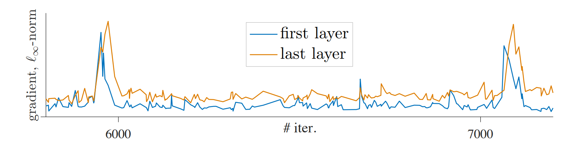

## [Momentum_Contrast_for_Unsupervised_Visual_Representation_Learning](https://openaccess.thecvf.com/content_CVPR_2020/papers/He_Momentum_Contrast_for_Unsupervised_Visual_Representation_Learning_CVPR_2020_paper.pdf) 【目标检测、图像分割】 CVPR2020

### 摘要

&emsp;&emsp;这篇文章实际上发布了有相当一段时间了，在两年之后的今天会看这项工作，很难不折服于 MoCo 的框架通用性、泛化性以及作者高度的前瞻性。随后作者又提出了 MoCoV2，MoCoV3，这两项工作在一定程度上就是单纯的对 MoCo 的适应性改编，尤其是 MoCoV2，几乎没有什么更新的想法，而 MoCoV3 至少发现了一些一直被人们所忽略的 VIT 的训练特性。作为相当一段时间内在对比学习领域和 SimCLR 齐名的前二名，MoCo 对对比学习问题进行了高度抽象，提出了简单又高效的改革。

### 概览


<!-- more -->

----

### 前置知识

&emsp;&emsp;在讲述 MoCo 发展史之前，首先需要了解何为对比学习，以及以往的对比学习都采取了哪样的策略，这些工作尽管很出名，但是为什么被 MoCo 的作者说成”不可避免地受限“。

#### 对比学习

&emsp;&emsp;首先，对比学习并非某种网络结构，更多地，这是像 AE、VAE、GAN 类似的无监督学习的一种学习方式。在对比学习之中，我们需要做两个关键的事情，1.构造正负例样本的向量表征，2.选择合适的损失函数训练分类/预测问题。

&emsp;&emsp;我们将举一个非常简单的例子描述对比学习，这种方式实际上出现在 SimCLR 之中。


&emsp;&emsp;简单来说，通过对同一张图像进行数据增强，得到的两个新图像互为正样本，同样的，由两个不同的图像进行数据增强之后的结果就是负样本，因此对于某个图像，对他来说是正样本的只有 1 个，负样本有很多个，准确来说应该是 (batchSize-1)x2 个，因此问题转化为一个多分类问题。将所有的正负样本输入一个编码器，得到向量表征，这里的向量表征就是我们在最后想要得到的具备强语义信息。对向量继续通过一个 MLP 进行分类，并对分类之后的结果求 NCELoss，梯度回传并更新编码器，我们其实只想要编码器，这里训练用的 MLP 在推理的时候并不使用，而是到时候再训练一个新的解码器。

#### 代理任务

&emsp;&emsp;所谓代理任务，即构造正负样本的方法，其中最出名的是 个体判别 方法，该方法将每个图像数据增强后的结果看做一个类，任何两个不同的图像都不属于一个类 ，这种简单粗暴的方式反而具备很好的效果，一直被 SimCLR，MoCo 等对比学习经典作品采用。

&emsp;&emsp;当然，还有其他的代理任务，正是代理任务的灵活性给了对比学习很高的进步空间，比如将一张图像打成多个 patch，选择中心 patch 作为基准，对其他 8 个 patch 进行标号，随机选取一个 patch，然后预测其相对于基准的标号。再比如在视频流中，每个帧和下一帧互为正样本，其他的随机抽取均为负样本。再比如在所有时序数据中，选取前四帧分别经过编码器和 MLP 整合成一个语义表征，则下四帧经过同样的编码器后的表征就是正样本，任意其他四帧经过编码器之后的就是负样本，这也就是 CPC 的策略，简单泛化效果好。

#### 对比学习中的困难点

&emsp;&emsp;当然，对比学习很棒，自监督意味着不需要额外的标号。但是正如 MoCo 所说，大多数工作都主要致力于解决这两个问题：1.负样本的一致性问题，2.负样本的数量问题。简单来说，问题 2 意味着负样本太少会让编码器学习到一些捷径，从而难以学到有力的表征，问题 1 意味着不同的负样本表征可能是由不同参数的编码器得到的，这加重了模型的训练难度，可能使其学到额外的知识并难以收敛。

### 创新

- MoCo
  - 提出了一种抽象的 q-k 描述来总结以往的对比学习优化目标和局限性
  - 提出使用 queue 的数据结构将 batchSize 和 dictSize 分开，保证了 key 数据多样性
  - 提出了动量更新的策略，保证了多个 key 之间的数据一致性
- MoCoV2
  -  对 ResNet50 之后的 MLP 层进行了加深
  - 采用了一种更新的数据增强策略
- MoCoV3
  - 将骨干网络换成了 VIT，微调了 loss，取得了相对于 MoCo，MoCoV2 稍好一点点的结果
  - 发现了在 VIT 训练过程中 patch projection 会导致训练精度突变的问题，并给出了解决方案

### 网络

&emsp;&emsp;MoCo 实际上只是提出了一种网络架构，并没有规定在这个架构中具体的网络是什么，在 MoCo 刚提出的时候还是 CNN 时代，因此最初选取的骨干网络是 ResNet50，之后 MoCoV2 对 ResNet50 进行了一点小改动，在 MoCoV3 的时候已经是 transformer 盛行时代了，因此 MoCoV3 把骨干网络换成了 VIT，但是在实际操作的过程中发现了效果并没有太好，因此作者认真探究了为何会变差，得到了很有意思的结论。

#### MoCo


&emsp;&emsp;对于 MoCo，所有的问题被重新表述了，在选用个体判别的代理任务的情况下，现在我们认为同一个 batch 内的所有图像中，由某一个图像数据增强得到的两个图像其中一个为 $x^q$，其他的都是 $x^k$，在所有的 $x^k$ 之中，只有 $x^{k_0}$ 的正样本，其他的都是负样本。对于 $x^q$ 和 $x^k$ 做转置乘，得到他们的相似性，这就相当于构造了一个字典，所有的 $x^k$ 就是字典中的键，原本的两个困难就可以被重新描述为 1. 字典的键要尽可能多，2. 字典的键要尽可能一致。为了解决这两个问题，MoCo 提出了两个方案：1.使用队列存储字典，2.不训练 key 的编码器

##### 队列和动量更新

&emsp;&emsp;对于刚刚提出的两个改进策略，1.将每次 batch 得到的所有 $x^k$ 都存储在一个队列里面，当队列满了之后就每次剔除队列头的元素，通过这种方式就可以保证负样本的数量。2.不训练 key 的编码器，而是每次直接从 query 的编码器中 copy 参数过来，通过一个公式进行动量更新，在保证 key 编码器在逐渐变化的情况下不失去 key 的一致性。

&emsp;&emsp;在每个 batch 得到 query 和 key 之后，key 进入队列，此时如果队列满了，就将队头移出。对于很多的 key，这之中有的是正样本，有的是负样本，总共约有 6W 多个，将这些 key 和 query 计算 loss，具体的 loss 这里选择 $\rm InfoNCELoss$，其具体计算公式如下：
$$
\zeta_q=-\log\frac{\exp(q·k_+/\tau)}{\sum_{i=0}^{K}\exp(q·k_i/\tau)}
$$
&emsp;&emsp;这里其实和 NCELoss 几乎没区别，加了个 $\tau$，目的是使模型更加好训练，据说是因为要控制 $q·k_+$ 的分布，咱也不太懂原理是啥。

&emsp;&emsp;总之，现在我们计算出来了 loss，接下来就可以进行反向传播了，但是要注意的是，这里的反向传播只能传播到 query 的编码器之中，我们切断了向 key 的梯度。然后更新 query 的编码器，更新完 query 的编码器之后我们同样要更新 key 的编码器，我们记 query 的编码器参数为 $\theta_q$，key 前一时刻编码器参数为 $\theta_k^{i-1}$，则当前时刻的 key 编码器参数由如下公式更新：
$$
\theta_k^i=m\times\theta_k^{i-1}+(1-m)\times\theta_q
$$
&emsp;&emsp;这个式子也就是所谓的动量更新，这里的 $m$ 就是动量，$m$ 越大代表 key 编码器更新越慢，而事实上 $m$ 在 MoCo 中选择非常之大，为 0.999，也就是每次 query 的编码器参数对 key 编码器参数的影响只占 $0.1\%$。

&emsp;&emsp;据此策略，MoCo 就可以展开训练了，作者选取 ResNet50 作为骨干网络，取得了很好的结果，并且给出了训练时的 pytorch 风格的伪代码：

```python
# f_q, f_k: encoder networks for query and key
# queue: dictionary as a queue of K keys (CxK)
# m: momentum
# t: temperature
f_k.params = f_q.params # initialize
for x in loader: # load a minibatch x with N samples
    x_q = aug(x) # a randomly augmented version
    x_k = aug(x) # another randomly augmented version
    q = f_q.forward(x_q) # queries: NxC
    k = f_k.forward(x_k) # keys: NxC
    k = k.detach() # no gradient to keys
    # positive logits: Nx1
    l_pos = bmm(q.view(N,1,C), k.view(N,C,1))
    # negative logits: NxK
    l_neg = mm(q.view(N,C), queue.view(C,K))
    # logits: Nx(1+K)
    logits = cat([l_pos, l_neg], dim=1)
    # contrastive loss, Eqn.(1)
    labels = zeros(N) # positives are the 0-th
    loss = CrossEntropyLoss(logits/t, labels)
    # SGD update: query network
    loss.backward()
    update(f_q.params)
    # momentum update: key network
    f_k.params = m*f_k.params+(1-m)*f_q.params
    # update dictionary
    enqueue(queue, k) # enqueue the current minibatch
    dequeue(queue) # dequeue the earliest minibatch
```

##### MoCo和其他对比学习框架

&emsp;&emsp;MoCo 在之前提到，以往的工作往往受限于字典大小和表征一致性，那么具体是如何受限的呢，MoCo 给出了对比，在 MoCo 的动量更新、队列存储之前，对比学习往往才有两种训练方式，一种是端到端的训练，另一种是使用 memory bank 存储较多 key 的训练。


&emsp;&emsp;对于端到端的训练，我们将 query 和 key 分别输入同样的 encoder，并且得到的 loss 直接反向传播到两个编码器，这两个编码器既可以共享参数也可以不共享参数，这样做的好处是每次我们得到的 $k$ 都是通过同一个编码器得到的，缺点就是每次一个 batch 得到的 $k$ 的个数太少了。

&emsp;&emsp;对于基于 memory bank 的方法，为了解决单个 batch 得到的 $k$ 的个数太少的问题，将预先将很多负样本通过一个 encoder 存储起来，这个就叫做 memory bank，每次计算时，从 memory bank 里面随机抽取几个负样本进行计算，并梯度回传更新 query 的 encoder，此时将我们抽取出来的负样本重新走一遍更新之后的 encoder，并更新这些样本然后再放回 memory bank。这样做的问题就是，memory bank 里面的 $k$ 不够一致，他们是由不同的 encoder 得到的，虽然为了解决这个问题，memory bank 方法采用了动量更新的方式更新改动的负样本，但是仍然无法从根本上解决一致性问题。

#### MoCoV2

[Improved Baselines with Momentum Contrastive Learning](https://arxiv.org/pdf/2003.04297.pdf)

&emsp;&emsp;在 MoCo 发表的同一年，SimCLR 也发表了出来，因此 FAIR 团队把 SimCLR 的技术关键点移植到了 MoCo，提出了 MoCoV2，在指标上超越了 SimCLR，但是因为实在没有什么创新，因此也没有发表，作者写了个三页的小报告挂在了 arxiv 上，具体来说，改动分为这两个方面。

&emsp;&emsp;1.加入一个预测头，也就是解码器，这个解码器由后接 RELU 的两层 MLP 组成，这个解码器只在训练的时候使用，而在训练完成之后将这个 linear projection 扔掉，这实际上是 SimCLRV1 的策略。2.加入了一个更加有效的数据增强方式，blur augmentation，即模糊图像。之后可以专门写一篇总结基于 torchvision.transforms 的数据增强 API。

#### MoCoV3

[An Empirical Study of Training Self-Supervised Vision Transformers](https://arxiv.org/pdf/2104.02057.pdf)

&emsp;&emsp;MoCoV3 是 VIT 提出之后作者将骨干网络换成 VIT 之后的续写，是在 MoCoV2 的改进基础上的续写，实际上如果仅仅如此，有可能 MoCoV3 也变成一篇技术报告，但是作者在替换骨干网络之后发现了奇怪的事情。

&emsp;&emsp;作者发现在将骨干网络替换为 VIT 之后出现了训练不稳定的问题，具体的不稳定体现在训练时的准确率会在某些时刻突然下降又升高。这和很多因素有关，作者做了一些实验，包括 batchsize，学习率，优化器。


&emsp;&emsp;通过上面三张图像，我们可以发现，batchsize 和学习率都属于适中最好。这没啥说的，但问题就在于无论是选择了不太好的 batchsize 还是不太好的学习率，这些不稳定是有规律可循的。另外就是优化器，作者默认AdamW 作为优化器（常用于 ViT model），而另一方面，最近的工作经常使用 LARS 优化器处理大的 batchsize，作者对 LAMB 优化器进行实验，其是 LARS 中 AdamW 对应版本。这些优化器说实话不太理解，只知道最基础的 SGD、Adam 之类的，之后可以写一篇总结各种优化器及其优劣。总之，作者通过测试，发现 LAMB 优化器不太好，不如 AdamW。

&emsp;&emsp;在发现有规律可循之后，作者尝试探索了一下，打印出了网络的第一层和最后一层的参数梯度变化图像如下



&emsp;&emsp;作者认为，这些突起的梯度，是因为在 MoCoV2 中加入的 linear projection 的训练问题，因此作者提出了一种策略：不训练 linear projection，仅做随机初始化。这是很离谱的想法，这样就让人很难理解为什么这样一个随机初始化又不更新的线性层对原本的 MoCo 有辅助作用，但实际上是有的，并且使用不训练策略之后梯度变化真的稳定了，而且在不同的学习率之下都是更稳定了。


&emsp;&emsp;甚至不仅如此，作者还贴心地测试了 SimCLR 和 BYOL，将 SimCLR 和 BYOL 的线性层也改成随机初始化不训练的方式，神奇的是得到的训练结果真的上了几个点，并且没有了准确率的突变。


&emsp;&emsp;总之，这就是 MoCoV3 的贡献，其不仅成功将 VIT 应用于 MoCo 的骨干网络，并且提升了结果，最关键的是其找到了新对比学习框架中常见的准确率突变问题的解决方案，并且在多个框架中验证了其有效性。同样地，这是 MoCoV3 的伪代码：

```python
# f_q: encoder: backbone + proj mlp + pred mlp
# f_k: momentum encoder: backbone + proj mlp
# m: momentum coefficient
# tau: temperature
for x in loader: # load a minibatch x with N samples
    x1, x2 = aug(x), aug(x) # augmentation
    q1, q2 = f_q(x1), f_q(x2) # queries: [N, C] each
    k1, k2 = f_k(x1), f_k(x2) # keys: [N, C] each
    loss = ctr(q1, k2) + ctr(q2, k1) # symmetrized
    loss.backward()
    update(f_q) # optimizer update: f_q
    f_k = m*f_k + (1-m)*f_q # momentum update: f_k
# contrastive loss
def ctr(q, k):
    logits = mm(q, k.t()) # [N, N] pairs
    labels = range(N) # positives are in diagonal
    loss = CrossEntropyLoss(logits/tau, labels)
    return 2 * tau * loss
```

### 损失

&emsp;&emsp;$\rm InfoNCELoss$ 已经说过，不再赘述，之后可以专门写一篇总结$\rm MSE, RMSE, NCE,InfoNCE,BCE,CE$ 等的区别和联系。


