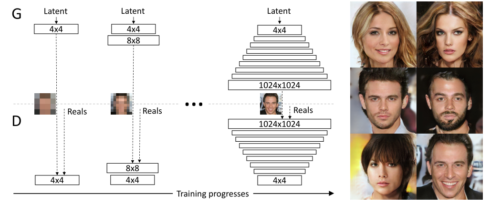
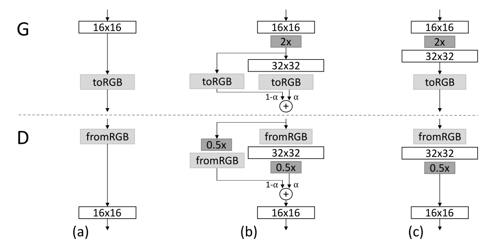
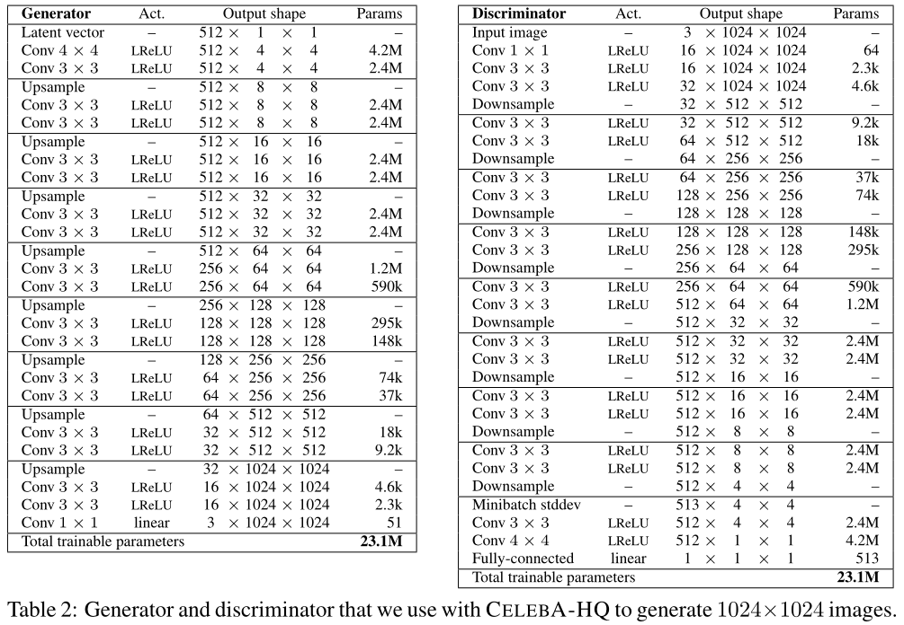
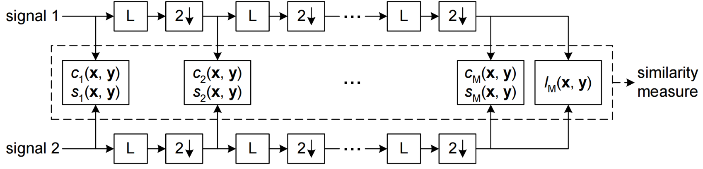
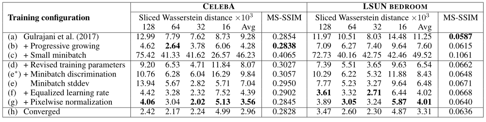
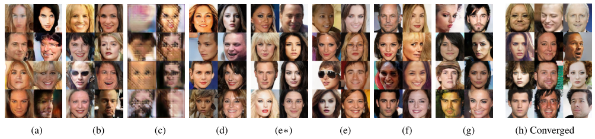

<h2><center> Progressive Growing of GANs for Improved Quality, Stability, and Variation </center></h2>

【图像生成】【ICLR2018】【[paper](http://arxiv.org/abs/1710.10196)】【[code](https://github.com/tkarras/progressive_growing_of_gans)】

### 摘要

&emsp;&emsp;本文使用逐步调大分辨率的生成方式成功生成了在当时还不错的高分辨率图像。具体来说是进行分阶段的训练，阶段按照分辨率进行分界。并且每个新的阶段要加入新的卷积层，为了防止没有经过训练的层回传梯度时影响训练好的层，本文还使用了一种平滑的融合策略。

### 概览


<!-- more -->

----

### 创新

- 逐步并行地向判别器和生成器之中加入新的卷积层从而最终生成高分辨率图像，这使得训练更稳定、迅速
- 使用类似于“动量更新”的方式加入新的卷积层，防止其刚开始训练时回传的粗梯度影响之前的结果
- 在判别器的最后使用 `minibatch` 的方式分组无参计算每个 `batch` 内的分布加强判别器的能力
- 在训练时使用多通道特征训练，在需要可视化的时候加入一个 `to_rgb` 层
- 使用 $\mathcal N(0,1)$ 初始化权重，并且在运行的过程中动态缩放权重
- 提出了一种基于 `MS-SSIM` 的生成图像评价指标，可以对生成的图像在不同尺度上的细节分布进行检测

### 网络

#### backbone



&emsp;&emsp;整个网络的生成器和判别器由两个对称的 CNN 网络组成，不同的是在判别器的最后一层 CNN 时加入了 `Minibatch stddev` 操作，用以计算某个 `batch` 内分组的分布，作为额外的特征通道加入 `C` 维度。

&emsp;&emsp;网络的训练逐步增加生成的图像分辨率，方式是逐步添加新的卷积层，上图中的 $4\times 4$ 表示针对 `NxCx4x4` 的特征的卷积操作，具体来说其中不包括上下采样，只包括多个卷积层和 `leaky_relu` 激活函数。上下采样没有在上图中显示，其存在于卷积层之间。

&emsp;&emsp;生成器逐步生成更高 `HxW` 的特征，最终得到 `NxCx1024x1024` 的特征，并由一个 `1x1Conv` 的 `to_rgb` 层整形成 `rgb` 通道的图像。该图像输入至判别器中由一个和生成器镜像对称的结构判断 `T/F`。



&emsp;&emsp;加入新的卷积层的方式如上图所示，其展示了从 `16x16` 分辨率的网络加入新的卷积层变为 `32x32` 分辨率网络的过程。$(a)$ 表示 `16x16` 对应的 $G,D$，$(c)$ 表示一种朴素的加入方式，其中 `2x,0.5x` 表示上下采样。这种方式在实现之后会产生对训练好的网络的冲击，这种冲击来自于新加入的层最初训练时回传的梯度并没有太大的意义，而训练好的层接受到这种梯度并更新之后，原有的参数会被破坏。因此本文采用了 $(b)$ 表示的结构，使用 $\alpha\in[0,1]$ 作为平衡新层旧层权重的量，这种处理方式和“动量更新”或者迁移学习都很近似。

&emsp;&emsp;最终得到的生成 $1024^2$ 分辨率的网络结构参数如下。



&emsp;&emsp;实际处理中整体上 $G,D$ 是镜像结构，但是 $D$ 中多了 `Minibatch stddev` 操作，其具体流程为：

- 按照 `batch_size=N` 分解为 `N=GxM`，其中 `G` 为分组大小，`M=N/G`，此时特征变为 `GMCHW`
- 在 `G` 维度上计算标准差，得到 `MCHW`
- 在 `C,H,W` 维度上再计算平均值，得到 `M111`
- 将上一步的结果在 `M` 维度上复制 `G` 次将 `M` 变成 `N`，在后两维度上各复制 `H,W` 次，得到 `N1HW`
- 将上一步的结果和原始的输入进行拼接，得到 `N(C+1)HW`

&emsp;&emsp;其具体实现代码为：

```python
# Minibatch standard deviation.

def minibatch_stddev_layer(x, group_size=4):
    with tf.variable_scope('MinibatchStddev'):
        group_size = tf.minimum(group_size, tf.shape(x)[0])     # Minibatch must be divisible by (or smaller than) group_size.
        s = x.shape                                             # [NCHW]  Input shape.
        y = tf.reshape(x, [group_size, -1, s[1], s[2], s[3]])   # [GMCHW] Split minibatch into M groups of size G.
        y = tf.cast(y, tf.float32)                              # [GMCHW] Cast to FP32.
        y -= tf.reduce_mean(y, axis=0, keepdims=True)           # [GMCHW] Subtract mean over group.
        y = tf.reduce_mean(tf.square(y), axis=0)                # [MCHW]  Calc variance over group.
        y = tf.sqrt(y + 1e-8)                                   # [MCHW]  Calc stddev over group.
        y = tf.reduce_mean(y, axis=[1,2,3], keepdims=True)      # [M111]  Take average over fmaps and pixels.
        y = tf.cast(y, x.dtype)                                 # [M111]  Cast back to original data type.
        y = tf.tile(y, [group_size, 1, s[2], s[3]])             # [N1HW]  Replicate over group and pixels.
        return tf.concat([x, y], axis=1)                        # [NCHW]  Append as new fmap.
```

&emsp;&emsp;最终采用的 `loss ` 为 `improved Wasserstein loss`。

#### MS-SSIM



&emsp;&emsp;本文提出现有的 `MS-SSIM` 方法只能对大尺度的模式崩溃进行响应，但不能对较小的影响做出反应，如颜色或纹理变化的损失，而且也不能从与训练集的相似性方面直接评估图像质量。上图展示了现有的 `MS-SSIM` 方法的流程，其中 $c,s$ 表示特征，$L$ 表示低通滤波，$2\downarrow$ 表示降采样。

&emsp;&emsp;本文基于同样的多尺度策略提出了另一种思路，也就是对于多张图像，每张图像逐步使用拉普拉斯金字塔进行多尺度滤波，对每一层的图像提取 `128` 个特征描述子，每个描述子由 `7x7` 个邻居的 `3` 个通道组成，对于提取出的描述子，首先标准化每个颜色通道的均值和标准差，然后通过计算它们的切片 `Wasserstein` 距离作为相似度。

### 结果



&emsp;&emsp;该表使用了 `WGAN` 的 `baseline`，逐步地添加各个改进策略，用以进行消融实验验证策略有效性，其中 `Sliced Wasserstein distance` 下的 `128,64,32,16,Avg` 表示在不同尺度下的 `WSD`，其最终得到的图像如下图所示。



