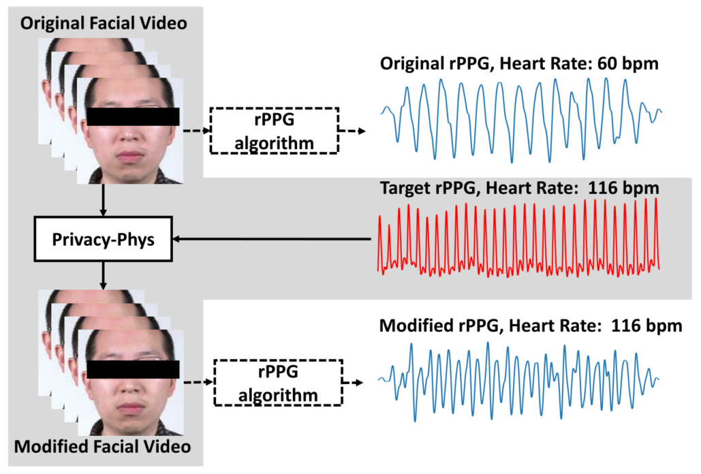
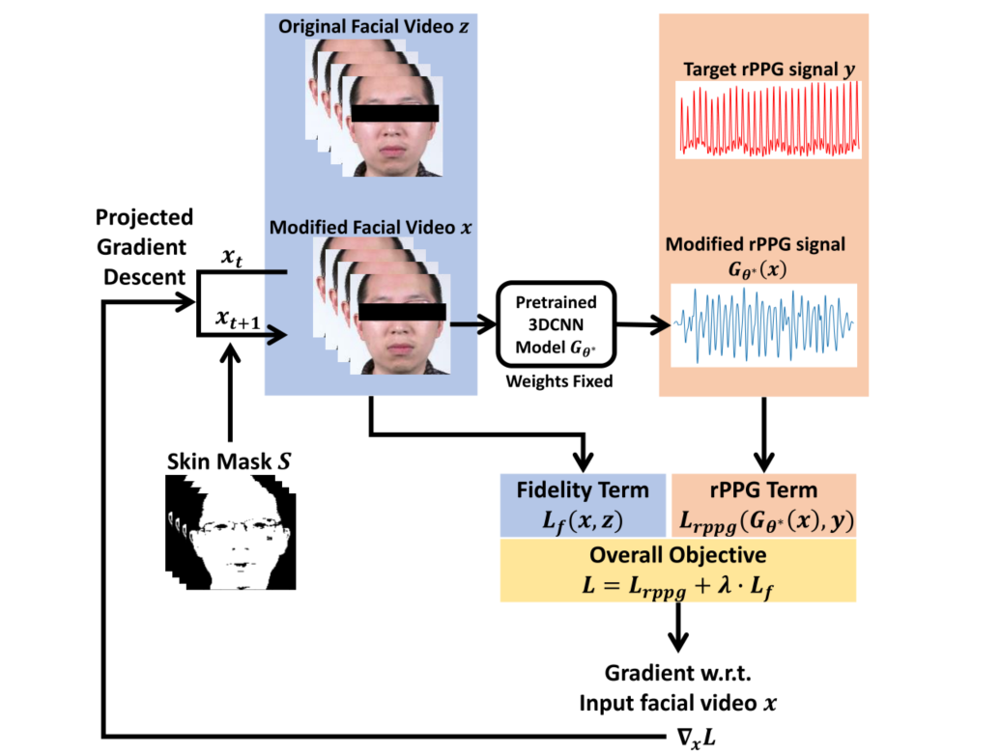
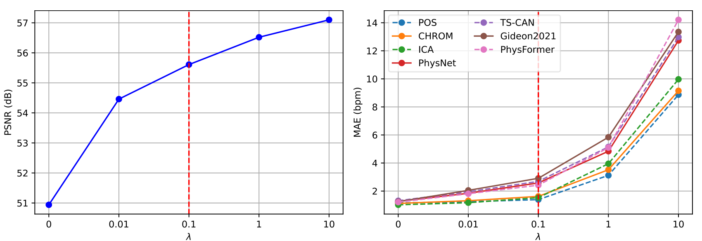
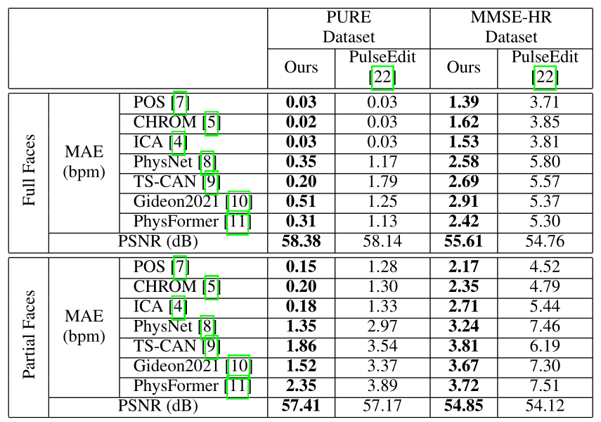
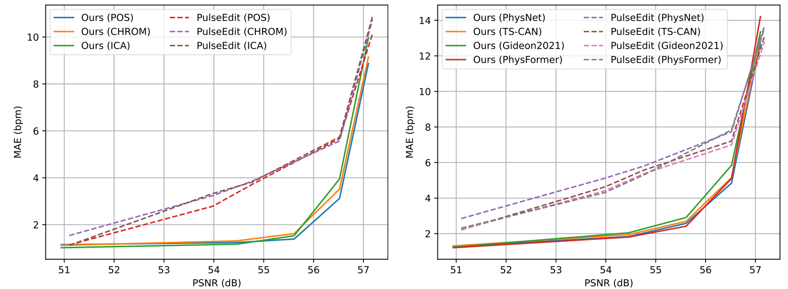
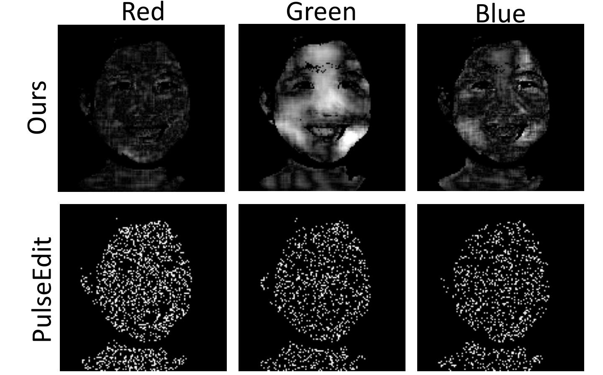

<h2>
 Privacy-Phys: Facial Video-based Physiological Modification for Privacy Protection 
</h2>

【心率监测】【SPL2022】【[paper](https://ieeexplore.ieee.org/document/9806161/)】【[code未开源]()】

### 摘要

&emsp;&emsp;本文提出了一种基于预训练的 3D-CNN 网络结构用于在保持视觉不变性的基础上修改视频中人脸的 rppg 信号，可以用于 IDEA 中的正样本生成模块之中。另外，本文讲故事的方式是：rppg 信号中具备人的生理和疾病等隐私信息，这些信息不希望被他人窃取，因此使用 PrivacyPhys 方法可以快速地修改 rppg 信号以干扰窃取，可以用于视频软件之中。

&emsp;&emsp;一个有意思的点在于：本文所谓的预训练的网络其实完全不参与微调，梯度也不用来更新网络参数，而是直接更新结果。

### 概览

<!-- more -->

----

### 创新

- 一种新的用于修改人脸视频中 rppg 信号的 3DCNN 网络
- 该网络修改之后的视频可以混淆当前检测的 SOTA 方法（有点像 deepfake 和 detection 了，好怪)
- 相比于之前的大作 PulseEdit，这个方法推理更加迅速

### 网络

&emsp;&emsp;本文的前向过程非常简单，首先对于输入的视频 $z$，copy 一份同样的视频 $x$（$x$ 最后就是输出），同时根据人脸分割生成皮肤掩码 $S$，生成 $S$ 的目的是：心率编辑不应当修改除了人脸范围以外的其他像素。

&emsp;&emsp;接着读入目标心率 $y$，通过一个训练好并且固定权重的 3DCNN，这里是 STN，但也可以使任何可以快速计算的网络，记为 $G_\theta$ ，对 $x$ 进行 rppg 信号提取，提取得到的信号记为 $G_\theta(x)$，然后开始计算 loss。

&emsp;&emsp;loss 的计算分为两个部分：1.用于保证原始视频和新视频视觉效果一致的损失 $L_{f}$，2.用于保证修改之后的视频提取出的 rppg 信号和目标信号一致的损失 $L_{rppg}$，具体来说：
$$
\rm
\begin{aligned}
&L_{f}(x,z)=\frac1{T\cdot C\cdot H\cdot W}||x-z||_2^2\\
&L_{rppg}(G_{\theta^*(x)},y)=L_{rppg}(\hat y,y)=\frac{-cov(\hat y, y)}{\sigma_{\hat y}\cdot \sigma_y}\\
where\ \ \ \ &\sigma_y=\sqrt{\frac 1 T \sum_{t=1}^Ty(t)^2-(\frac 1 T \sum_{t=1}^Ty(t))^2}\\
and\ \ \ \ &cov(\hat y,y)=\frac 1 T \sum_{t=1}^T\hat y(t)y(t)-\frac 1 T \sum_{t=1}^T\hat y(t)\cdot\frac 1 T \sum_{t=1}^Ty(t)
\end{aligned}
$$
&emsp;&emsp;简单概括来说就是：使用 MSELoss 限制视频的视觉一致性，使用 NPC 限制 rppg 信号的一致性。

&emsp;&emsp;获得两个损失之后求和得到最终的损失：$L=L_{rppg}+\lambda L_f$，$\lambda$ 用于控制视频和 rppg 信号的重要程度。通过 $L$ 向输出 $x$ 求导得到 $\nabla_xL$，并使用此梯度更新 $x$，但是这里注意更新的其实是 $S\bigotimes x$，也就是只更新人脸 mask 之内的部分。具体实现中直接全部更新，更新之后再做掩码即可。

&emsp;&emsp;整体来说，本文的优化目标可以看做：
$$
x=arg\min_{x\in R^{T\times C\times H\times W}} L_{rppg}(G_\theta(x),y)+\lambda L_f(x,z)\\
s.t.\ \ S\bigotimes x=S\bigotimes z
$$

### 结果

&emsp;&emsp;本文的创新性比较高，整体的实现有点天马行空，消融实验只能做一下 $\lambda$，其他都是对比实验。

- $\lambda$ 的选择

&emsp;&emsp;这部分选择了 7 种预训练的模型作为 $G$，分别探索了在不同 $\lambda$ 的选择下对于视频 PSNR 和 rppg 信号 MAE 的平衡性，最终选择了 $\lambda=0.1$（其实我感觉有点怪，这个 PSNR 都最低 51 了 $\dots\dots$ 正常来说 30+ 就是高质量图像了，35+ 都肉眼无法区别了，这意思感觉像是 $\lambda$ 可以不要一样，后面就知道为啥明明都 50+ 了还要选“平衡”）

- 和 PulseEdit 的对比

&emsp;&emsp;同样是之前选择的预训练模型，这里对比了在 PURE 和 MMSE 中和 PulseEdit 的结果，可以看出基本上在正常的 PSNR 下都是 PrivacyPhys 更好一些（就是为了全面超 PulseEdit 才选 0.1 的 $\lambda$ 以提高 PSNR）

- 注意区域的对比

&emsp;&emsp;可以看出相对来说，PrivacyPhys 还是更加关注了正确的区域，但是总觉得也就那样，和其他的注意力图展示出来差不少，整体来说 rppg fake 或许都不太好。

