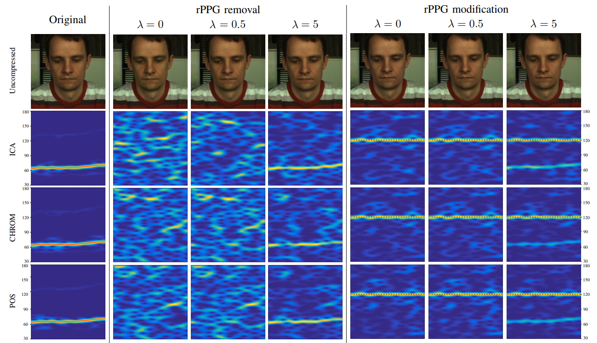

<h2>
 PulseEdit: Editing Physiological Signal in
Facial Videos for Privacy Protection 
</h2>

【心率检测】【TIFS2022】【[paper](https://ieeexplore.ieee.org/stamp/stamp.jsp?tp=&arnumber=9680677)】【[code未开源]()】

### 摘要

&emsp;&emsp;本文提出了一种在不改变外观特征的情况下进行心率信号改变的方法，具体来说，使用一系列的图像处理步骤得到逐帧的像素更改区域以及更改量，直接更改 RGB 区域从而混淆估计器。区别于 privacy-phys，本文梯度更新的是扰动信号 $\delta$，而 privacy-phys 梯度直接更新结果，一致的是两篇文章都没有参数。

### 概览

<!-- more -->

----

### 创新

- 一种新的用于更改或者抹除 rppg 信号的算法
- 结合 pulseEdit 和 deepfake 技术探索能否绕过活体检测或者 deepfake detection

### 网络

&emsp;&emsp;本文没有实际上的网络，其实更加是一种算法，由于梯度更新的只是扰动量，因此本文实际上把 rppg 信号的编辑抹除过程看做优化问题。而区别编辑和抹除，在优化目标为抹除的时候，直接以高斯噪声为编辑目标即可。

&emsp;&emsp;在前向过程中，大体分为三个部分：首先是 rppg 信号提取部分，目的是从背景中选取 ROI 区域，做法是采用高斯皮肤色彩模型；然后是 rppg 信号编辑部分，目的是给出扰动量的表达式从而写出优化表征；最后是更改部分，使用前一部分的结果直接编辑视频即可。

- rppg 信号提取部分

&emsp;&emsp;首先使用 Dlib 库函数提取出 landmark，但是没有开源我也不太确定这里是每帧都做还是只做第一帧。

&emsp;&emsp;然后使用高斯皮肤色彩模型将 ROI 转化到颜色空间，描述为：
$$
p(x)=\exp(-\frac12(x-m)^T\Sigma^{-1}(x-m))\begin{matrix}skin\\\to\\non-skin\end{matrix}p_t
$$
&emsp;&emsp;通过上述模型可以判断出一个像素点是否属于皮肤，接着从每个 ROI 区域之中选取 M 个子区域（本文的设置为 M=6x6），每个子区域含有 RGB 三通道，同时含有 N 帧，因此记选出的 M 个 ROI 区域为 $R\in\mathbb R^{M\times3\times N}$

- rppg 信号编辑部分

&emsp;&emsp;对于提取出的多个 ROI $R$，进行去势处理，假设去势之后的信号为 $S$，这里的 $S$ 加入扰动后和 rppg 信号 $T$ 需要对齐。去势阶段对 $S$ 的要求包括：$S$ 的信号本身峰值不能太高，$S$ 的局部变化应该和 $R$ 一致，这主要是为了消除环境光照的影响（亮度不变性）

&emsp;&emsp;因此描述为：
$$
\min_{S_{i,c}}\ \frac 1 2||S_{i,c}||_2^2+\mu||D(R_{i,c}-S_{i,c}) ||_1,\ \forall \ i,c
$$
&emsp;&emsp;其中 $S\in\mathbb R^{M\times 3\times N}$，$S_{i,c}\in\mathbb R^{N}$，$D\in\mathbb R^{(N-2)\times N}$，$D$ 是一个差分矩阵，其值为：
$$
D = \begin{bmatrix}
-1&2&-1\\
&-1&2&-1\\
&&\ddots&\ddots&\ddots&\\
&&&-1&2&-1\\
&&&&-1&2&-1
\end{bmatrix}
$$
&emsp;&emsp;因此 $D$ 和 $(R-S)$ 的乘积代表着在某个固定的 ROI 的某个固定的通道内，差值每个帧与前后两帧之间的差值 $2x_i-x_{i-1}-x_{i+1}$ 应当接近 0，也即 $R$ 和 $S$ 趋势尽可能接近。

&emsp;&emsp;对于提取出的信号 $S$ ，其本质上就是 $R$ 的亮度不变性版本，和 rppg 信号并不对得上，因此在其上加入扰动 $\delta\in \mathbb R^{3\times N}$，将 $\delta$ 重复之后加到 $S$ 上就得到了 $\hat S$，$\hat S=S_{i,c}+\delta_c$，其中 $\delta_c$ 表示在某个通道下的扰动。

&emsp;&emsp;对于 $\hat S$，其应当和 $T$ 尽可能接近，此时使用负皮尔森相关性 NPC 度量，记为：
$$
\min_{\delta} -\frac 1 M \sum_{i,c}\rho(\hat S_{i,c},T_c)=-\frac 1 M \sum_{i,c}\rho( S_{i,c}+\delta_c,T_c)
$$
&emsp;&emsp;其中 $T\in\mathbb R^{3\times N}$，由于没有开源，因此不知道是怎么从 $N$ 扩展到 $3\times N$ 的，猜测应该是直接重复填充的。除了上述要求之外，还需要使得扰动足够小，因此描述为：
$$
\frac 1N ||\delta||_2^2
$$
&emsp;&emsp;综上，$\delta$ 的求解可以看做最小化问题：
$$
\min_\delta-\frac 1 M \sum_{i,c}\rho( S_{i,c}+\delta_c,T_c)+\lambda\frac1N||\delta||_2^2
$$
&emsp;&emsp;说白了接下来就以这个作为 loss，用 Adam 优化器以 lr=0.1 迭代 200 个 epoch，鉴于这篇文章最初都不提自己的 efficient，因此确实比较慢，后面结果有分析

- 皮肤信号修改

&emsp;&emsp;在这部分，我们希望的是能够通过扰动 $\delta$ 改变图像视觉效果，需要注意的是对于是否含有人脸的部分调整是不同的，非人脸区域不应该做调整，即使在人脸区域，扰动的调整也具备可调节性。而本文选择在不同位置随机给 $\delta $ 加扰动，没有说明为啥一定要取这个随机。

&emsp;&emsp;具体来说，我们希望以 $p$ 的概率取 $\delta$ 的下整，除此之外取上整，又为了让整体的 $\delta $ 分布尽可能一致，因此有：
$$
\delta_c(n)=\lfloor\delta_c(n)\rfloor p+\lceil\delta_c(n)\rceil(1-p)
$$
&emsp;&emsp;上式化简之后可以得到：
$$
p=\lceil\delta_c(n)\rceil-\delta_c(n)
$$
&emsp;&emsp;故而在所有的人脸区域范围内，随机取 $p\in(0,1)$，判断 $p$ 和上述式子的阈值大小关系，从而决定使用 $\delta$ 的上整还是下整，其伪代码如下：

### 结果

&emsp;&emsp;由于本文实际上是针对 rppg 信号编辑的算法，因此没有和 SOTA 的对标，首先做了有效性的可视化实验，选取了三个传统方法在不同的 $\lambda$ 下进行实验，从结论上看 $\lambda$ 不能太大。可视化效果中确实还行。同时还做了在 MPEG-4 压缩之后的视频中提取修改的 rppg 信号的实验，结果大差不差。

&emsp;&emsp;接着是这类工作最重要的实验：分析是否确实在保证了视觉不变性的情况下改变了信号的数据测试：

&emsp;&emsp;其实还有很多的实验，主要是测试是否能够结合 deepfake 的，和我不太相关，因此不再记录。