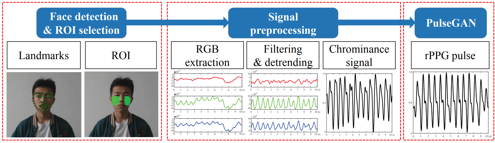
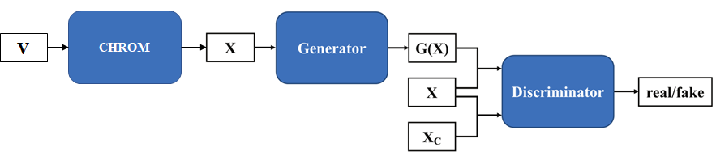
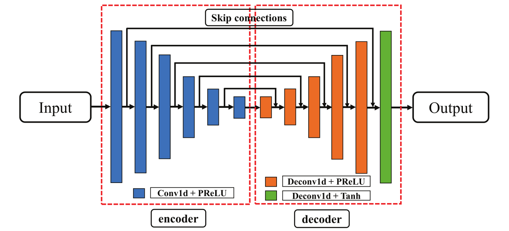
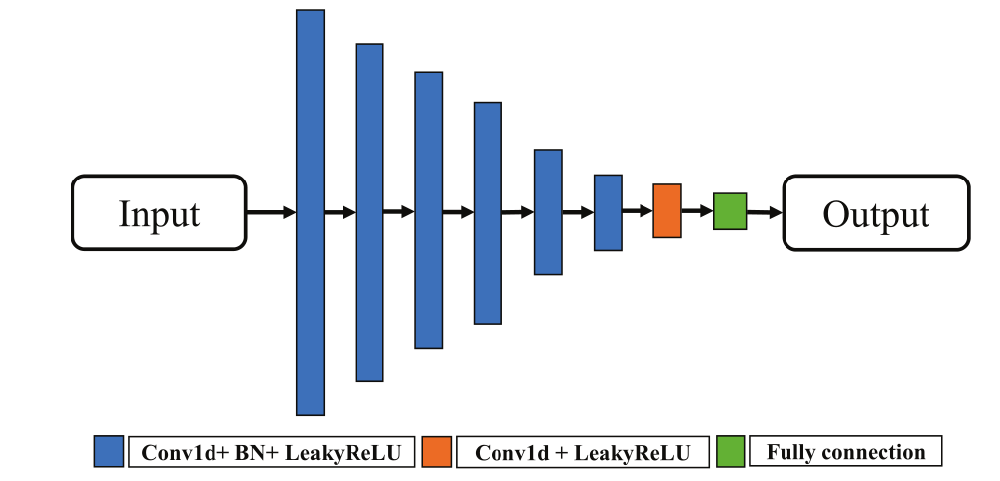
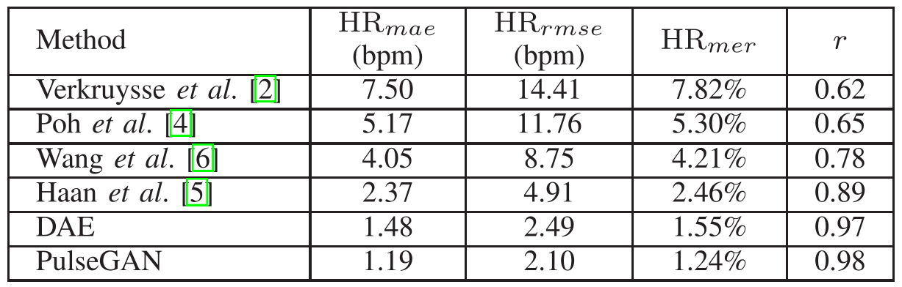
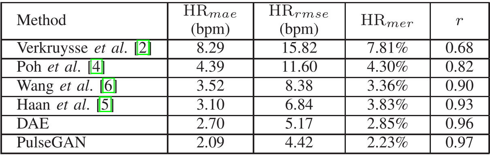

<h2>
 PulseGAN: Learning to generate realistic pulse
waveforms in remote photoplethysmography 
</h2>

【心率检测】【BHI2021】【[paper](https://arxiv.53yu.com/pdf/2006.02699)】【[code非官方](https://github.com/miki998/PulseGAN.git)】

### 摘要

&emsp;&emsp;本文引入了一种使用 GAN 训练的网络，网络并不直接从原始视频中获得 rppg 信号，而是使用其他方法已经估计出的粗糙 rppg 信号进行细化，BHI 是生物信息期刊，这篇文章相对其他论文具备更多的专业性指标，但是实验做得很少，没有在其他数据集内验证有效性。

### 概览

<!-- more -->

----

### 创新

- 针对已有的粗糙的 rppg 信号估计更加精确的信号
- 结合了 GAN 和 Conv（可惜这里 GAN 并非生成式任务，不然可以试着用 DM 代替）

### 网络

&emsp;&emsp;这篇文章的网络结构很简单，主要分为两个部分：1. 已有的方法估计出的粗糙的 rppg 信号，2. 使用 GAN 进行对抗式训练。

&emsp;&emsp;首先将输入 $V\in\mathbb R^{T\times C\times H\times W}$ 输入某个方法用于提取粗糙信号 $X\in\mathbb R^{T}$，为了快速训练和对运动鲁棒，本文选择的方法是 CHROM（又或许是因为 SOTA 很难再改进了），实际上这种方式在 Dual-GAN 里面也有运用，使用这种类似 CGAN 结构训练的话，一个直观的想法是直接从原视频中生成 rppg 信号。

&emsp;&emsp;但是无论是这篇文章还是 Dual-GAN 都没有这么做的原因应该是原视频包含了太多的噪音。因此 CHROM 的预处理相当于剔除环境噪音，而 Dual-GAN 则采用 STMap 进行输入，在某种程度上也是去除环境噪音。

&emsp;&emsp;将处理之后的粗糙信号 $X$ 输入 U-Net 形状的生成器 $G$，得到整形之后的输出 $G(X)\in\mathbb R^{T}$，接着借用 CGAN 的方式，将 $G(X)$ 和 $X$ 组合（cat）之后输入判别器 $D$ 并判断概率。

&emsp;&emsp;判别器 $D$ 总共接受两个输入：1. $(G(X),X)$，2. $(X_C,X)$，其中 $X_C$ 为 GT。判别器期望对输入 1 判别为假，对输入 2 判别为真，生成器则相反。判别器估计之后的结果计算 loss 之后回传至生成器。

&emsp;&emsp;其中，生成器 $G$ 的网路结构如图所示，整个网络是 U-Net 形状的网络，包含 6 个降采样和升采样模块，每个模块由 1d 卷积和 PReLU（在 ReLU 的基础上的改进，用于防止过拟合）组成，解码器则是对应的 1d 转置卷积。

&emsp;&emsp;同上，判别器 $D$ 的网络结构如下：

### 损失

&emsp;&emsp;对抗训练的损失可以写为：
$$
\begin{align}
&L_G=\frac12(D(G(X),X)-1)^2+\lambda||X_c-G(X)||_1+\beta||X_{cf}-G_f(X)||_1\\
&L_D=\frac12(D(G(X),X))^2+\frac12(D(X_c,X)-1)^2
\end{align}
$$

&emsp;&emsp;其中， $X_{cf}$ 和 $G_f$ 分别表示对 $X_c,\ G(X)$ 进行傅里叶变换向频率域的映射后的信号值，生成器期望：1. $G(X)$ 难以分辨真假，2. $G(x)$ 在时间域上接近 GT，3. $G(X)$ 在频率域上接近 GT；判别器期望：能够分辨 $G(X)$ 和 $X_c$。

### 结果

&emsp;&emsp;本文整体来说实验较少，主要实验是在 UBFC 上做了数据集内测试如下所所示，其中的 $HR_{mer}$ 表示平均错误率百分比，至少在 MAE 和 RMSE 上达到的结果只能说还 ok，毕竟在 21 年的时候 Siamese rppg 也发表了。

&emsp;&emsp;接着是跨数据集测试，PURE → UBFC。可以看出指标下滑较多，因为只选了 DAE 做对比因此看上去还行，整体上不如 Siamese rppg，不过跨数据集只做了这一个略显寒酸了。

&emsp;&emsp;其他的实验测量了包括 AVNN，SDNN、IBI 等其他方法不测试的指标，因为没得比，因此主要是做离群值分析，或许是因为发在生物信息的期刊，对这方面的指标比较看重吧。

