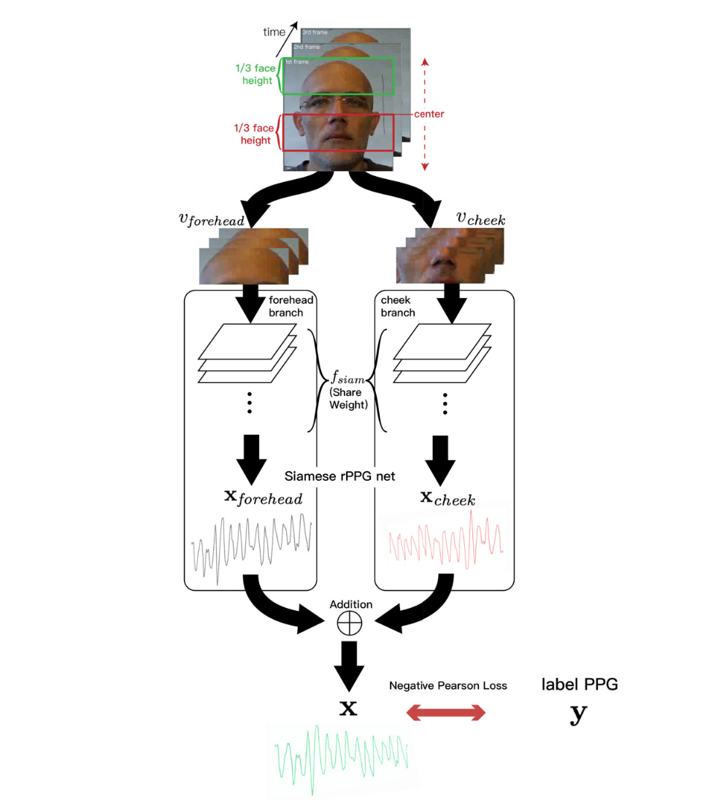
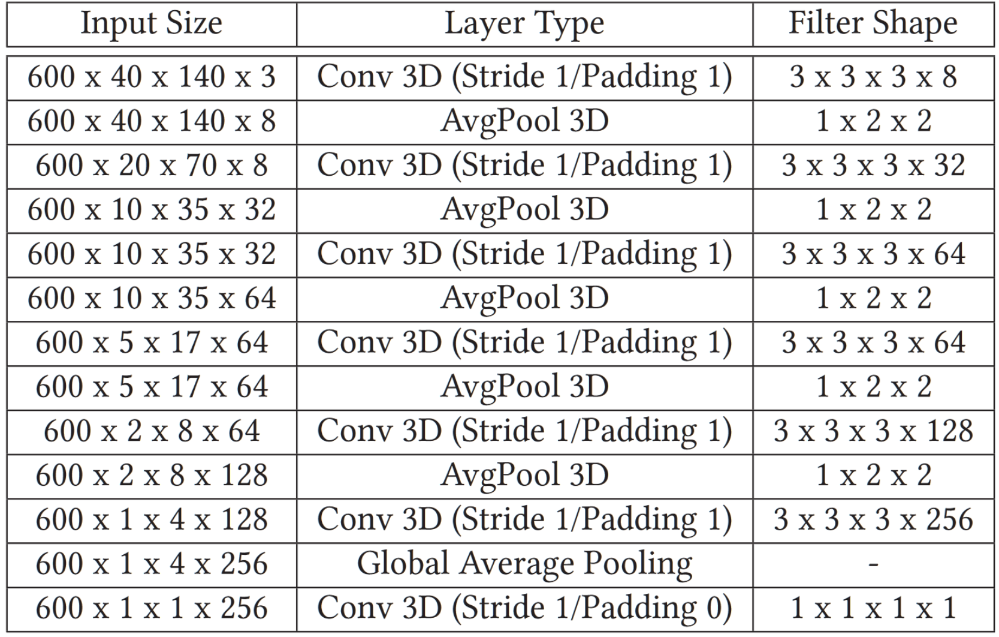
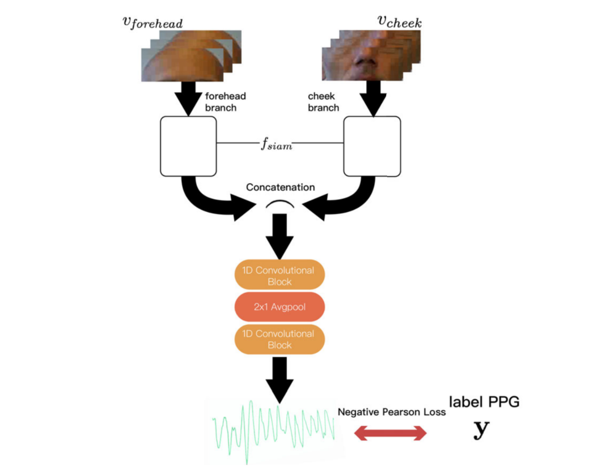
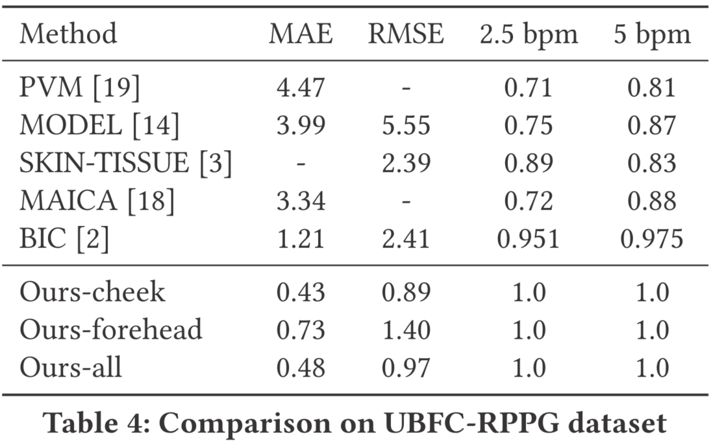
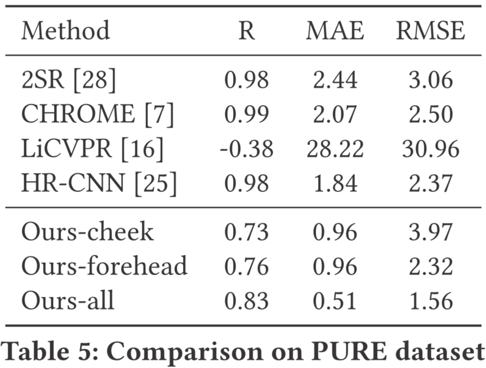
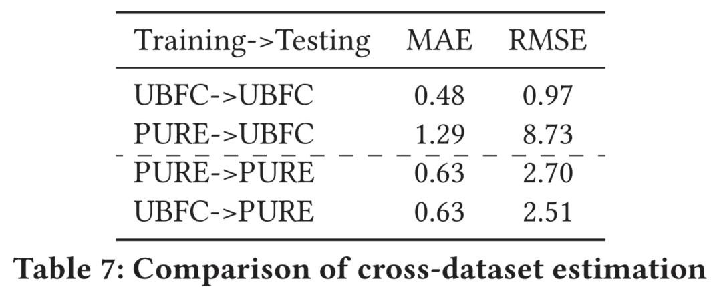

<h2>
 Siamese-rPPG network: remote photoplethysmography signal estimation from face videos 
</h2>

【心率监测】【SAC2020】【[paper](https://dl.acm.org/doi/10.1145/3341105.3373905)】【[code未开源]()】

### 摘要

&emsp;&emsp;本文提出了一种基于孪生网络的 rppg 估计网络，这种网络结构以一种十分简单的思路对人脸进行分割，通过简单的 3DCNN 取得了很好的结果，这篇文章当初觉得太简单没有看，但看数据居然和 Dual-GAN 差不多。这篇文章整体来说比较容易，但是一些处理能够引发思考：心率估计是否不太需要复杂的非线性计算能力？

### 概览

<!-- more -->

----

### 创新

- 使用孪生网络针对不同 ROI 进行提取，这应该是最早的对不同 ROI 能够提取同样心率的假设
- 假设同一个 clip 的 ROI 区域关键点很接近（在新的 VIPL 等数据集上似乎不太适用）

### 网络

&emsp;&emsp;对于同一个视频，首先将其裁剪成 clip $v$，这里在实现的时候选取的帧数较高，$v\in R^{600\times W\times H\times C}$，接着对于每一个 clip 的第一帧使用 dlib 库函数标定人脸关键点，并且通过该信息区分出额头区域和脸颊区域的大致 crop 范围，接下来对剩余视频的每一帧不再执行人脸关键点标定，而是直接使用第一帧的结果。这种方式是极其简单的偷懒方式，但也是有原因的，rppg 估计的网络大多没有大幅度的动作变化，并且简单裁剪之后就可以得到粗略的人脸对齐结果。

&emsp;&emsp;对于获得的额头区域和脸颊区域，分别取出 $v_{forehead},\ v_{check}$，将其输入一个孪生网络，该孪生网络具备两个相同的分支，具体来说每个分支的结构如下：

&emsp;&emsp;通过网络之后将会分别得到两个预测结果，分别记为 $x_{forehead},\ x_{check}$，接下来是一个 late fusion，这里的 fusion 策略也很关键，本文最初尝试了 Conv+pooling 结构，如下图所示：

&emsp;&emsp;但是这样的结果很差，因此最终本文选择了直接使用两个信号的加法，即 $x=x_{forehead}+x_{check}$，这里又是一点，在某个程度上证明了对于 rppg 估计任务也许简单的策略才是好的。对于得到的结果，本文选择 NPCLoss，离谱的是居然还说明了一下为啥选择 NPC，或许是因为文章发得比较早？现在早已是固定的选择了。计算出 loss 之后进行梯度回传，这里是我比较疑惑的点，因为参数共享的网络梯度回传有不同的做法，不说清楚的话不知道是怎么做的，猜想应该是先锁住一个，回传并更新另一个的梯度，再锁住另一个并更新之前被锁住分支的参数，然后更新之前锁住的梯度。

&emsp;&emsp;接着为了评估网络效果，对 HR 的计算也很简单，不使用 PSD，而是直接用 fft，然后去除心率 < 40 或者 > 180 的，再在剩余的频率中取最大值，其实和 PSD 差不多，毕竟 PSD 也是根据 fft 来的，不过或许和现在的方法比起来稍显落后。

### 结果

&emsp;&emsp;本文的结果在 UBFC 和 PURE 上做了测试，这两个数据集都属于比较简单的，结果相对来说比较容易达到好的效果，本文这种用简单方法做出来的结果反而好得很，在更复杂的数据集上或许会变差一些。

&emsp;&emsp;同时还有跨数据集的测试，效果比较差一些，应该是简单的策略匹配简单的数据集和简单的任务吧，可以看到在 PURE 训练的结果在 UBFC 上迁移效果比较差，反过来则不是这样。这或许也是因为 UBFC 相对于 PURE 更加有利于模型的训练。

----

### 启发

&emsp;&emsp;本文总共采用了三个简单化处理的策略：1. 使用每个 clip 的第一帧标定 ROI，其余帧不再检测，2. 使用加法做 late fusion，而不是基于学习的方法，3. 使用 ftt 提取 HR，而不是用 PSD。有意思的是在这种设置下效果反而不错，有这么一种可能，虽然心率监测的任务看起来玄学一些，但是对于稀疏编码了生理信号的视频，也许提取 ppg 信号不太需要模型具备复杂的高维映射能力。
