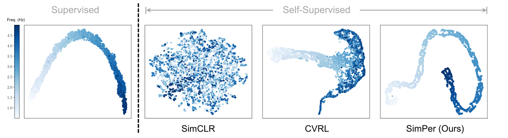
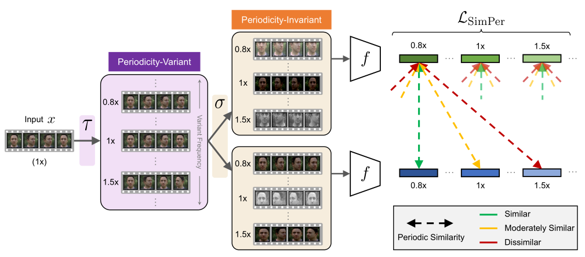
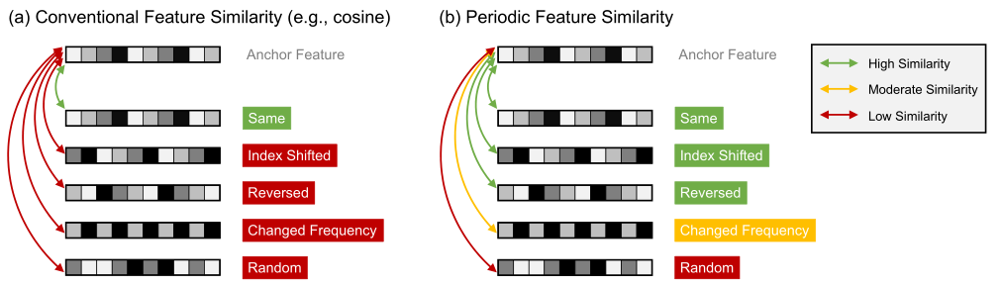
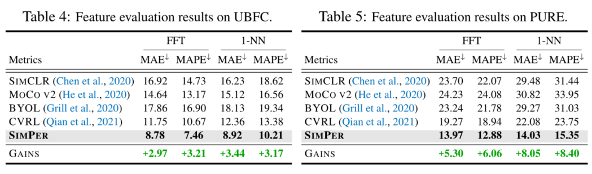

<h2>
 SIMPER: SIMPLE SELF-SUPERVISED LEARNING OF PERIODIC TARGETS 
</h2>

【周期性信号对比学习】【arxiv】【[paper](https://arxiv.org/pdf/2210.03115.pdf)】【[code](https://github.com/YyzHarry/SimPer)】

### 摘要

&emsp;&emsp;本文探索了旧有对比学习方法在周期性任务学习中的局限性，提出了一种新的周期性对比学习的代理任务，并且改进了 InfoNCE，测试了六个周期性变化的对比学习任务，和 MoCo，SimCLR，BYOL 等对比学习方法相比取得了较大的进步。（其实是个实验详实的水文，对比的这些 SOTA 都是学 ID 或者 ACTION 语义的，和 HR 等目标完全不一样）

### 概览

<!-- more -->

----

### 创新

- 提出周期性任务对比学习的内在特性
- 提出了一种周期性任务对比学习的框架 SimPer

### 网络

&emsp;&emsp;对于网络结构，参考 [The Way to My Heart](https://bnucsy.github.io/HR_CL_the_way_to_my_heart/) 是一目了然的，也就是提了一些更加准确性的定义：

- $\tau$：周期改变的数据增强
- $\sigma$：周期不变的数据增强

&emsp;&emsp;因此对于输入 $x$ 首先进行周期改变的数据增强，得到 $\tau_i(x),i\in [1,k]$，对于得到的 $k$ 个视频，将其逐个进行周期不变的增强，每个视频进行两次增强作为 pos 对，得到 $2k$ 个样本 $\sigma_i(\tau_j(x)),i\in [1,2],j\in[1,k]$。对于所有的样本通过 backbone $f$，$\tau $ 下标一致的接近，不一致的远离。

&emsp;&emsp;其中 backbone 针对不同的六个任务选取不同，RotatingDigits 和 SCAMPS 上，采用了 CNN 的简单 3D 变体。采用 TS-CAN 模型的变体对 UBFC 和 PURE 进行实验。最后，在 Countix 和 LST 上，使用ResNet-3D-18。

### 损失

&emsp;&emsp;对于损失函数，为了度量周期性信号的相似度，不可以使用普通的 cos 方式测量，而是需要能够测量周期的损失，绝对误差和周期误差的区别如下图所示。

&emsp;&emsp;因此本文尝试了 MXCorr（最大互相关）和 nPSD（归一化功率谱密度）对周期性信号进行建模，并且提出了一种基于 InfoNCE 的广义 InfoNCE。

- InfoNCE

$$
\rm \mathcal L_{InfoNCE}=-log\frac{exp(sim(z,\hat z)/\nu)}{\sum_{z'\in \mathcal Z/\{z\}}exp(sim(z,z')/\nu)}
$$

- Generalized InfoNCE

$$
\rm\mathcal L_{SimPer } = \mathop\sum\limits_i \mathcal l_{SimPer}^i
$$

$$
\rm \mathcal l_{SimPer}^i=\mathop\sum\limits_i-\mathop\sum\limits_{j=1}^M\frac{exp(w_{i,j})}{\sum_{k=1}^Mexp(w_{i,k})}log\frac{exp(sim(z_i,\hat z_j)/\nu)}{\sum_{k=1}^Mexp(sim(z_i,z_k')/\nu)}
$$

&emsp;&emsp;综合来看，其本身没有和 InfoNCE 的太大区别，区别在于对于高频采样的信号，GInfoNCE 可以将其视为连续信号计算误差，这样在实验中可以得到更好的优化。

### 结果

&emsp;&emsp;结果相对于 SIMCLR、MoCo，BYOL，CVRL 等都好很多，但是和正儿八经做周期性对比学习的方法差很多，以心率检测为例：其中 FFT 和 1-NN 是分别以傅立叶变换和最近邻分类器直接评估学习到的特征。虽然这样做由于没有进行特殊设计相比于 The Way to My Heart 略有劣势，但结果也差了不少，和 physnet 都差很多，更不用提 physformer 和 Dual-GAN 了。

