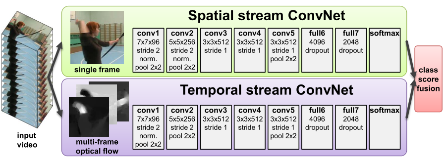
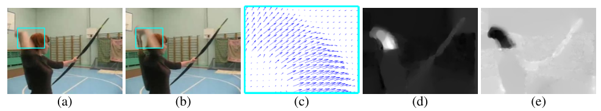
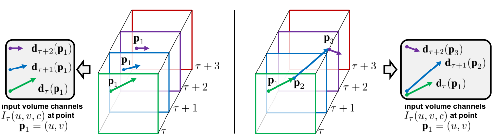

## [Two-stream convolutional networks for action recognition in videos](https://proceedings.neurips.cc/paper/2014/file/00ec53c4682d36f5c4359f4ae7bd7ba1-Paper.pdf) 【视频动作识别】 NIPS2014

### 摘要

&emsp;&emsp;双流网络是卷积神经网络在视频理解领域的第一个应用，在这之前的视频理解都是基于手工制作的特征，正是从这项工作开始，视频理解领域步入 CNN 时代。虽然早就有人尝试使用 CNN 做视频，但是效果很差，主要原因是 CNN 难以理解视频帧之间的时间变化。双流网络克服了这个问题，提出了使用光流信息代替时间变化的思路，将空间帧和光流帧按顺序输入两个不同的 CNN 网络，将得到的输出通过一个 SVM 分类器进行分类。

### 概览

<!-- more -->

----

### 创新

- 使用双向光流图代表时间信息
- 对光流图的叠加方式进行了探究
- 使用了 JPEG 的方式存储光流图

### 网络

&emsp;&emsp;本文的网络正如概览，大致是个 AlexNet 变体，对于输入的 video，单帧输入空间流网络，同时抽取光流之后堆叠输入时间流网络，得到的结果通过 SVM 进行分类，两个网络联合训练，是经典且简单的 CNN。

#### 光流

&emsp;&emsp;光流顾名思义表示了光的流动，在图像每一帧之间抽取光流，对于 (a)，(b) 两帧抽取光流，将会得到 (c)，(c) 是一个二维表示，每个点有一个梯度，梯度的方向和大小分别代表了点移动的方向和距离，二维表示中的二维分别是水平方向和垂直方向的变化。如果将水平方向和垂直方向的单一维度进行灰度图可视化，将会得到 (d)，(e)。

&emsp;&emsp;光流是一种直接性的时间变化信息，因此本文使用这种数据的堆叠输入 CNN，帮助 CNN 进行了难以理解的特征的抽取，得出了较好的结果。但是光流存在一些缺点，1.计算较为困难，2.密集表示的光流需要的空间太大。为了解决这些问题，本文提出了一种基于 GPU 方式计算光流的方法，平均计算一张光流图需要 0.06s，同时对于一张 HxWx2 的光流图，本文采用 JPEG 的方式压缩图像，在需要使用的时候再解压缩。这种方式能够在一定程度上解决前两个问题，但是以目前的眼光来看，对于大型数据集，光流预处理时间需要按周/月来计算，存储空间也是 TB 级别。更离谱的是，时至今日，仍然没有人提出更好的处理和存储方式，基本上光流已经被废弃了。

#### 光流叠加

&emsp;&emsp;在光流抽取之后，作者认为将光流逐帧输入 CNN 在一定程度上丧失了其时间上的语义信息，因此作者选取连续的 10 个帧，将其光流进行叠加。这里作者探讨了两种叠加方法：

&emsp;&emsp;图左表示直接进行叠加，也就是单纯地将计算得到的光流按帧排列，然后输入给网络，图右是一种更加利用光流位移信息的叠加方式，对于后一帧的图像，其每个点的梯度继承前一帧同一个点的梯度，两个梯度进行叠加，用于表示当前状态相对于初始状态下的位移情况。看上去第二种叠加更加有效，但实际上单纯的排列会得到更好的效果，作者表示了疑惑但没有解释原因。我猜这是因为对于 CNN 来说，从原始叠加学会梯度移动的叠加并不困难，但是返回来就会很难学习。当然，这也是结果导向的猜测，原始堆叠更好我也能编个理由出来。

#### 数据组织方式

&emsp;&emsp;本文的输入数据采样固定数量的帧 ( 25 个) ,它们之间的时间间隔相等。从每一帧中，通过裁剪和翻转帧的四个角和中心，获得 10 个 ConvNet 输入，因此对每一组输入共有 250 维。对于光流图像一致。

&emsp;&emsp;同时，本文采用了双向光流，也即同时对这个视频倒着计算光流，分别进行输入和计算，和 bi-LSTM 一致。这种方式是稳定的涨点方法，基本等同于平时的金字塔操作。

