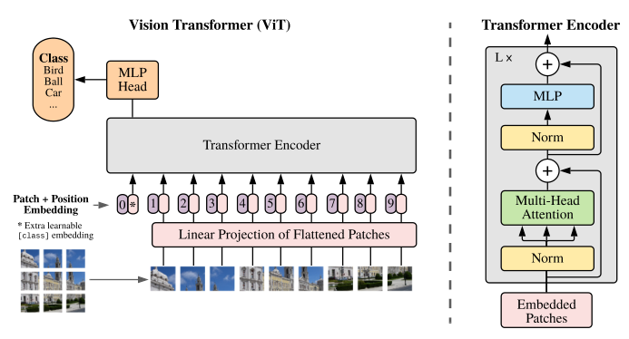
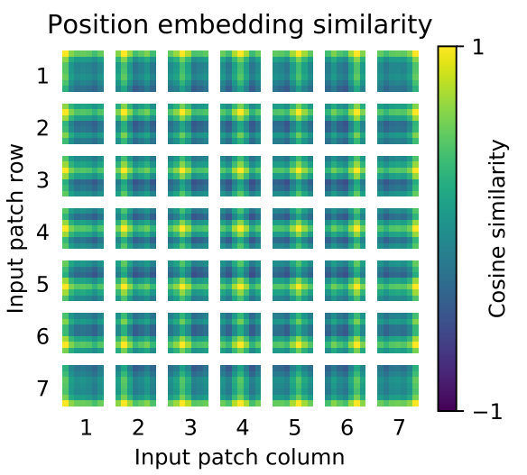

## [AN IMAGE IS WORTH 16X16 WORDS](https://arxiv.org/abs/2010.11929)  【图像分类】 ICLR

### 摘要

&emsp;&emsp;VIT(vision transformer) 是第一个将NLP领域的颠覆性成果——transformer成功迁移到视觉领域的工作。VIT采用了非常简单的操作使图像可以像文字序列一样输入transformer架构之中。正如题目所说，VIT将图像分为许多16x16的patch，并将这些patch视为句子中的word，将图像视为句子，几乎完全使用transformer架构完成了对CNN的超越。

### 概览



<!-- more -->

----

### 创新

- 将图像打成patch，几乎使用标准transformer进行处理
- 借鉴bert，采用cls作为标志位进行分类

### 理论

&emsp;&emsp;整体来说，该工作与普通的transformer差别不大，基本过程几乎没有差别，在这里的分析过程中不讲理由，只按照论文的前向过程走一遍，看一下VIT中的各个参数维度变化。

#### patch embedding

&emsp;&emsp;初始输入的图像 image 具有 $H\times W\times C$ 的 shape，首先我们需要对每个 image 按照 $P\times P$ 切分成多个 patch，理论上共有 $N = \frac{HW}{P^2}$ 个patch。以 VIT-base 为例，$H = W = 256, P = 32$, 切分之后有8\*8=64个patch， 每个patch经过拉平之后大小为32\*32=1024维，此时输入序列为 $(N, P^2\times C)$，在这之后，为了对准标准 transformer，使用一个Linear层完成从 $P^2\times C \rightarrow D$ 的维度转化。因此输入的序列维度为 $(N,D)$。VIT-base 中 $D=1024$。

```python
assert image_size % patch_size == 0, 'Image dimensions must be divisible by the patch size.'  # 保证一定能够完整切块
num_patches = (image_size // patch_size) ** 2  # 获取图像切块的个数
patch_dim = channels * patch_size ** 2  # 线性变换时的输入大小，即每一个图像宽、高、通道的乘积
assert pool in {'cls', 'mean'}, 'pool type must be either cls (cls token) or mean (mean pooling)'  # 池化方法必须为cls或者mean

self.to_patch_embedding = nn.Sequential(
    Rearrange('b c (h p1) (w p2) -> b (h w) (p1 p2 c)', p1 = patch_size, p2 = patch_size),  # 将批量为b通道为c高为h*p1宽为w*p2的图像转化为批量为b个数为h*w维度为p1*p2*c的图像块
    # 即，把b张c通道的图像分割成b*（h*w）张大小为P1*p2*c的图像块
    # 例如：patch_size为16  (8, 3, 48, 48)->(8, 9, 768)
    nn.Linear(patch_dim, dim),  # 对分割好的图像块进行线性处理（全连接），输入维度为每一个小块的所有像素个数，输出为dim（函数传入的参数）
)
```

---

#### position embedding

&emsp;&emsp;VIT的位置编码不像普通transformer的编码直接指定，而是通过学习进行编码，VIT将会初始化一个size和输入序列一致的位置编码 $(N,D)$，然后和序列每个位置的编码直接相加，通过梯度下降学习。事实上，通过这种策略学习到的编码在变回2D之后，其大小分布基本表示了每个patch在原图像中的位置，如下图。



&emsp;&emsp;在加入位置编码的同时，VIT为了实现分类任务进行了对bert的借鉴，也就是在整个序列的首位加入了一个CLS标志位，直接使用CLS标志位的输出过一个MLP后进行图像分类。

```python
self.pos_embedding = nn.Parameter(torch.randn(1, num_patches + 1, dim))  # 位置编码，获取一组正态分布的数据用于训练
self.cls_token = nn.Parameter(torch.randn(1, 1, dim))  # 分类令牌，可训练
```

---

#### transformer encoder

&emsp;&emsp;这里的计算过程基本和transformer没有区别，详见[标准transformer](https://bnucsy.github.io/Attention%20is%20all%20you%20need/)，这里主要说一些不同点，在VIT中，首先要进行LayerNorm再进行MHA，虽然事实上transformer在pytorch中的接口中也提供了这种先做norm的选项。这里没有 $A\&N$ 部分，非要说的话可以说成 $N\&A$，具体地，这 $L$ 次encoder中的变化过程大致是：
$$
\rm A^i \rightarrow Z,Z=A + MHA(LayerNorm(A))\rightarrow A^{i+1},A^{i+1}=Z+MLP(LayerNorm(Z))
$$
&emsp;&emsp;这里的 MLP 约等于标准 transformer 中的 FFN，都属于先放大再缩小的全连接层，VIT-base 中的隐藏层维度为 2048，具体到 transformer 中的内部参数，$W_{Q/K/V}\rightarrow (1024,64), headers=6$。另有一处区别于标准transformer，在 MLP 中，其过程中的 RELU 被替换成了 GELU，并且在多处加入了dropout，由于实在有很多地方都加入了dropout，具体哪些位置这里不做记录。

```python
class PreNorm(nn.Module):
    def __init__(self, dim, fn):
        super().__init__()
        self.norm = nn.LayerNorm(dim)  # 正则化
        self.fn = fn  # 具体的操作
    def forward(self, x, **kwargs):
        return self.fn(self.norm(x), **kwargs)

class FeedForward(nn.Module):
    def __init__(self, dim, hidden_dim, dropout = 0.):
        super().__init__()
        # 前向传播
        self.net = nn.Sequential(
            nn.Linear(dim, hidden_dim),
            nn.GELU(),
            nn.Dropout(dropout),
            nn.Linear(hidden_dim, dim),
            nn.Dropout(dropout)
        )
    def forward(self, x):
        return self.net(x)

class Attention(nn.Module):
    # attention
    def __init__(self, dim, heads = 8, dim_head = 64, dropout = 0.):
        super().__init__()
        inner_dim = dim_head *  heads  # 计算最终进行全连接操作时输入神经元的个数
        project_out = not (heads == 1 and dim_head == dim)  # 多头注意力并且输入和输出维度相同时为True

        self.heads = heads  # 多头注意力中“头”的个数
        self.scale = dim_head ** -0.5  # 缩放操作，论文 Attention is all you need 中有介绍

        self.attend = nn.Softmax(dim = -1)  # 初始化一个Softmax操作
        self.to_qkv = nn.Linear(dim, inner_dim * 3, bias = False)  # 对Q、K、V三组向量先进性线性操作

        # 线性全连接，如果不是多头或者输入输出维度不相等，进行空操作
        self.to_out = nn.Sequential(
            nn.Linear(inner_dim, dim),
            nn.Dropout(dropout)
        ) if project_out else nn.Identity()

    def forward(self, x):
        b, n, _, h = *x.shape, self.heads  # 获得输入x的维度和多头注意力的“头”数
        qkv = self.to_qkv(x).chunk(3, dim = -1)  # 先对Q、K、V进行线性操作，然后chunk乘三三份
        q, k, v = map(lambda t: rearrange(t, 'b n (h d) -> b h n d', h = h), qkv)  # 整理维度，获得Q、K、V

        dots = einsum('b h i d, b h j d -> b h i j', q, k) * self.scale  # Q, K 向量先做点乘，来计算相关性，然后除以缩放因子

        attn = self.attend(dots)  # 做Softmax运算

        out = einsum('b h i j, b h j d -> b h i d', attn, v)  # Softmax运算结果与Value向量相乘，得到最终结果
        out = rearrange(out, 'b h n d -> b n (h d)')  # 重新整理维度
        return self.to_out(out)  # 做线性的全连接操作或者空操作（空操作直接输出out）

class Transformer(nn.Module):
    def __init__(self, dim, depth, heads, dim_head, mlp_dim, dropout = 0.):
        super().__init__()
        self.layers = nn.ModuleList([])  # Transformer包含多个编码器的叠加
        for _ in range(depth):
            # 编码器包含两大块：自注意力模块和前向传播模块
            self.layers.append(nn.ModuleList([
                PreNorm(dim, Attention(dim, heads = heads, dim_head = dim_head, dropout = dropout)),  # 多头自注意力模块
                PreNorm(dim, FeedForward(dim, mlp_dim, dropout = dropout))  # 前向传播模块
            ]))
    def forward(self, x):
        for attn, ff in self.layers:
            # 自注意力模块和前向传播模块都使用了残差的模式
            x = attn(x) + x
            x = ff(x) + x
        return x
```

---

#### MLP header

&emsp;&emsp;最后的MLP就是一个普通的MLP，$\rm layernorm +Linear$就无了。

```python
self.mlp_head = nn.Sequential(
    nn.LayerNorm(dim),  # 正则化
    nn.Linear(dim, num_classes)  # 线性输出
)
```

---

### 损失

&emsp;&emsp;由于是分类问题，VIT使用最终输出的结果和真实label进行计算交叉熵损失。其SOTA的性能由JFT的大规模数据集预训练保证。

