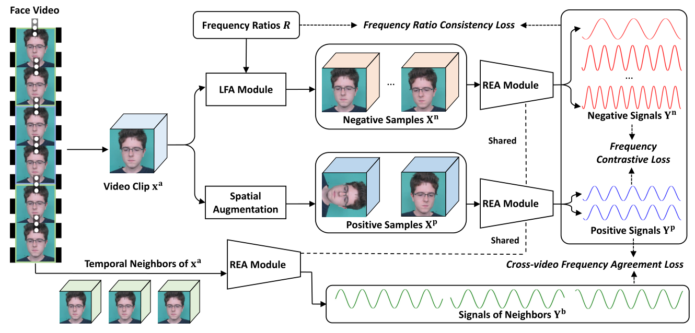
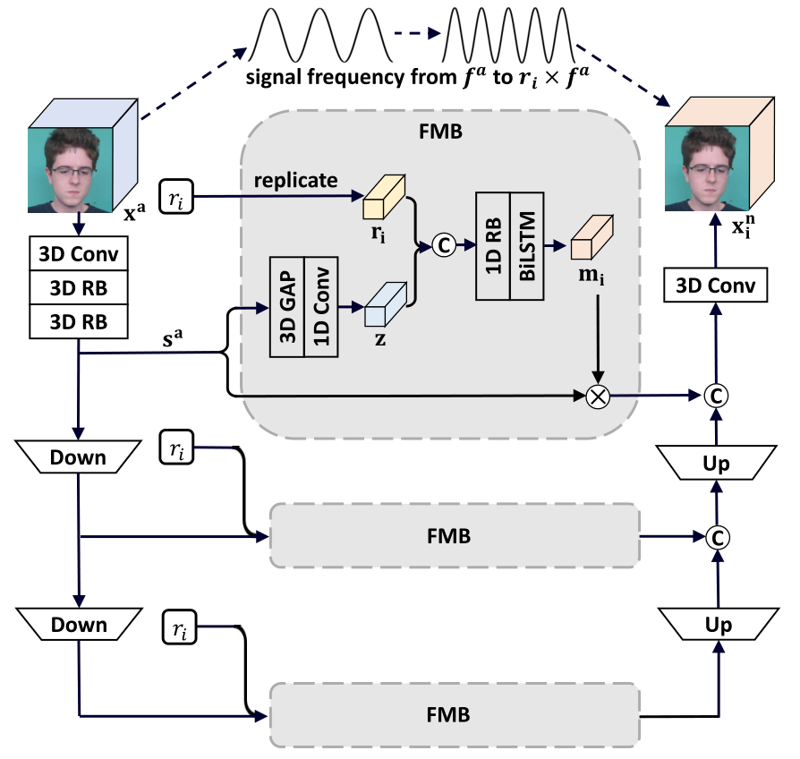
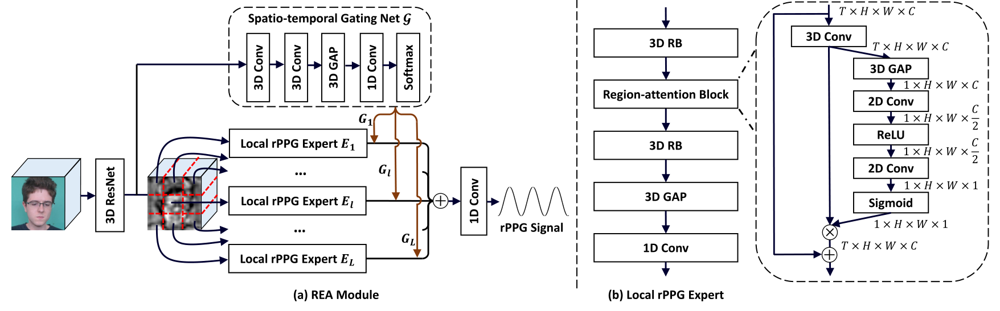
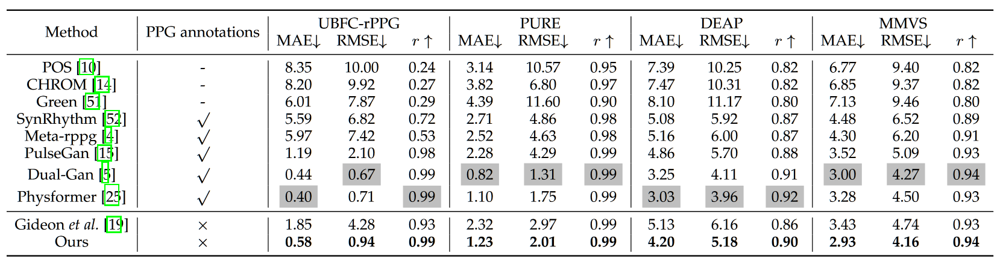
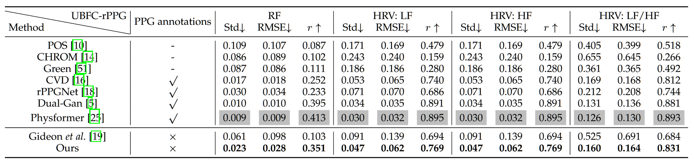
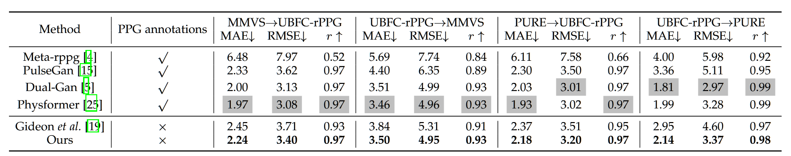

<h2><center> Video-based Remote Physiological Measurement via Self-supervised Learning </center></h2>

【心率监测】【arxiv2022】【[paper](http://arxiv.org/abs/2210.15401)】【[code](https://github.com/yuezijie/Video-based-Remote-Physiological-Measurement-via-Self-supervised-Learning)】

### 摘要

&emsp;&emsp;本文是基于对比学习进行 rppg 信号估计的又一 SOTA，在 UBFC、PURE、DEAP、MMVS 上展示了最好的性能。鉴于目前的 rppg 对比学习网络结构基本都基于孪生网络，在数据增强和代理任务上进行创新，本文主要采样的方法有：正样本：来自空间增强的 anchor $p_1$ 和 anchor 在同一个 video 的邻居 $p_2$，负样本：来自 LFA 模块 $n$，该模块可以在视觉不变的基础上进行频率重采样，代理任务：对比 $p_1$ 和 $p_2$ 拉进距离，对比 $p_1$ 和 $n$ 拉远距离，backbone：基于混合专家模型的 ResNet3D。并且对于多样的样本提出了多样的损失。

&emsp;&emsp;整体来说起作用的我认为最可能是 LFA，该模块可以生成大量的负样本，或许负样本的数量是 CL 的关键。

### 概览



<!-- more -->

----

### 创新

- 一种新的正样本获取策略：时间上的邻居
- 一种新的负样本获取策略：基于学习的 LFA 模块，用于生成不同频率但人物一致的视频
- 一种基于混合专家模型的 backbone
- 对正样本间、正负样本间的不同损失函数 CFAL、FCL、FRCL

### 网络


#### 前向过程

- 对于输入的视频 $X$，首先将其裁剪为多个 clip，每个 $T$ 帧，然后随机选择其中一个 clip 作为主 clip $X^a$，而其他的 clip 作为邻居 $X^b$，此时的 $X^b$ 也是正样本的一员
  - 在实现的过程中，每个输入产生三个邻居，这些正样本之间互相不重合帧，记为 $X^b_1,\ X^b_2,\ X^b_3$

```python
def load_img(filepath, scale, video_length):
    list = os.listdir(filepath)
    imglen = len(list)
    begin = random.randrange(0, int(imglen-(video_length*4)))
    whole_video = []
    count = [0, 1, 2, 3]
    for i in range(begin, begin + (video_length*4)):

        img = cv2.imread(os.path.join(filepath, 'face_{0}.png'.format(i)))
        img = cv2.resize(img, (scale, scale))

        whole_video.append(img)
    whole_video = np.array(whole_video)

    whole_video = whole_video.reshape(
        (4, video_length, whole_video.shape[1], whole_video.shape[2], whole_video.shape[3]))
    a = random.choice(count)
    input = whole_video[a]
    count.remove(a)
    neighbor1 = whole_video[count[0]]
    neighbor2 = whole_video[count[1]]
    neighbor3 = whole_video[count[2]]
    return input, neighbor1, neighbor2, neighbor3
```

- 同时输入的还有一系列的频率 $R$，这个频率数组控制了期望 LFA 模块后的 video 与原 clip 的频率比，$R$ 中的值随机在 $(0.3,0.8)\cup(1.2,1.7)$ 之中产生

```python
def frequency_ratio():
  ratio_interval1 = np.random.uniform(0.3, 0.8)
  ratio_interval2 = np.random.uniform(1.2, 1.7)
  full_interval = np.stack((ratio_interval1, ratio_interval2))
  random_ratio = np.random.choice(full_interval)
  return random_ratio
```

- 对于 $X^a$，执行以下两种增强策略：
  - 将 $X^a$ 和 $R$ 输入 LFA 模块，得到负样本 $X^n$，这应当是本文的关键，即大量的有效负样本
    - 重建之后为了保证视觉一致性，需要通过重建损失 $L_{rec}=\mathrm {MSE}(X^a,X^n)$
  - 将 $X^a$ 进行空间上的数据增强，具体来说就只包括旋转和反转，得到正样本 $X^p$
    - 在实现的过程中，每个 $X^a$ 生成两个正样本，记为 $X^p_1,\ X^p_2$
- 对于之前得到的所有正负样本：$X^b,\ X^p,\ X^n$，将他们全部通过 rppg 估计网络 REA 模块，分别得到输出 $Y^b,\ Y^p,\ Y^n$
- 为了拉进正样本之间的距离以及拉远正负样本之间的距离，同时限制 LFA 的学习，需要过以下 3 个损失
  - 用于拉进同视频增强后的正样本距离，同时与负样本拉远距离，需要通过 $L_{FCL}=f_1(Y^p_1,\ Y^p_2,\ Y^n)$
    - 有一说一，其他的两个 loss 算是新的，这个 loss 最多算是重写了一下 InfoNCE
  - 用于拉进增强后正样本与邻域正样本的距离，需要通过 $L_{CFAL}=f_2(Y^p_1,\ Y^p_2,\ Y^b_1,\ Y^b_2,\ Y^b_3)$
  - 用于限制正负样本对之间的信号比与 $R$ 一致，也就是为了 LFA 的学习，需要通过 $L_{FRCL}=f_3(R,\ Y^p_1,\ Y^p_2,\ Y^n)$
- 将所有 loss 求和之后进行梯度回传，loss 之间不设权重调整项

#### LFA 模块



&emsp;&emsp;LFA 模块是生成负样本的关键，其正向过程如下：

- 对于输入的 $X^a$，首先经过 3D 卷积和 Res3D，得到 $s^a_1$
- 再将 $s^a_1$ 进行降采样两次分别得到 $s^a_2,\ s^a_3$，所有的 $s_i^a$ 和从 $R$ 中 sample 出的 $r_i$ 共同输入 FMB 模块
  - 对于每个 FMB 模块，首先将 $s^a$ 进行全局池化和卷积得到 $z$，然后将 $r_i$ 填充至和 $z$ 等长（其实输入的时候就是等长）
  - 然后 cat $r_i$ 和 $z$，并经过一个 Res 块和 LSTM，输出之后和之前的输入 $s^a$ 做按位乘法后输出
  - FMB 的伪代码如下：

```python
class FMB(nn.Module):
    def __init__(self, s_a, ratio, video_length):
        super(FMB, self).__init__()
        self.mod_gap = nn.AdaptiveAvgPool3d((video_length, 1, 1))
        self.mod_conv1d = nn.Conv1d(
            in_channels=base_filter, out_channels=1, kernel_size=3, stride=1, padding=1)
        self.mod_res1d = ResnetBlock1D(
            2, kernel_size=3, stride=1, padding=1, bias=True, activation='relu', norm=None)
        self.mod_lstm = nn.LSTM(2, 1, num_layers=1, batch_first=True)

    def forward(self, input, ratio):
        s_a = self.mod_gap(s_a)
        s_a = s_a.squeeze(3)
        s_a = s_a.squeeze(3)
        z = self.mod_conv1d(s_a)
        r_i = ratio.unsqueeze(1)
        fuse = torch.cat((z, r_i), 1)
        m_i = self.mod_res1d(fuse)
        m_i = m_i.transpose(1, 2)
        m_i = self.mod_lstm(m_i)[0]
        m_i = m_i.view(B, 1, T, 1, 1)
        s_n = torch.mul(s_a, m_i)
        return s_n
```

- 对于三个 FMB 模块的输出分别按照降采样的程度进行上采样，整体上算是个类 U-net 的结构

#### REA 模块



&emsp;&emsp;REA 模块是一个基于混合专家模型的 rppg 估计网络，所谓混合专家模型（MOE），本质上像是集成学习一样的策略，即对不同的子问题有不同的网络（专家模型）进行拟合，最终给各个网络（专家模型）赋值权重得到输出。

&emsp;&emsp;对于 REA 模块，其将输入的视频经过一个 resnet 之后进行分割，将一个 clip 按照空间区域划分为 L 个子空间（L=4），每个空间经过同样结构但不共享参数的局部专家模型得到对应空间的输出，并且给每个专家模型赋值不同的权重，这些权重来自于另一个模型 $\cal G$，整个模型的前向过程由上图给出，蛮清晰的，实现也比较简单。

### 损失

&emsp;&emsp;上述前向过程之中总共出现了四个损失函数 $\cal L_{vr},\ L_{fc},\ L_{fr},\ L_{fa}$，分别对应：Video reconstruction loss，Frequency contrastive loss，Frequency ratio consistency loss，Cross-video frequency agreement loss，他们的表达式分别如下：
$$
\begin{align}
&\rm \mathcal L_{vr}=MSE(X^n, X^a)\tag 1\\
&\rm \mathcal L_{fc}=\log (1+\frac{\exp(d(y_1^p,y_2^p)/\tau)}{\sum_{i=1}^k(\exp(d(y_1^p,y_i^n)/\tau)+\exp(d(y_2^p,y_i^n)/\tau))})\tag 2\\
&\rm \mathcal L_{fr}=\frac1{2k}\sum_{i=1}^k\left|\frac{P(y_i^n)}{P(y_1^p)}-r_i \right|+\left|\frac{P(y_i^n)}{P(y_2^p)}-r_i \right|\tag 3\\
&\rm\mathcal L_{fa} =\frac 1 {2J} ∑^J_{j=1} d(y^p_1 , y^b_ j ) + d(y^p_ 2 , y^b_ j )\tag 4
\end{align}
$$
&emsp;&emsp;其中，$(2)$ 是对 InfoNCE 损失的重写，基本的表示方式也参考了 InfoNCE（$-\log\frac{\exp(q·k_+/\tau)}{\sum_{i=0}^{K}\exp(q·k_i/\tau)}$），$(3)$ 是度量两个正样本和负样本的频率比是否和预设的 $R$ 一致，用来限制 LFA 的学习，$(4)$ 是用来拉进正样本之间距离的。

&emsp;&emsp;总体来说 $\mathcal L=\mathcal L_{vr} +\mathcal L_{fc}+\mathcal L_{fr}+\mathcal L_{fa}$，需要注意的是，这里的正样本包括增强样本和邻居样本，但是和负样本拉远距离的只包括增强样本，邻居样本不和负样本拉远距离，作者在文中提到如果都拉远的话效果会变差，结果上来说这有点反直觉，也难以解释。

```python
class FRCL(nn.Module):
    def __init__(self, Fs, min_hr, max_hr):
        super(FRCL, self).__init__()
        self.Fs = Fs
        self.min_hr = min_hr
        self.max_hr = max_hr

    def forward(self, neg_rppgarr, pos_rppg1, pos_rppg2, ratio_array):
        loss = 0
        count = 0

        poshr1 = predict_heart_rate(pos_rppg1[0].detach(
        ).cpu().numpy(), self.Fs, self.min_hr, self.max_hr)

        poshr2 = predict_heart_rate(pos_rppg2[0].detach(
        ).cpu().numpy(), self.Fs, self.min_hr, self.max_hr)
        for i in range(len(neg_rppgarr)):
            neghr = predict_heart_rate(neg_rppgarr[i][0].detach().cpu().numpy(), self.Fs, self.min_hr, self.max_hr)

            loss += np.abs(neghr/poshr1-ratio_array[0][i][0].detach().cpu().numpy()) +\
                np.abs(neghr/poshr2-ratio_array[0][i][0].detach().cpu().numpy())
            count += 2
        loss = loss/count
        return loss


class CFAL(nn.Module):
    def __init__(self, Fs, high_pass=2.5, low_pass=0.4):
        super(CFAL, self).__init__()
        # PSD_MSE
        self.norm_psd = CalculateNormPSD(Fs, high_pass, low_pass)
        self.distance_func = nn.MSELoss()

    def forward(self, pos_rppg1, pos_rppg2, neighbor_rppg1, neighbor_rppg2, neighbor_rppg3):
        posfre1 = self.norm_psd(pos_rppg1)
        posfre2 = self.norm_psd(pos_rppg2)
        neifre1 = self.norm_psd(neighbor_rppg1)
        neifre2 = self.norm_psd(neighbor_rppg2)
        neifre3 = self.norm_psd(neighbor_rppg3)

        loss = self.distance_func(posfre1, neifre1)+self.distance_func(posfre1, neifre2)+self.distance_func(posfre1, neifre3)\
            + self.distance_func(posfre2, neifre1)+self.distance_func(posfre2, neifre2)+self.distance_func(posfre2, neifre3)
        loss = loss/6
        return loss


class FCL(nn.Module):
    def __init__(self, Fs, high_pass=2.5, low_pass=0.4, tau=0.08):
        super(FCL, self).__init__()
        # PSD_MSE
        self.norm_psd = CalculateNormPSD(Fs, high_pass, low_pass)
        self.distance_func = nn.MSELoss()
        self.tau = tau

    def forward(self, neg_rppgarr, pos_rppg1, pos_rppg2):

        posfre1 = self.norm_psd(pos_rppg1)
        posfre2 = self.norm_psd(pos_rppg2)
        pos_dis = torch.exp(self.distance_func(posfre1, posfre2)/self.tau)
        neg_dis_total = 0
        for i in range(len(neg_rppgarr)):
            negfre = self.norm_psd(neg_rppgarr[i])
            neg_dis = torch.exp(self.distance_func(posfre1, negfre) / self.tau)+torch.exp(self.distance_func(posfre2, negfre) / self.tau)
            neg_dis_total += neg_dis

        loss = torch.log10(pos_dis/neg_dis_total+1)
        return loss
```

### 结果

&emsp;&emsp;本文总共在 UBFC，PURE，DEAP，MMVS 上测试了效果，结果如下图所示，可以看出相比于 the way to my heart 好了不少，现在比较有竞争力的 SSL 方法也就是这一篇以及 oulu 的一篇 contrast phys，可以看出慢慢地在追赶上有监督的方法了。



&emsp;&emsp;除了心率实验之外，本文也延续在 UBFC 上测试了基于 rppg 信号的各个指标的估计值



&emsp;&emsp;以及跨数据集测试



&emsp;&emsp;总体来说，本文的效果非常地好，虽然还没发，不过应该很快就能见会，问题在于：不论是这一篇还是之前的对比学习任务，以及简单化处理的 Siamese rppg，似乎都偏爱于 UBFC、PURE 这一类简单的数据集，而这篇文章做出来的时候已经有更难的 VIPL 数据集了，但是却完全没有在 VIPL 上做测试，让人不得不怀疑 SSL 方法是否仅能适用于简单的数据集。

