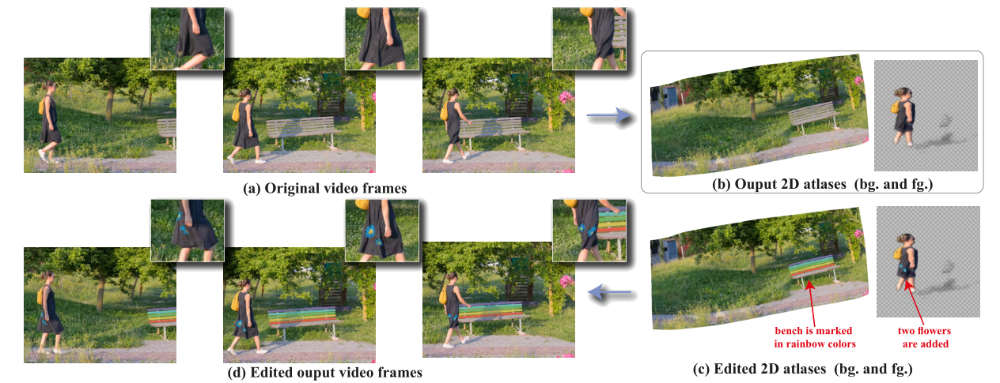
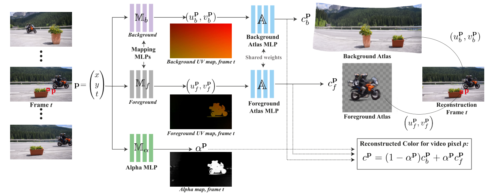

<h2>
 Layered Neural Atlases for Consistent Video Editing 
</h2>

【视频编辑】【SIGA2021】【[paper](https://arxiv.org/pdf/2109.11418.pdf)】【[code](https://github.com/ykasten/layered-neural-atlases)】

### 摘要

ds；本文使用一种很新的方法（对我来说）进行了视频编辑的工作。得到的模型将输入视频分为前景和背景并分别映射到两个图层。允许对背景图层或者前景图层的编辑并且一致性地传播到整个视频之中从而达到编辑视频的效果。本文除了 PSNR 之外没有其他数据指标，多为定性研究与消融实验。

### 概览

<!-- more -->

----

### 创新

（视频编辑第一次接触，都挺新的）

- 仅使用四个 MLP 作为整个网络的 backbone
- 对不同的数据来说，测试集和训练集一致，并且模型不可泛化
- 设计了多个损失函数，针对可能出现的不同问题进行特有的限制

### 网络

ds；本文含参的网络模块只有四个，分别对应上图的：$\mathbb M_b, \mathbb M_f, \mathbb M_\alpha, \mathbb A$，这四个网络都是 MLP 结构，具体参数量不同

### 损失

$$
math\_express
$$

### 结果

----

### 启发

