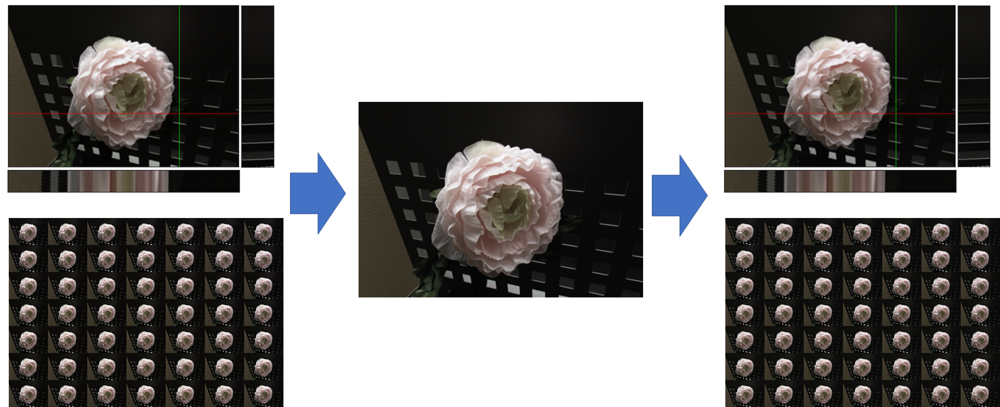
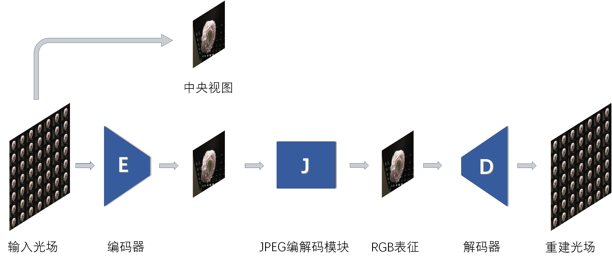
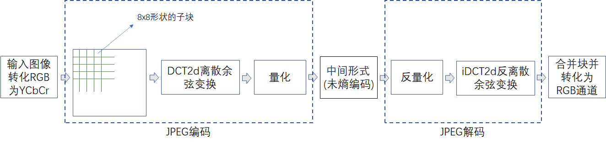
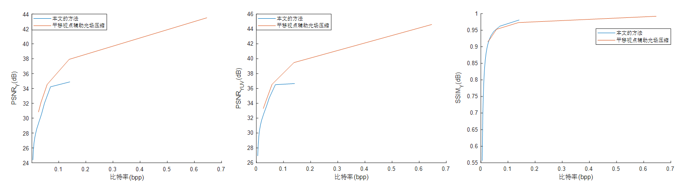
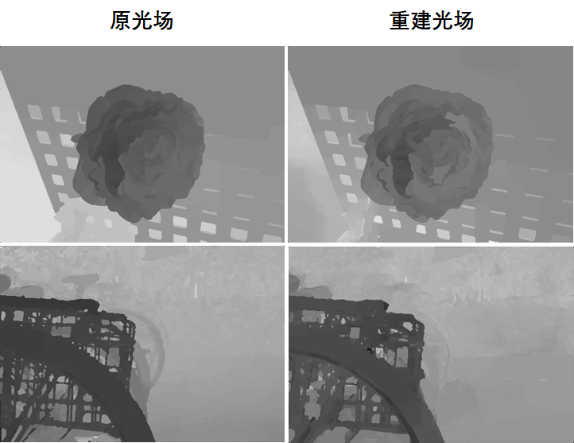
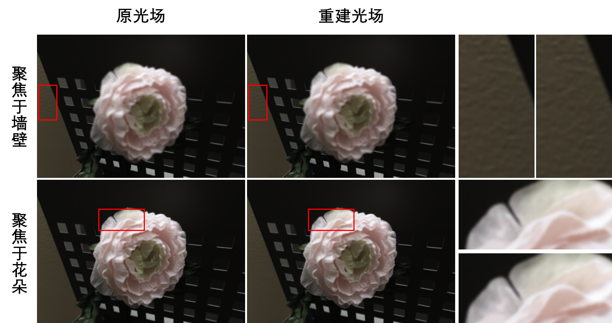

## [Represent LightField With A Single Image](https://gitee.com/bnucsy/represent-light-field-with-a-single-rgb-image)【光场压缩】【not published】

### 摘要

- 提出了一种基于自编码器的光场压缩方法，构建了基于 U-Net 的编解码器使用单张RGB图进行光场压缩。
- 得到的 RGB 表征在 0.07bpp 下𝑃𝑆𝑁𝑅为 41.31dB，重建光场𝑃𝑆𝑁𝑅值 36.51dB， 𝑆𝑆𝐼𝑀值为 0.96。
- 在使用网络平台 JPEG 压缩后重建光场𝑃𝑆𝑁𝑅值为 35.48dB。
- 对重建后光场应用重聚焦和深度估计任务，均取得了较好的结果。

### 概览

<!-- more -->

----

### 创新

- 限制使用单张 RGB 图像表征光场，并且该图像和光场中央视图视觉效果一致
- 得到的 RGB 表征对 JPEG 压缩具备鲁棒性

### 网络

- 网络概览

  

- $E、D$ 网络结构

  

- $J$ 网络结构

  

### 损失

使用$MSELoss$，分别限制中央视图和光场，比率分别为$0.9$，$0.5$。
$$
\rm arg \min\limits_{E,D,\alpha,\beta}:=\alpha\times||J(E(L))-L(\frac M 2,\frac N 2)||_2^2 + \beta\times ||D(J(E(L)))-L||_2^2
$$

### 结果

- 和传统方法对比

  

- 深度估计

  

- 重聚焦

  
  
  

----

### 启发

&emsp;自己的文章，启发即为过程性总结，全在毕设记录之中了

