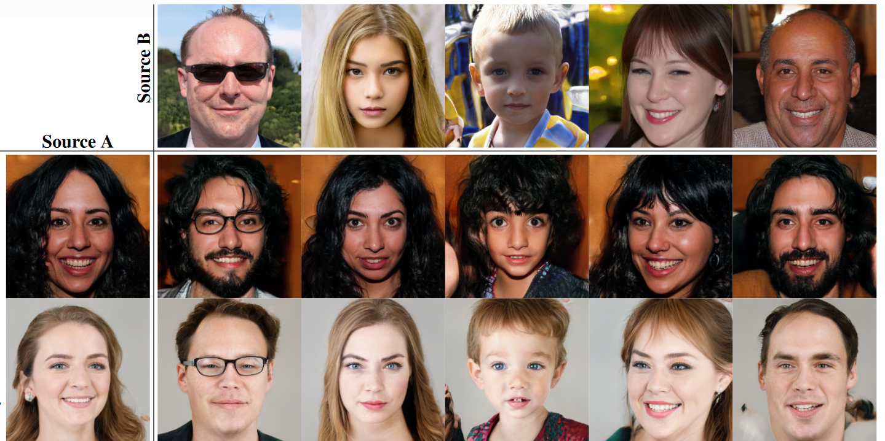
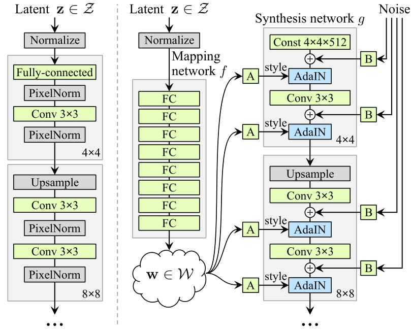
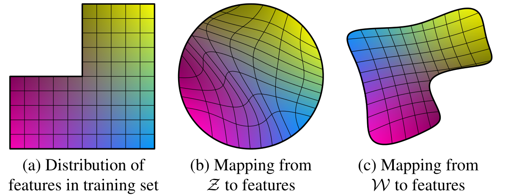
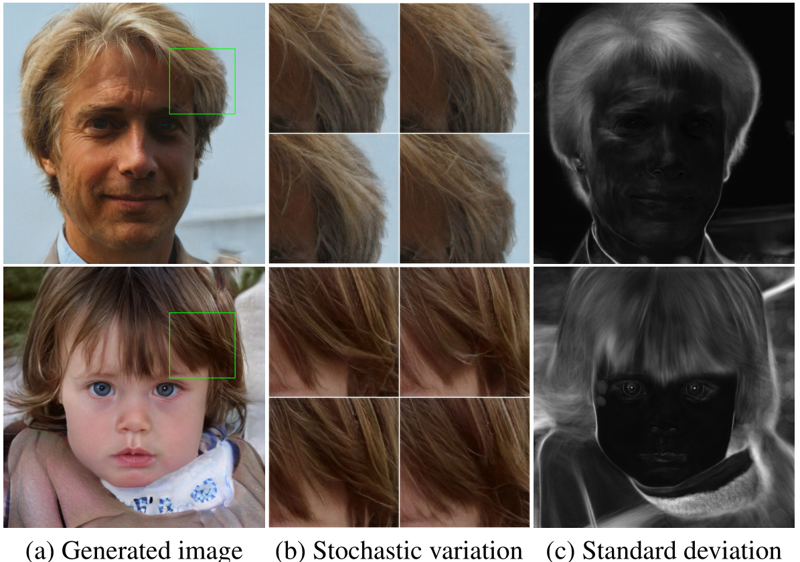
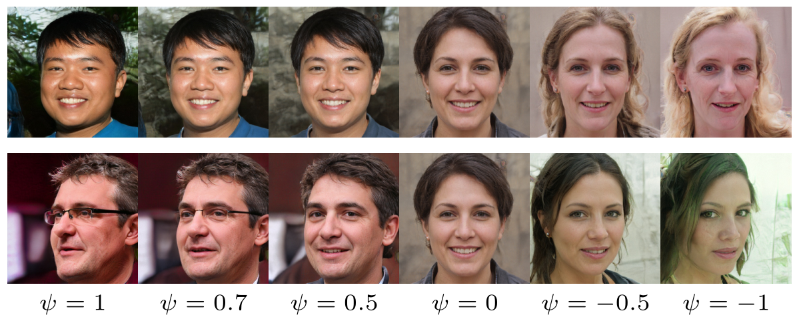
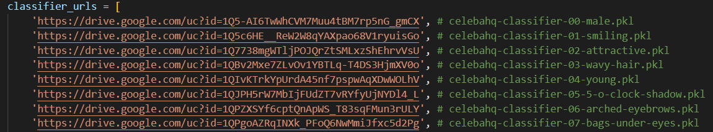
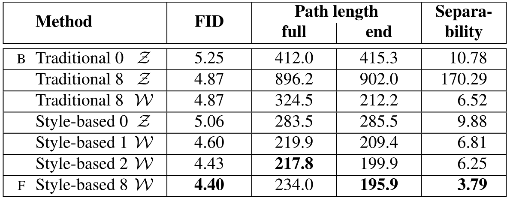
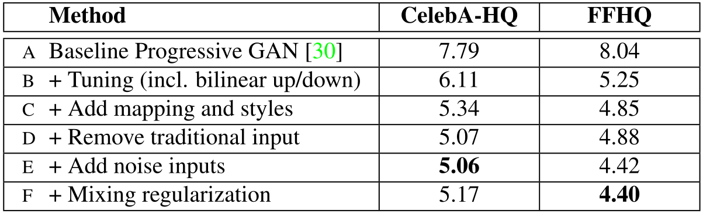

<h2><center> A Style-Based Generator Architecture for Generative Adversarial Networks </center></h2>

【图像生成】【CVPR2019】【[paper](http://arxiv.org/abs/1812.04948)】【[code](https://github.com/NVlabs/stylegan)】

### 摘要

&emsp;&emsp;本文基于 PGGAN 提出了一种按照尺度（非属性）解耦隐空间特征的 styleGAN 网络，这种尺度在 fine detail 上对于视觉的表现即为风格，因此除了生成和 PGGAN 一样的高分辨率图像之外，styleGAN 还可以对多个图像的不同尺度特征进行拼接，从而进行风格迁移。局限于这些特征都是 latent code，因此不能融合任意图像，但仍然挖下了解耦隐空间的坑。

### 概览



<!-- more -->

----

### 创新

- 基于 PGGAN 的插值、Norm 改进以及超参数调优
- 隐空间 $\cal W$ 的提出，使用 $f$ 在输入生成器 $g$ 之前将正态分布 $\cal Z$ 映射到 $\cal W$
- 使用 AdaIN 操作将采样出的 $w\in\cal W$ 逐级加入不同的分辨率
- 对于不同的尺度，加入随机噪声，从而保证图像的多样性（一般）
- 混合正则化，即生成图像时从不同的 $z$ 生成的不同 $w$ 中取不同的尺度进行组合，进一步解耦
- 两个新的度量生成图像的隐空间解耦程度的指标，`Perceptual path length(PPL)` 和 `Linear separability`
- 不同尺度控制的风格不同，粗粒度的特征（前几层）控制姿态、头发、脸型等，中粒度的特征控制眼睛、脸部特征等，细粒度的特征控制风格、色调等。需要注意的是这些属性并没有限制，而是通过限制尺度自主学习到的属于不同尺度的属性。

### 网络

#### backbone



&emsp;&emsp;上图中左侧是 PGGAN 的 backbone， 在其中加入了 `PixelNorm`，整体上就是针对 PGGAN 的调优。右侧即为 styleGAN 的 backbone，可以看出对于 $g$ 基本没有变化，区别在于：

- 多了一个由八个 MLP 组成的 Mapping Network $f$，用于将 $z\in\cal Z$ 的采样映射到 $w\in\cal W$
- 对于 $g$，其输入不同，PGGAN 中输入直接是 $z$，而 styleGAN 之中输入是一个 `const`，在前向的过程之中输入 `style` 和 `noise`，其中 `style` 来自于对 $w$ 进行可学习的仿射变换 $A$，`noise` 来自于对随机噪声进行通道加权填充 $B$
- 对于输入的 `style`，使用 $AdaIN$ 输入，$AdaIN$ 是其他工作验证有效的 `style` 嵌入方式

&emsp;&emsp;对于上述 backbone 的改进，其具体操作和有效性证明如下：

1. **$\cal W$ 空间映射的必要性**



&emsp;&emsp;之前的工作多为直接从 $\cal Z$ 即 $\mathcal N(0,1)$ 采样，通过这种方式采样的隐编码 $z$ 往往在线性插值之后失去其语义信息，上述图像是一个例子：

- $(a)$ 表示训练集的一个分布，可以简单理解为性别和头发长度的分布，缺少的一角表示在训练集中不存在长发男性，则理论上 $g$ 不可能生成长发男性而不被 $D$ 认出。

- 对于这种不规则的分布，如果希望 $\cal Z$ 中的采样能映射至 $(a)$，则 $\cal Z$ 会产生较大的 `warp`，如 $(b)$ 所示，这种 `warp` 会导致 $\cal Z$ 难以学习到插值有效的隐编码。

- 而允许 $\cal f(Z)\to W$  的变形则赋予了 $\cal W$ 更灵活的初始分布，如图 $(c)$ 所示，这样可以产生更少的 `warp`，也就更容易学习。

2. **`style` 的语义以及 $AdaIN$ 的输入**

&emsp;&emsp;对于采样出的 $z\to(512,1)$，经过映射之后 $w=f(z)\to(512,1)$，这里的 $w$ 就初步代表 `style`，而针对不同的尺度，学习不同的仿射变换 $A$ 将 $w$ 映射至 $(512,2)$，其中 `512` 表示通道的个数，`2` 表示针对每个通道有两个值分别表示缩放和平移。这里的缩放和平移就是最终针对不同尺度不同通道的 `style`。

&emsp;&emsp;对于 $AdaIN$，其输入包括 `feature map` $x$ 和 `style` $y$，公式描述为：
$$
AdaIN(x_i,y)=y_{s,i}\frac{x_i-\mu(x_i)}{\sigma(x_i)}+y_{b,i}
$$
&emsp;&emsp;其中的 $i\in0\to512$，含义上代表第几个通道，$s,\ b$ 分别代表 $y_i$ 的第 `0` 维和第 `1` 维，含义上分别代表缩放和平移，这么做的原因是：

- 首先对 $x_i$ 进行归一化，防止 $x_i$ 的不同值的尺度产生的影响，也起到去除 $x_i$ 的风格的作用
- 接着对归一化的 $x_i$ 进行平移和缩放，加入新的风格

```python
# Style modulation.

def style_mod(x, dlatent, **kwargs):
    with tf.variable_scope('StyleMod'):
        style = apply_bias(dense(dlatent, fmaps=x.shape[1]*2, gain=1, **kwargs))
        style = tf.reshape(style, [-1, 2, x.shape[1]] + [1] * (len(x.shape) - 2))
        return x * (style[:,0] + 1) + style[:,1]
```

3. **`noise` 的输入与作用**

&emsp;&emsp;由不相关的噪声根据不同的尺度无参应用不同的比例因子，噪声直接来源于 $\mathcal N(0,1)$，并且直接广播至所有的特征通道。

```python
# Noise input.

def apply_noise(x, noise_var=None, randomize_noise=True):
    assert len(x.shape) == 4 # NCHW
    with tf.variable_scope('Noise'):
        if noise_var is None or randomize_noise:
            noise = tf.random_normal([tf.shape(x)[0], 1, x.shape[2], x.shape[3]], dtype=x.dtype)
        else:
            noise = tf.cast(noise_var, x.dtype)
        weight = tf.get_variable('weight', shape=[x.shape[1].value], initializer=tf.initializers.zeros())
        return x + noise * tf.reshape(tf.cast(weight, x.dtype), [1, -1, 1, 1])
```

&emsp;&emsp;`noise` 的应用可以让图像有更多的生成，原文提出细小的变化会增大图像的多样性同时不影响人眼的辨识度，下图给出了原图以及在不同噪音下生成的图像的标准差和随机变化，对于肉眼确实区别不大，但是这个多样性在现在的 DM 之前就差得太多了。



#### 前向过程

&emsp;&emsp;训练过程中采样出的 $z\in\cal Z$ 经过映射网络 $f$ 得到 $w\in\cal W$，接着随机化一个常数输入进入生成器 $g$，生成器从 `4x4` 的生成分辨率逐级增加，直到 `1024x1024`，判别器结构以及整个过程和 PGGAN 一致。

&emsp;&emsp;在 $g$ 的前向过程中，$w$ 在不同尺度下使用不同的可学习的仿射矩阵 $A$ 融合进入 $g$ 的特征图，融合方式为 $AdaIN$，这样可以将原本的特征替换为新的 $w$ 决定的特征，而多个 $A$ 的方式可以分开不同尺度的风格。

&emsp;&emsp;为了进一步进行属性分离，使用了混合正则化的方式，所谓混合正则化，就是同时采样两个 $z$，生成两个不同的 $w$，在训练 $g$ 时，在某个固定的层之前使用 $w_1$ 通过对应的 $A$ 生成 `style`，在之后使用 $w_2$，通过这种方式强制网络认为不同粒度之间的非耦合性。

&emsp;&emsp;同时，为了防止在 GAN 的训练过程中出现无法生成图像的隐空间（即 $\cal W$ 中低密度的区域），本文使用了截断 $w$ 的技巧，这并非本文首次提出，截断的目的是缩小采样空间的范围，使其更加密集。具体的做法为设定超参数 $\psi$，对于从训练好的 $\cal W$ 中采样出的 $w$，其操作可以描述为：$w'=\bar w+\psi(w-\bar w)$，可以看出当 $\psi=0$ 时，用于生成图像的 $w$ 是固定的 $\mathbb E(\cal  W)$，从而只能生成同样的“平均脸”。具体来说，$\psi$ 控制了采样的隐编码和分布本身的权重关系，限制了一定的多样性同时提高了稳定性。

&emsp;&emsp;下图展示了不同 $\psi$ 下同一个隐编码 $w$ 的生成结果，有趣的是在不加限制的情况下学到的网络可以将 $\psi$ 正负调转显式地投影到属性的翻转上。



#### 感知路径长度 & 线性可分性

&emsp;&emsp;为了度量生成图像的质量，需要比较其和训练集图像的分布一致性，这部分的研究非常多，但是 styleGAN 研究的是如何对尺度进行解耦合，因此需要另外的指标判断解耦合的程度。

&emsp;&emsp;对于感知路径长度 `Perceptual path length`，其本质上进行了如下操作：

- 从 $\cal Z$ 中采样 $z_1, z_2$，从 $U(0,e_t)$ 中采样 $t$，固定超参数 $\epsilon=10^{-4}$，对于 `full`，$e_t=1$，对于 `end`，$e_t=0$
- 对 $z_1,z_2$ 进行插值，比例分别为 $t,t+\epsilon$，得到 $s_1=lerp(z_1,z_2;t),s_2= lerp(z_1,z_2;t+\epsilon)$
- 将 $s_1,s_2$ 使用 `VGGLoss` 计算结构误差，计算出的结果除以 $\epsilon^2$
- 多次采样求期望即可

&emsp;&emsp;对于线性可分性 `Linear separability`，其本质上是度量一个图像是否可以由两个分类器在不同 `level` 上进行属性区分。举例来说，对于性别属性（必须是二值属性），使用 SVM 分类隐编码是否能够得到和 CNN 分类生成图像一致的结果即为线性可分性。其选择的属性共包括 40 个：



&emsp;&emsp;记 SVM 的结果为 $X$，CNN 的结果为 $Y$，则最终的线性可分性即为 $\exp (\sum_iH(Y_i|X_i))$，其中 $H$ 是条件熵，$i$ 表示某一个属性，$i\in 0\to40$。

&emsp;&emsp;下图展示了 FFHQ 中映射网络的效果。方法名称中的数字表示映射网络的深度。可以看到，FID、可分离性和路径长度都受益于映射网络。此外，深度映射网络通常比浅映射网络表现更好。



### 结果

&emsp;&emsp;对于消融实验，本文逐渐向 PGGAN 中加入了自己的策略，从而得到了最终的 styleGAN，这个消融实验的方式也和 PGGAN 的很接近。消融实验展示了各个策略的有效性，其中指标为 FID，用于度量数据的分布一致性。其中加入噪音没有使指标更好，其本质的作用是使图像具备多样性。这些指标均为叠加使用策略。



