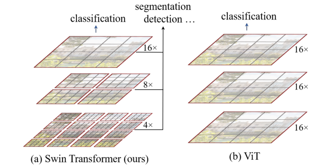
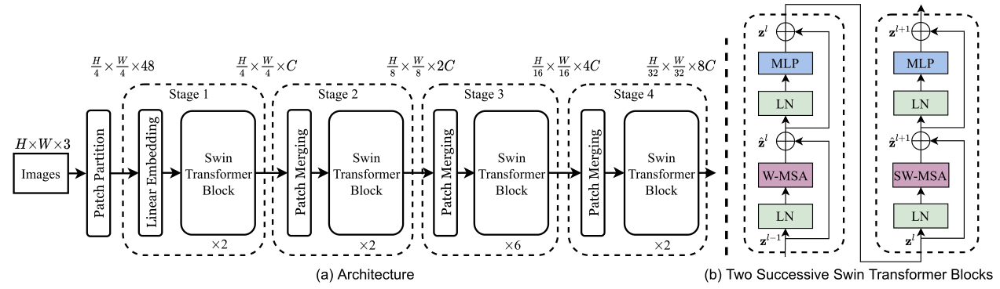
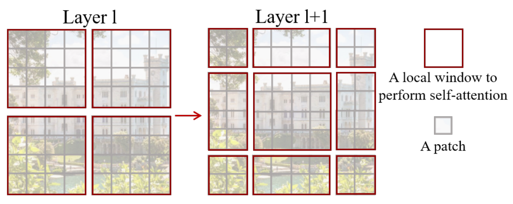
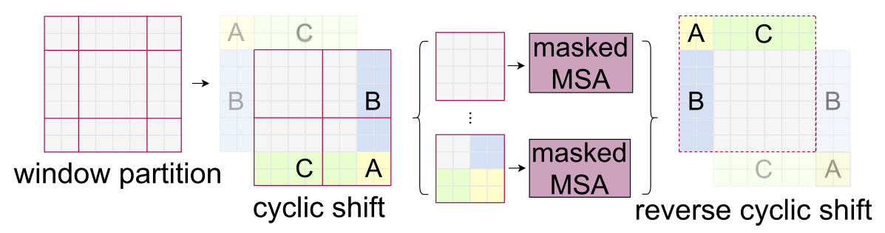
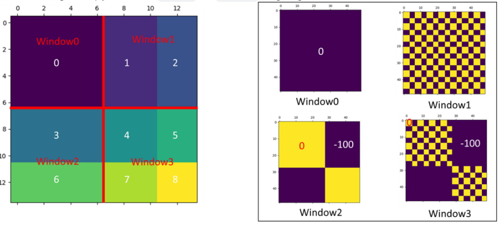
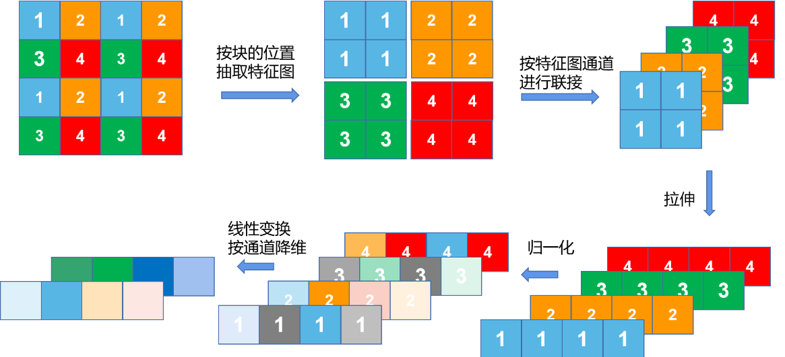

## [Swin_Transformer_Hierarchical_Vision_Transformer_Using_Shifted_Windows](https://arxiv.org/abs/2103.14030) 【图像分类、目标检测、语义分割】 ICCV

### 摘要

&emsp;&emsp;SwinTransformer 同样是一篇尝试探索如何将 NLP 领域的 transformer 迁移到 CV 领域的工作，其指出，文字的密度和图像的像素密度差距较大，直接迁移如 VIT 将会产生大图像难以计算的问题，因此 swinTransformer 提出了一种层级式的计算方式，不仅将计算复杂度降低了很多，同时提取到了不同尺度的特征，解决了 VIT 的大尺寸图像处理困难、任务场景较为单一等问题。

### 概览



<!-- more -->

----

### 创新

- 使用基于 Window 的 MSA 来进行大尺寸图像的分割处理，降低 transformer 的计算复杂度，使 transformer 可以计算大尺寸的图像
- 使用 shift Window 来加强不同 window 之间的通信，使全局的信息更容易被学习
- 通过 patch merging 获得多尺度的信息，以此产生不同的感受野，适应了多种任务场景构造特征图的需要
- 构造了掩码，用以加速当 shift window 产生大小不同的 Windows 时的额外的 padding 计算

### 网络



&emsp;&emsp;由于 swinTransformer 提出的是一种通用架构，所以这里的网络模型并没有给出具体到分类 / 分割 / 检测应该如何继续实现，事实上直接按照常见的实现方式，分类用 1x1 Conv，分割用 Unet，检测用 pyramid feature。这里的输入是每个 window 的输入，每个 Swin Transformer Block 都会产生一个输出，Patch Merging 是下采样操作，类似于 pixel shuffle，接下来按照前向过程逐步分析一下网络的实现。

---

#### patch embedding

&emsp;&emsp;这一部分主要是预处理，将图片打成不同的 patch，并且把 patch 拉平，作用和 VIT 的一样，但是由于 swinTransformer 将其进一步分成了不同的 window，因此略有细节上的不同。

##### patch partition

&emsp;&emsp;对于输入的图像 image $H\times W$（Swin-T 中图像大小为 224x224），按照每个 patch 为  $P\times P$  切分为多个 patch，在标准 swinTransformer 中，$P=4$。此时每个 patch 中有 $P\times P\times 3$ 个值，Swin-T 中这里为 48,。因此共有 $\frac{H}{4}\times \frac{W}{4}$ 个 patch，每个 patch 48 个值。

##### linear embedding

&emsp;&emsp;接下来和 VIT 一致，通过一个 linear layer 将 48 映射到 transformer 接受的维度 $C$，在 Swin-T 中为 96，此时我们拿到了 56x56 个 patch，每个 patch 96 维，也即 $\frac{H}{4}\times \frac{W}{4}\times C$。  


---

#### Swin Transformer block

&emsp;&emsp;这里的部分是整个工作最重要的部分，在这里讲述了窗口自注意力机制的计算方式，以及如何进行 shift window，包括之后的移位回位以及掩码设置。整体来说，对于上一个输入 $Z^{i-1}$，需要经过 $\rm LayerNorm, WMSA,Add,SWMSA,MLP$ 这些操作才能得到 $Z^{i+1}$。也就是每一个 swinTransformerBlock 需要做两次自注意力的计算。具体地，这个过程可以用如下公式表示，其中 $\hat Z$ 是中间变量：
$$
\hat Z^{i}=W\_MSA(LN(Z^{i-1}))+Z^{i-1}
$$

$$
Z^i=MLP(LN(\hat Z^i))+\hat Z^i
$$

$$
\hat Z^{i+1}=SW\_MSA(LN(Z^i))+Z^i
$$

$$
Z^{i+1}=MLP(LN(\hat Z^{i+1}))+\hat Z^{i+1}
$$

##### W-MSA

&emsp;&emsp;这是整个 swinTransformer 里面最核心的部分，后面的 shift window 只不过是多加了一个移位的操作后处理了一下额外计算量。回到之前我们得到的输入，这时候我们拿到的输入维度是 $\frac{H}{4}\times \frac{W}{4}\times C$，在 Swin-T 中，这里也达到了 3136x96 的级别，而 3136 的序列长度对于 transformer 来说，复杂度太高，因此将其切分成 window。

&emsp;&emsp;在切分 window 的时候，每个 window 有固定 7x7=49 个 patch，这 49 个 patch 线性排列，形成 $\frac{H}{28}\times \frac{W}{28}$ 个 window，每个 window 序列维度为 $(49,C)$ ，接下来对每个 window 做 self-attention。这里的 SA 操作在一些实现细节上略有区别于 VIT 和 标准transformer，首先是 $Q,K,V$ 的维度，这里的 $W_{Q/K/V}$ 矩阵维度为 $(C,\frac C {heads})$，因此，得到的 $Z\to (49, \frac C {heads}),Z_{mix}\to (49,C)$。这样得到的 $Z_{mix}$ 再和 VIT 一样经过一个 linear，不过这里的 linear 是 $C\to C$ 的，其余操作和 VIT 无异。这样输出的结果维度仍然为 $\frac{H}{4}\times \frac{W}{4}\times C$。

```python
class WindowAttention(nn.Module):
    r""" Window based multi-head self attention (W-MSA) module with relative position bias.
    It supports both of shifted and non-shifted window.

    Args:
        dim (int): Number of input channels.
        window_size (tuple[int]): The height and width of the window.
        num_heads (int): Number of attention heads.
        qkv_bias (bool, optional):  If True, add a learnable bias to query, key, value. Default: True
        qk_scale (float | None, optional): Override default qk scale of head_dim ** -0.5 if set
        attn_drop (float, optional): Dropout ratio of attention weight. Default: 0.0
        proj_drop (float, optional): Dropout ratio of output. Default: 0.0
    """

    def __init__(self, dim, window_size, num_heads, qkv_bias=True, qk_scale=None, attn_drop=0., proj_drop=0.):

        super().__init__()
        self.dim = dim
        self.window_size = window_size  # Wh, Ww
        self.num_heads = num_heads
        head_dim = dim // num_heads
        self.scale = qk_scale or head_dim ** -0.5

        # define a parameter table of relative position bias
        self.relative_position_bias_table = nn.Parameter(
            torch.zeros((2 * window_size[0] - 1) * (2 * window_size[1] - 1), num_heads))  # 2*Wh-1 * 2*Ww-1, nH

        # get pair-wise relative position index for each token inside the window
        coords_h = torch.arange(self.window_size[0])
        coords_w = torch.arange(self.window_size[1])
        coords = torch.stack(torch.meshgrid([coords_h, coords_w]))  # 2, Wh, Ww
        coords_flatten = torch.flatten(coords, 1)  # 2, Wh*Ww
        relative_coords = coords_flatten[:, :, None] - coords_flatten[:, None, :]  # 2, Wh*Ww, Wh*Ww
        relative_coords = relative_coords.permute(1, 2, 0).contiguous()  # Wh*Ww, Wh*Ww, 2
        relative_coords[:, :, 0] += self.window_size[0] - 1  # shift to start from 0
        relative_coords[:, :, 1] += self.window_size[1] - 1
        relative_coords[:, :, 0] *= 2 * self.window_size[1] - 1
        relative_position_index = relative_coords.sum(-1)  # Wh*Ww, Wh*Ww
        self.register_buffer("relative_position_index", relative_position_index)

        self.qkv = nn.Linear(dim, dim * 3, bias=qkv_bias)
        self.attn_drop = nn.Dropout(attn_drop)
        self.proj = nn.Linear(dim, dim)
        self.proj_drop = nn.Dropout(proj_drop)

        trunc_normal_(self.relative_position_bias_table, std=.02)
        self.softmax = nn.Softmax(dim=-1)

    def forward(self, x, mask=None):
        """
        Args:
            x: input features with shape of (num_windows*B, N, C)
            mask: (0/-inf) mask with shape of (num_windows, Wh*Ww, Wh*Ww) or None
        """
        B_, N, C = x.shape
        qkv = self.qkv(x).reshape(B_, N, 3, self.num_heads, C // self.num_heads).permute(2, 0, 3, 1, 4)
        q, k, v = qkv[0], qkv[1], qkv[2]  # make torchscript happy (cannot use tensor as tuple)

        q = q * self.scale
        attn = (q @ k.transpose(-2, -1))

        relative_position_bias = self.relative_position_bias_table[self.relative_position_index.view(-1)].view(
            self.window_size[0] * self.window_size[1], self.window_size[0] * self.window_size[1], -1)  # Wh*Ww,Wh*Ww,nH
        relative_position_bias = relative_position_bias.permute(2, 0, 1).contiguous()  # nH, Wh*Ww, Wh*Ww
        attn = attn + relative_position_bias.unsqueeze(0)

        if mask is not None:
            nW = mask.shape[0]
            attn = attn.view(B_ // nW, nW, self.num_heads, N, N) + mask.unsqueeze(1).unsqueeze(0)
            attn = attn.view(-1, self.num_heads, N, N)
            attn = self.softmax(attn)
        else:
            attn = self.softmax(attn)

        attn = self.attn_drop(attn)

        x = (attn @ v).transpose(1, 2).reshape(B_, N, C)
        x = self.proj(x)
        x = self.proj_drop(x)
        return x
```

##### SW-MSA

&emsp;&emsp;shift window multi-head self attention 是这项工作最创新的地方，事实上，如果删除了 shift window，这项工作在发表之前很短时间恰好有一篇 PVT 的工作通过堆叠不重合窗口实现大图像 transformer。当然，swinTransformer 具备更全的应用范围，更优的实验设计，仍然会成为一项颠覆性的工作。

&emsp;&emsp;整体来说，SW-MSA 首先进行窗口的移动，准确来说是分割线移动 1/2 个 window\_size（Swin-T 中是7/2=3），这样会产生与之前不同的窗口，并且新窗口的范围和旧窗口范围有部分重叠，然后在新窗口上做 W-MSA即可，但是这样的话会产生更多的窗口，并且会产生非 7x7 的窗口，一种产生这种 “不规整情况” 的示意图如下：



&emsp;&emsp;这种不规则将会给批处理图像带来极大的困难，一种普通的想法是采用 padding 策略，对不同的 window 都补 0 成 7x7，但这样增加了很多计算量。swinTransformer 没有选择采用 padding 策略修补这些窗口，而是采用了一种巧妙的移位。一个完整的 SW-MSA 工作流程如下：



&emsp;&emsp;在这个过程中，cyclic shift 和 reverse cyclic shift 操作直接采用数组切片即可完成，这里主要难以理解的是 masked MSA，即为什么要用掩码，以及怎么赋值掩码矩阵？

&emsp;&emsp;至于为什么要用到掩码，这是因为在 cyclic shift 形成的新四个窗口中，对于左下、右上、右下的窗口，他们都含有图像不相邻位置的像素，这些像素可能实际上没有任何关联，如左下角的上半部分可能是草原，而其下半部分可能是上面移过来的天空。这种情况下他们是不应该互相进行计算注意力的 ，然而我们只要用 W-MSA 就一定会计算他们之间的注意力，所以我们需要给一个 mask，让我们不需要计算的部分消失掉。

&emsp;&emsp;对于这四种情况，在进行 SA 之后会得到四种不同的值分布，如下图所示：



&emsp;&emsp;在右边这几幅小图中，赋 0 的位置表示我们希望保留的计算，赋 -100 的位置表示我们希望忽略的计算，这些 mask 将会作用于 $\rm softmax(\frac{QK^T}{\sqrt d_k} + mask)$，此时 -100 将会经过 $\rm softmax$ 变成 0，从而消除其掩码所在位置的影响。

##### Add & LayerNorm & MLP

&emsp;&emsp;这些无论和 VIT 还是和 transformer 都没有任何区别，不再赘述。

---

#### patch merging

&emsp;&emsp;这里的 patch merging 就是一个单纯的降采样的过程，其操作和 pixel shuffle 基本一致，其具体的方法和操作流程如下图：



&emsp;&emsp;我们可以看到，patch merging 将原本 4x4x1 的 tensor 变成了 2x2x2 的 tensor，具体来说使长宽小一半，通道加一倍，从而达到降采样的目的，swinTransformer 中总共进行了 3 次 patch merging，将 $\frac{H}{4}\times \frac{W}{4}\times C$ 最终变成了 $\frac{H}{32}\times \frac{W}{32}\times 8C$。这样的操作使感受野逐渐增大，从而感知不同尺寸的图片信息，更广泛地应用于更多任务。

```python
class PatchMerging(nn.Module):
    r""" Patch Merging Layer.

    Args:
        input_resolution (tuple[int]): Resolution of input feature.
        dim (int): Number of input channels.
        norm_layer (nn.Module, optional): Normalization layer.  Default: nn.LayerNorm
    """

    def __init__(self, input_resolution, dim, norm_layer=nn.LayerNorm):
        super().__init__()
        self.input_resolution = input_resolution
        self.dim = dim
        self.reduction = nn.Linear(4 * dim, 2 * dim, bias=False)
        self.norm = norm_layer(4 * dim)

    def forward(self, x):
        """
        x: B, H*W, C
        """
        H, W = self.input_resolution
        B, L, C = x.shape
        assert L == H * W, "input feature has wrong size"
        assert H % 2 == 0 and W % 2 == 0, f"x size ({H}*{W}) are not even."

        x = x.view(B, H, W, C)

        x0 = x[:, 0::2, 0::2, :]  # B H/2 W/2 C
        x1 = x[:, 1::2, 0::2, :]  # B H/2 W/2 C
        x2 = x[:, 0::2, 1::2, :]  # B H/2 W/2 C
        x3 = x[:, 1::2, 1::2, :]  # B H/2 W/2 C
        x = torch.cat([x0, x1, x2, x3], -1)  # B H/2 W/2 4*C
        x = x.view(B, -1, 4 * C)  # B H/2*W/2 4*C

        x = self.norm(x)
        x = self.reduction(x)

        return x
```

### 损失

&emsp;&emsp;swinTransformer 在多个应用领域均取得了超越 SOTA 的指标，由于其在多个领域都做了应用，因此根据不同的实现目标选择了不同的损失函数。

----

### 启发

&emsp;&emsp;总而言之，swinTransformer 相对于 VIT 来说，进一步激发了 VIT 在视觉领域的潜力，将其扩展到了更多的任务，并在各种任务上面都成为了 SOTA，对 VIT 的改编无疑是巨大的成功，目前基于 CNN 的 SOTA 已经很难找到了。但这项工作同时有着一定的局限性，由于其是 VIT 在视觉领域的改编，其借鉴了很多 CV 的先验知识，尤其是很多之前 CNN 架构的处理方法，这意味着 transformer 在 NLP 到 CV 领域的迁移还没有完全性地实现，如何像 VIT 一样，在几乎不对网络结构做 CV/NLP 方向的特殊适应的情况下，直接修改数据结构就可以一个网络做多个任务，这是 swinTransformer 的团队挖出的一个大坑，也许会有下一个颠覆性的工作完成这项预期。


