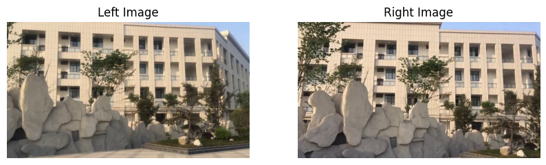
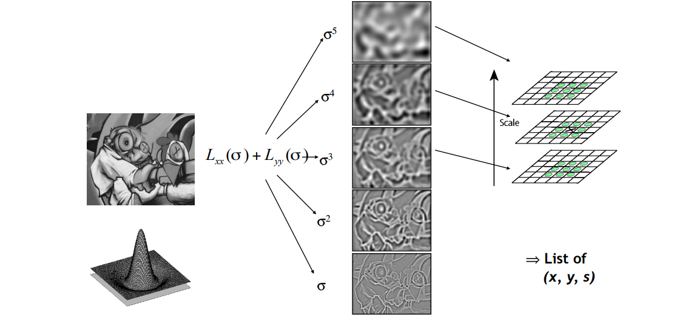
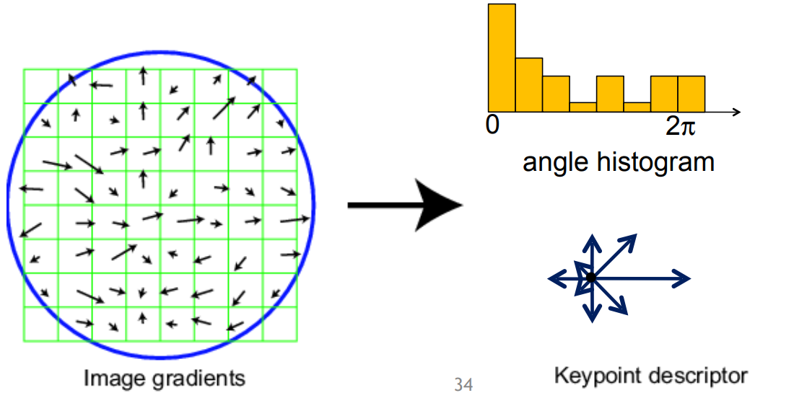
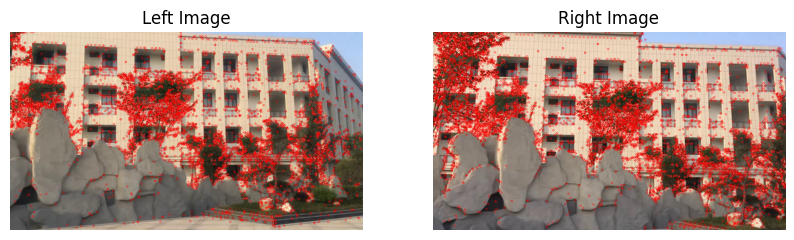
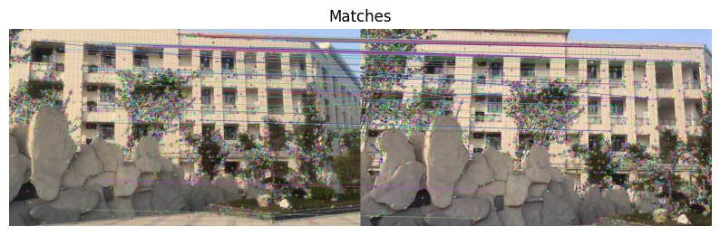
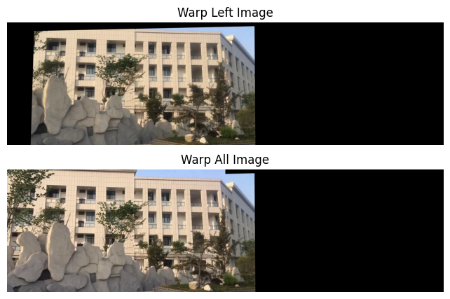
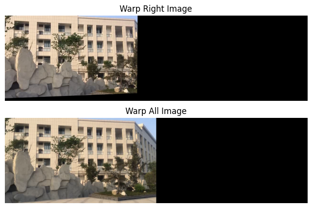
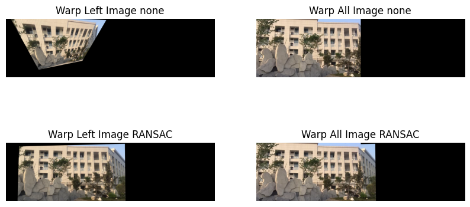
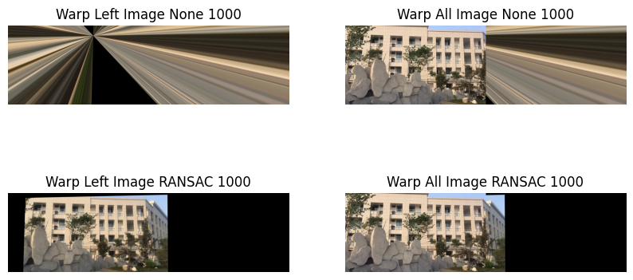

<h2><center> 图像对齐和图像拼接</center>
</h2>


👉👉👉👉👉👉本次实验选取来自 [论文](http://www.liushuaicheng.org/TIP/VideoStitching2016/index.html) 的数据集  video2 的视频帧，其第一帧的左，右视图如下：



### 图像的 SIFT 特征检测原理

&emsp;&emsp;SIFT 特征全称 Scale Invariant Feature Transform（尺度不变特征变换），通过 SIFT 生成的特征点具备对旋转、尺度缩放、平移、亮度变化、视角变化、仿射变换、噪声的鲁棒性。

&emsp;&emsp;为了寻找视觉不变性的特征，需要对图像使用尺度空间方法，即在图像模型中引入尺度参数。常见的尺度空间由 LoG 产生，但是 LoG 较难计算，后面发现 DoG 能够近似代替 LoG，因此 SIFT 使用 DoG 空间作为尺度空间获取关键点。

#### DoG 空间的计算

&emsp;&emsp;对 DoG 空间的有效性可以这样理解：使用高 $\sigma$ 和低 $\sigma$ 分别产生的模糊与不模糊的图像作差即可得到边缘。这也解释了 DoG 空间检测出的极值点实际上对边缘具备更强的响应。

&emsp;&emsp;在计算 DoG 空间之前需要先计算 SIFT 高斯金字塔，区别于普通的高斯金字塔，SIFT 高斯金字塔每一层具有多个图像，每一层最低端的图像单独拿出来就是普通的高斯金字塔。在金字塔的每一层内，从下往上的 $\sigma$ 逐渐增大，即在每一层内越向上的图像越模糊。

&emsp;&emsp;对于构建好的 SIFT 金字塔中每个层的图像做上下差分，即可得到 DoG 空间。

#### 使用 DoG 空间获取极值点

&emsp;&emsp;这里采用的判断逻辑是斑点的判断方式，但是和斑点不同的是 DoG 的极值点需要额外对比上下两层的点，类似于使用 3Dconv 进行卷积。 



#### 关键点处理

&emsp;&emsp;对于上一步中获得的极值点，其具备一些缺点：1. 对边缘响应太大，2. 同一个特征检测出的特征点较多，3. 特征点是离散像素，位置不够精确。而对于这些缺点，接下来需要进一步处理这些特征点。

&emsp;&emsp;对于边缘响应问题，需要计算特征点处的 Hessian 矩阵 H，这个矩阵的特征值代表了 x, y 方向的梯度，接下来需要利用两个特征值的比计算出一个阈值，将横边缘相比垂直边缘具备较大主曲率的特征点剔除；对于特征点多的问题，采用 NMS 过一遍即可；对于离散像素位置不精确问题，需要对尺度空间进行曲线拟合，利用 DoG 函数的泰勒展开计算出插值中心的偏移量，针对偏移量的大小判断是否需要改变关键点位置并逐次迭代，最终插值中心就是原位置加上基于尺度的偏移量。

#### 估计关键点方向

&emsp;&emsp;由于关键点同时应当具备旋转不变形，因此需要确定关键点的方向，其做法如下：

- 在不同的尺度上计算图像的梯度，计算范围是特征点的邻域，然后统计成直方图
- 将直方图中最大值的梯度定为主方向，超过最大值80%的方向定为辅方向【将所有的梯度归到八个正交方向上】



#### 生成关键点的描述子

&emsp;&emsp;为了保证旋转不变性，需要将特征点邻域内的图像旋转一个方向角 $\theta$，然后重新栅格化图像，更新梯度。接着对每个特征点的邻域分成十六个子邻域，每个子邻域的梯度分到八个方向，统计各个方向的梯度信息最终形成一个 128 维度的向量作为特征描述。

&emsp;&emsp;为了去除光照产生的影响，对特征向量进行归一化处理，然后为了去除相机饱和度等因素的影响，对梯度较大的值进行截断（0.2），然后再进行一次归一化，最终根据特征点的尺度对特征向量进行排序即可得到最终的描述子。

👉👉👉👉👉👉经过 SIFT 特征检测得到的特征如下图所示



### 特征描述子的距离匹配和 RANSAC 方法

&emsp;&emsp;为了描述特征的距离，可以使用简单的 L2 距离，但是这样对于比较接近的特征点会出现错误匹配的情况。

&emsp;&emsp;因此更多的选用 ratio distance，即 $ d=\frac{||f_1-f_2||}{||f_1-f_2'||}$，这种方式计算了第一相似的点和第二相似的点之间的相似度差距，这种差距比较大是符合我们期望的，因为比较大就代表了我们得到的特征混淆可能性低，反之则代表相似的特征点比较多，这个特征不太合适用作对齐。

&emsp;&emsp;而对于 RANSAC 方法，其本身是一个从误匹配或离群点较多的数据中正确估计数学模型的方法。该方法是基于迭代的概率性算法，其假设为：内点表示正常的数据点，而外点表示误匹配和离群点，整个数据集由内点和外点组成。

- 选择出可以估计出模型的最小数据集（对于 H 矩阵随机选择 4 个点即可）
- 使用这个数据集计算出模型 H
- 将所有数据代入 H，计算内点的数目，比较当前的内点数目和之前最好的内点数，并且选择是否更新模型
- 重复前三步，直到目前的内点数目大于给定的阈值或超过迭代次数

&emsp;&emsp;这里的迭代次数是可以计算的，假设总数据中内点的概率为 $t$，预期能够获取的模型 H 的正确概率为 $P$，每次模型采样 $N$ 个点，（H 矩阵为 4）则迭代次数 $k=\frac{\log (1-P)}{\log (1-t^N)}$。

👉👉👉👉👉👉对 SIFT 特征子的距离匹配（仅匹配概率最大的前 100 个点）



👉👉👉👉👉👉使用 RANSAC 方法找到在上述匹配中的内点，并且构造出模型 H，结果为：

```python
H = [[ 9.03698224e-01 -3.28876988e-02  1.58813667e+02]
 [-2.37023637e-02  9.45220683e-01  5.04870429e+01]
 [-7.30423646e-05 -2.73295440e-05  1.00000000e+00]]
```

### 基于单应矩阵 H 的图像变换与拼接

&emsp;&emsp;基于已经求出的单应矩阵 H，使用 warp 方法对左图进行 Perspective 变换得到 warp 之后的图像以及合成之后的总图像：



&emsp;&emsp;其中图像融合的方法为：

- 对左图进行 warp
- 将右图填充到左图的左侧

&emsp;&emsp;这里无论是计算 left 映射到 right 的 H 矩阵还是计算 right 到 left 的 H 矩阵都可以得到同样的结果，从效果上看，右面似乎更好一些，但是这是和图像质量密切相关的：



### 实验总结

&emsp;&emsp;实验的关键在于是否使用 RANSAC 方法，也就是对于不同特征点的匹配性，消融实验如下：



&emsp;&emsp;这里尽管没有使用 RANSAC 方法，warp 之后的图像看上去也没有失真，这是因为之前 match 的特征点仅保留了最接近的 100 个，可见尽管如此仍然由不少的离群点，而如果保留 1000 个match 特征点，不使用 RANSAC 方法则会完全失真，实验结果如下。



### demo

```python
#%% import
import cv2
import numpy as np
import matplotlib.pyplot as plt
#%% read image
left_img = cv2.imread('left.png')
right_img = cv2.imread('right.png')
fig, ax = plt.subplots(1, 2, figsize=(10, 5))
ax[0].imshow(left_img)
ax[0].set_title('Left Image')
ax[0].axis('off')
ax[1].imshow(right_img)
ax[1].set_title('Right Image')
ax[1].axis('off')
#%% SIFT feature detection
li_gray = cv2.cvtColor(left_img, cv2.COLOR_BGR2GRAY)
ri_gray = cv2.cvtColor(right_img, cv2.COLOR_BGR2GRAY)
sift = cv2.SIFT_create()
kp1, des1 = sift.detectAndCompute(li_gray, None)
kp2, des2 = sift.detectAndCompute(ri_gray, None)
li, ri = left_img.copy(), right_img.copy()
cv2.drawKeypoints(li, kp1, li, (255, 0, 0))
cv2.drawKeypoints(ri, kp2, ri, (255, 0, 0))
fig, ax = plt.subplots(1, 2, figsize=(10, 5))
ax[0].imshow(li)
ax[0].set_title('Left Image')
ax[0].axis('off')
ax[1].imshow(ri)
ax[1].set_title('Right Image')
ax[1].axis('off')
#%% feature matching
matcher = cv2.DescriptorMatcher_create("BruteForce")
matches = list(matcher.match(des1, des2, None))
matches.sort(key=lambda x: x.distance, reverse=False)
matches_all = matches.copy()
matches = matches[:100]
imMatches = cv2.drawMatches(left_img, kp1, right_img, kp2, matches, None)
fig, ax = plt.subplots(1, 1, figsize=(10, 5))
ax.imshow(imMatches)
ax.set_title('Matches')
ax.axis('off')
#%% RANSAC to find homography H
match_kp_left = np.array([kp1[m.queryIdx].pt for m in matches])
match_kp_right = np.array([kp2[m.trainIdx].pt for m in matches])
# (H, status) = cv2.findHomography(match_kp_left, match_kp_right, cv2.RANSAC, 4.0)
(H2, status2) = cv2.findHomography(match_kp_left, match_kp_right, None, 4.0)

match_kp_left_all = np.array([kp1[m.queryIdx].pt for m in matches_all])
match_kp_right_all = np.array([kp2[m.trainIdx].pt for m in matches_all])
(H, status) = cv2.findHomography(match_kp_left_all, match_kp_right_all, cv2.RANSAC, 4.0)
(H3, status3) = cv2.findHomography(match_kp_left_all, match_kp_right_all, None, 4.0)
print(f'H = {H}')
print(f'H2 = {H2}')
print(f'H3 = {H3}')
# H => 使用 RANSAC 算法计算的单应性矩阵，保留特征点前 100 个
# H2 => 不使用 RANSAC 算法计算的单应性矩阵，保留特征点前 100 个
# H3 => 不使用 RANSAC 算法计算的单应性矩阵，保留特征点前 1000 个
#%% warp image
warp_left = cv2.warpPerspective(left_img, H, (left_img.shape[1] + right_img.shape[1], left_img.shape[0]))
warp_all = warp_left.copy()
warp_all[0:right_img.shape[0], 0:right_img.shape[1]] = right_img
fig, ax = plt.subplots(2, 1, figsize=(10, 5))
ax[0].imshow(warp_left)
ax[0].set_title('Warp Left Image')
ax[0].axis('off')
ax[1].imshow(warp_all)
ax[1].set_title('Warp All Image')
ax[1].axis('off')
#%% warp image w/o RANSAC in 100 matches
warp_left_none = cv2.warpPerspective(left_img, H2, (left_img.shape[1] + right_img.shape[1], left_img.shape[0]))
warp_all_none = warp_left_none.copy()
warp_all_none[0:right_img.shape[0], 0:right_img.shape[1]] = right_img
fig, ax = plt.subplots(2, 2, figsize=(10, 5))
ax[0, 0].imshow(warp_left_none)
ax[0, 0].set_title('Warp Left Image none')
ax[0, 0].axis('off')
ax[0, 1].imshow(warp_all_none)
ax[0, 1].set_title('Warp All Image none')
ax[0, 1].axis('off')
ax[1, 0].imshow(warp_left)
ax[1, 0].set_title('Warp Left Image RANSAC')
ax[1, 0].axis('off')
ax[1, 1].imshow(warp_all)
ax[1, 1].set_title('Warp All Image RANSAC')
ax[1, 1].axis('off')
#%% warp image w/o RANSAC in 1000 matches
warp_left_all = cv2.warpPerspective(left_img, H3, (left_img.shape[1] + right_img.shape[1], left_img.shape[0]))
warp_all_all = warp_left_all.copy()
warp_all_all[0:right_img.shape[0], 0:right_img.shape[1]] = right_img
fig, ax = plt.subplots(2, 2, figsize=(10, 5))
ax[0, 0].imshow(warp_left_all)
ax[0, 0].set_title('Warp Left Image None 1000')
ax[0, 0].axis('off')
ax[0, 1].imshow(warp_all_all)
ax[0, 1].set_title('Warp All Image None 1000')
ax[0, 1].axis('off')
ax[1, 0].imshow(warp_left)
ax[1, 0].set_title('Warp Left Image RANSAC 1000')
ax[1, 0].axis('off')
ax[1, 1].imshow(warp_all)
ax[1, 1].set_title('Warp All Image RANSAC 1000')
ax[1, 1].axis('off')
```

