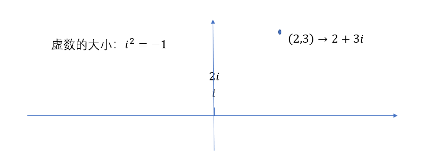
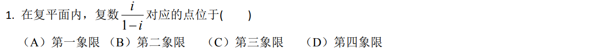

### 分母有理化

<!-- more -->

定义：将分母中含有根式的分数通过变化使得分母中仅含有有理数

:warning:平方差公式：$(a+b)(a-b)=a^2-b^2$

- 分母中仅含有根式

$$
\frac {1+\sqrt 2}{\sqrt 3}\to(上下同\times分母)\to\frac {(1+\sqrt2)\sqrt3}{\sqrt3\times\sqrt3}\to\frac{\sqrt3+\sqrt6}{3}
$$

- 分母中含有根式和整式

$$
\frac{1+\sqrt2}{\sqrt3+1}\to(上下同\times分母的平方差公式)\to\frac{(1+\sqrt2)(\sqrt3-1)}{(\sqrt3+1)(\sqrt3-1)}\to\frac{\sqrt3-1+\sqrt6-\sqrt2}{2}
$$

---

### 虚数 / 复数

- 虚数即在实数轴之外的部分，基本单位是 $i$ ，并且 $i^2=-1$
  - 虚数的运算除了 $i^2=-1$ 之外，其余和实数完全一致
  - $i^3=i^2\times i=-1\times i=-i$，更复杂的计算如下：

$$
(3i^3+2)(i-1)\\=3i^4-3i^3+2i-2\\=3+3i+2i-2\\=1+5i
$$

- **复数**即虚数与实数的组合，基本表示形式为 $z=a+bi$，其中 $a,b\in R$
  - 实部/虚部
    - 其中 $a$ 叫做复数 $z$ 实部，$bi$ 叫做复数 $z$ 的虚部
    - :warning: $a,b$ 均可以为 0，也就是说 **所有的 纯实数/纯虚数 本身就是复数**
  - 复平面
    - 复数 $a+bi$ 在复平面对应点 $(a,b)$
  - 复数的模
    - 对于 $z=a+bi$，$z$ 的模 $|z|=\sqrt{a^2+b^2}$
  - 共轭复数
    - 对于 $z=a+bi$，$z$ 的共轭(复数) $\bar z=a-bi$ 
- 复数的例子：
  - 对于 $z=1+2i$
    - $z$ 的实部为 $1$，虚部为 $2i$
    - $z$ 在复平面对应的点为 $(1,2)$
    - $z$ 的模 $|z|=\sqrt{1^2+2^2}=\sqrt 5$
    - $z$ 的共轭 $\bar z=1-2i$

---

### 复数分母实数化

定义：将分母中含有虚部的分数通过变化使得分母中仅含有实数

- 分母中仅含有虚部

$$
\frac{1+2i}{3i}\to(上下同\times i)\to \frac{(1+2i)i}{3i^2}\to\frac{i+2i^2}{3i^2}\to\frac{i-2}{-3}\to\frac{2-i}{3}\\=\frac2 3-\frac1 3i
$$

- 分母中实部虚部都不为零

$$
\frac{1+2i}{3i+1}\to(上下同\times分母的平方差公式)\to\frac{(1+2i)(3i-1)}{(3i+1)(3i-1)}\to\frac{3i-1+6i^2-2i}{9i^2-1}\to\frac{i-7}{-10}\\=\frac7 {10}-\frac1{10}i
$$

例题1：

$$
解：\frac{i(1+i)}{(1-i)(1+i)}=\frac{i+i^2}{1-i^2}\to\frac{i-1}{2}\\=-\frac1 2+\frac1 2i
$$
因此对应点坐标为 $(-\frac1 2,\frac1 2)$ 即第二象限，选 $B$

