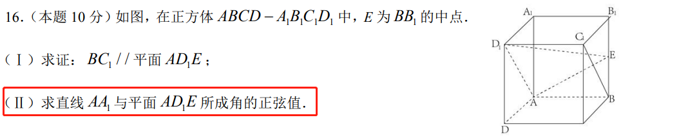
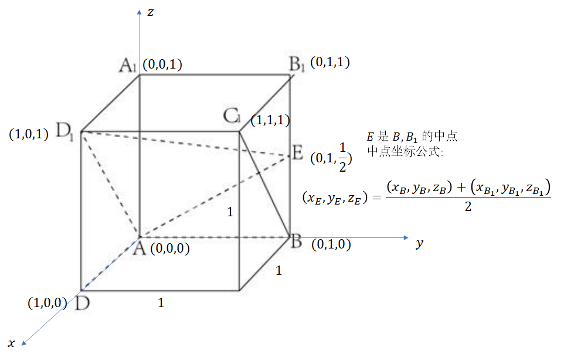

## 空间解析几何

<!-- more -->

求解步骤：

- :pensive:写坐标（建立空间直角坐标系 $o-xyz$，并写出各个点的空间坐标）
- :smile:写向量（根据写出的坐标求出一些向量的坐标）
- :pensive:求法向量（根据同一个平面上两个向量坐标求出平面法向量）
- :pensive:求解（解 二面角 / 线面角 的 正弦 / 余弦 / 角度）

### 建系+写坐标

- 右手坐标系

### 写向量

